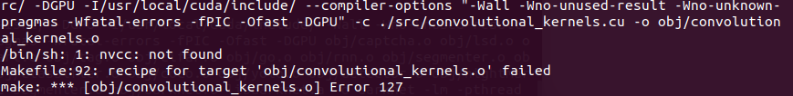

# 1. 简介

- Github: https://github.com/ggerganov/llama.cpp/tree/master
- 参数说明：https://github.com/ggerganov/llama.cpp/blob/master/examples/main/README.md
- 50k stars
- Port of Facebook's LLaMA model in C/C++
- 支持模型一部分在cpu一部分在gpu运行
- Plain C/C++ implementation without dependencies
- Apple silicon first-class citizen - optimized via ARM NEON, Accelerate and Metal frameworks
- AVX, AVX2 and AVX512 support for x86 architectures
- Mixed F16 / F32 precision
- 2-bit, 3-bit, 4-bit, 5-bit, 6-bit and 8-bit integer quantization support
- CUDA, Metal, OpenCL, SYCL GPU backend support

# 2. 安装

以下仅以Ubuntu和nvidia GPU为例

```bash
git clone https://github.com/ggerganov/llama.cpp
cd llama.cpp
```

```bash
make
```

```bash
# todo: 检查这种方法仅安装cpu版本，有待检查
make LLAMA_CUBLAS=1
```

# 3. 运行

```bash
# run the inference
./main -m ./models/7B/ggml-model-q4_0.gguf -n 128
```

```bash
# CLI交互运行
# custom arguments using a 13B model
./main -m ./models/13B/ggml-model-q4_0.gguf -n 256 --repeat_penalty 1.0 --color -i -r "User:" -f prompts/chat-with-bob.txt --n_gpu_layers 20000 -ts 1
```

# 4. 问题

/bin/sh:1:nvcc:not found



解决方法

查看/usr/local/cuda/bin下是否有nvcc可执行程序，如果有则说明nvcc没有被设置为系统变量，执行如下命令

$ cd /usr/local/cuda/bin && ls

发现了nvcc确实已安装，则只需执行如下命令将其加入系统变量中:

$ sudo vi ~/.bashrc

在末尾行添加环境变量export PATH=$PATH:/usr/local/cuda/bin

这时再新建终端，然后切换到目录下进行make时就不会出现错误了。

# 参考

[1] 解决nvcc找不到的问题/bin/sh:1:nvcc:not found，https://blog.csdn.net/weixin_43046653/article/details/100019901