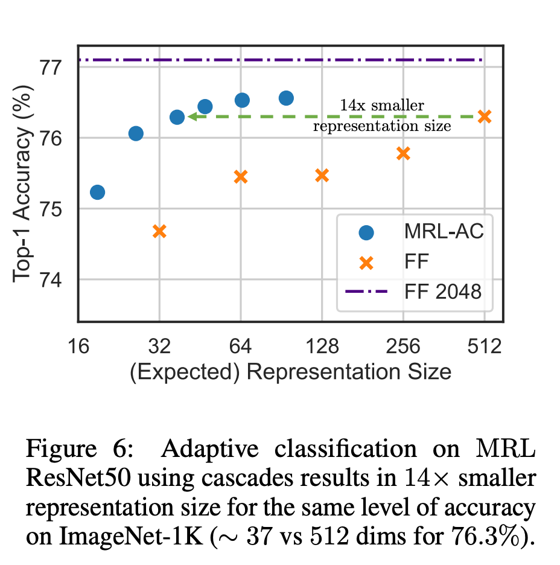

# 1. 简介

- 论文标题：Matryoshka Representation Learning
- 论文链接：https://arxiv.org/pdf/2205.13147.pdf

使用更大的嵌入（比如将它们存储在向量存储器中以供检索）通常要比更小的嵌入消耗更高的成本、以及更多的算力、内存和存储。
而 OpenAI 此次推出的两个文本嵌入模型分别是更小且高效的 text-embedding-3-small 
模型和更大且更强大的 text-embedding-3-large 模型。

这两个新嵌入模型都使用一种技术进行训练，允许开发人员权衡使用嵌入的性能和成本。具体来说，
开发者通过在 dimensions API 参数中传递嵌入而不丢失其概念表征属性，从而缩短嵌入（即从序列末尾删除一些数字）。
例如在 MTEB 基准上，text-embedding-3-large 可以缩短为 256 的大小， 同时性能仍然优于未缩短的 
text-embedding-ada-002 嵌入（大小为 1536）。

# 2. 原理

研究者提出的问题是：能否设计一种灵活的表征方法，以适应计算资源不同的多个下游任务？

MRL 通过以嵌套方式对 O (log (d)) 低维向量进行显式优化在同一个高维向量中学习不同容量的表征，
因此被称为 Matryoshka「俄罗斯套娃」。MRL 可适用于任何现有的表征 pipeline，
并可轻松扩展到计算机视觉和自然语言处理中的许多标准任务。

图 1 展示了 MRL 的核心理念以及所学习 Matryoshka 表征的自适应部署设置：

Matryoshka 表征的第一个 m-dimensions（m∈[d]）是一个信息丰富的低维向量，不需要额外的训练成本，
其精确度不亚于独立训练的 m 维表征法。Matryoshka 表征的信息量随着维度的增加而增加，形成了一种从粗到细的表征法，
而且无需大量的训练或额外的部署开销。MRL 为表征向量提供了所需的灵活性和多保真度，
可确保在准确性与计算量之间实现近乎最佳的权衡。凭借这些优势，MRL 可根据精度和计算约束条件进行自适应部署。

在分类方面，研究者使用了自适应级联，并使用由 MRL 训练的模型产生的可变大小表征，从而大大降低了
达到特定准确率所需的嵌入式平均维数。例如，在 ImageNet-1K 上，MRL + 自适应分类的结果是，
在精度与基线相同的情况下，表征大小最多可缩小 14 倍。

同样地，研究者在自适应检索系统中也使用了 MRL。在给定一个查询的情况下，使用查询嵌入的前几个 dimensions 来筛选检索候选对象，
然后连续使用更多的 dimensions 对检索集进行重新排序。与使用标准嵌入向量的单次检索系统相比，
这种方法的简单实现可实现 128 倍的理论速度（以 FLOPS 计）和 14 倍的墙上时钟时间速度；需要注意的是，
MRL 的检索精度与单次检索的精度相当（第 4.3.1 节）。

最后，由于 MRL 明确地学习了从粗到细的表征向量，因此直观地说，它应该在不同 dimensions 之间共享更多的语义信息（图 5）。
这反映在长尾持续学习设置中，准确率最多可提高 2%，同时与原始嵌入一样稳健。此外，由于 MRL 具有粗粒度到细粒度的特性，
它还可以用作分析实例分类难易程度和信息瓶颈的方法。

# 参考

[1] OpenAI新模型用的嵌入技术被网友扒出来了，https://mp.weixin.qq.com/s/NPCPuk5iczS09qWI8EKWkQ
