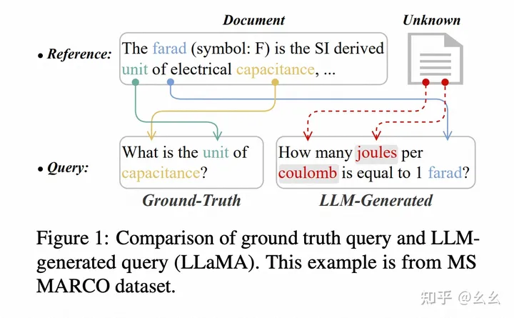
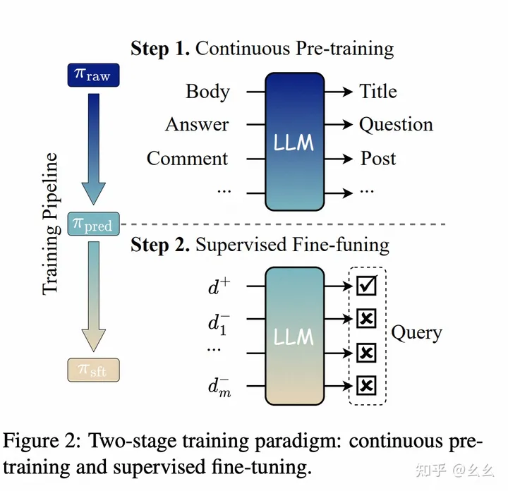
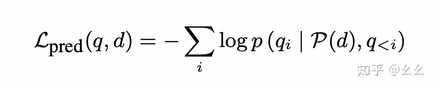
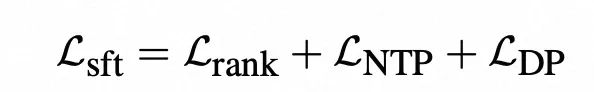
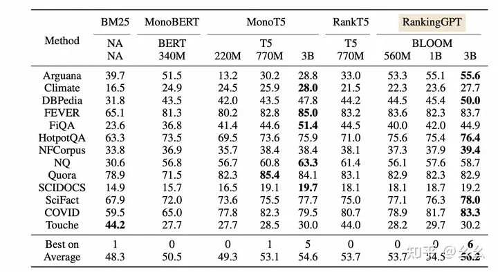

# 1. 简介

- 模型下载：https://modelscope.cn/models/iic/RankingGPT-qwen-7b/summary
- 代码：https://github.com/Alibaba-NLP/RankingGPT
- text ranker based on large language models with significant in-domain and out-domain effectiveness. 
- RankingGPT: Empowering Large Language Models in Text Ranking with Progressive Enhancement
- 论文：https://arxiv.org/pdf/2311.16720.pdf

# 2. 原理

主要贡献：

现在主流的LLM的预训练目标是预测下一个词的概率(next token prediction)，
如果直接采用无监督的方式将LLM直接用于文本排序，效果并不是十分显著，因为文本排序的相关性目标与LLM的预训练目标
(next token prediction)是不一致的，为了验证这件事，论文中举了一个例子，输入Document，
让大模型直接生成query，大模型生成的query中包含很多无用信息，跟真实的query相差较大。

论文这里为什么要输入Document输出query，因为利用大模型做Text-Ranking的策略是把输入Document，
LLM输出该query的概率可以作为评估Document与query相似性的分数，论文通过举例说明LLM输出的最大概率的query
跟ground truth差距很大来说明直接用LLM做text-ranking可能跟真实的文档相关性排序存在一定的gap

为了提升大模型在text ranking任务上的效果，该论文提出多阶段的训练策略(multi-stage training strategy)，
主要包含预训练(pre-trainning)和微调(supervised fine-tuning)两个阶段，实验证明RankingGPT在多个
公开数据集上都取得了较明显的效果提升。

实现细节：

改变LLM的预训练目标：收集开源的数据，构造成弱监督数据集，数据集是文本对形式，例如：

- 网页 ，正文 -> 标题
- 学术出版物， 摘要 -> 标题
- 社区论坛， 评论 -> 帖子标题
- 知识问答， 答案 -> 问题

这里与经典的LLM的next token prediction的预训练目标还是有显著差异的，数据集有点像是反着构造的，
思想类似于根据Document生成主题或者标题以及提问,通过教会大模型提取文章主题的预训练能力，使大模型输出的最大
概率的query与真实query更接近。并losss设计也很巧妙，跟原始的next token prediction loss计算方式保持一致，
但是只计算query部分包含的token，也就是加强LLM根据Document生成query的能力

2.Supervised Fine-tuning:经过上一步，文档和query之间的相关性已经有保证了，
SFT是为了进一步增强模型对正负文本对的区分能力。训练数据集构造：MS MARCO数据集，
利用BGE embedding model (Xiao et al., 2023)作为encoder，为每个query 检索top1000的文档。
对于每个query，从候选文档中随机选择m个负向文档来构建微调集合。

rank部分的训练loss仍是经典的对比损失。由于LLM生成的是自然语言，所以这里的socre其实是给的d,生成query token的乘积

因为上面sft的过程中会产生“知识遗忘”， 削弱预训练带来的效果，作者使用了3种方案改善：

- PEFT，冻结其他层参数，仅对前k个Transformer层进行微调
- NTP， next token prediction 加入NTP损失（第一步query的next token prediction产生的loss）
- Difference Penalty (DP)， 差异惩罚考虑了微调模型和预训练模型在token生成上概率分布上的差异。

所以SFT最终的loss是由rank,NTP和DP三部分构造：

# 2. 实验结果与分析

评测指标采用的是常见的NDCG@10，作者对比不同参数量下的效果1B以下的模型。
RankingGPT的Average表现相对有2-3.7pt的提升（红色部分上下对比），
3B的模型也有1.1pt的提升（绿色部分上下对比），LLaMa和RankingLLaMA也有0.3pt的提升（蓝色部分上下对比）。

同时论文对比了RankingGPT在大量数据集上的表现，实验结果证明，3B的底底座在6个数据集上都取得了最优表现。

最后值得一提的是，论文在最后对比了单独只用pre-training和只用SFT以及两阶段都采用的效果对比，
这里有一个神奇的结论：那就是SFT的效果远远超过pre-traing，两阶段的模型vs没有pretraing的模型只跌了0.4pt，
但是两阶段的模型对比没有sft的模型效果跌了10几pt。不过只使用pre-traning的模型跟原始模型比还是有接近10pt的提升。
这里的实验结论说明pre-training有一定的效果，但是未经过sft直接用于ranking的话还是略微逊色。
这里跟我最开始读论文觉得主要贡献的感受其实有些相反，我本以为预训练比较重要。也可能是因为sft部分的多个
loss叠加使得sft的过程中其实也在学习pre-traing的思想，让模型学到了基于document输出最相关query的能力。

此外对于表格的第二部分，3种缓解遗忘的策略不论是丢弃哪一部分结指标上差异并不是太大，这让人有点难以
分辨3种策略对于缓解模型遗忘部分的作用差异，这里有些存疑。

作者同时对比了LoRA vs PEFT的效果，LoRA的方式严格约束可以减轻过拟合，但同时也限制了模型的领域内学习能力，
所以效果有轻微降低。

实际应用思考：

预训练的思想以及缓解遗忘的改进方式还是有一定的借鉴参考和借鉴意义的，可以考虑尝试加入text-ranking相关预训练任务，
但是从实验结果来看，RankingGPT对比LLaMA原始，其实并没有非常亮眼的比如十几pt的显著差异，需要综合考虑投入产出比。

# 参考

[1] 【LLM用于排序1】RankingGPT: Empowering Large Language Models in Text Ranking with Progressive Enhancement，
     https://zhuanlan.zhihu.com/p/671475270
