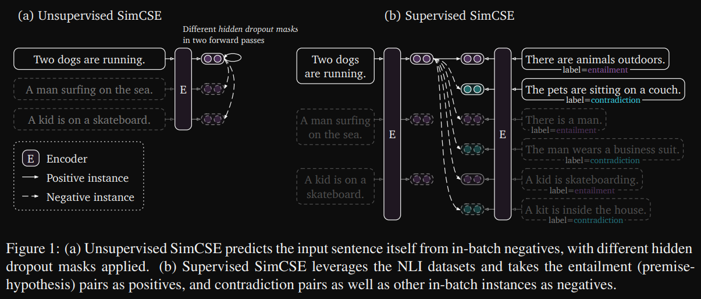

# 1. 简介

- 论文地址: https://arxiv.org/pdf/2104.08821.pdf
- https://github.com/seanzhang-zhichen/simcse-pytorch
- 数据集: 
  - https://pan.baidu.com/s/1Qq2kzIkHD3uPpxZ7_KHY_g
  - 提取码: hlva

# 2. 原理

SimCSE模型主要分为两大块，一个是无监督的部分，一个是有监督的部分。

对于无监督的部分, 最巧妙的是采用Dropout做数据增强, 来构建正例, 从而构建一个正样本对, 而负样本对则是在同一个batch中的其他句子.

那么有人会问了, 为何一个句子, 输入到模型两次, 会得到两个不同的向量呢?

这是因为: 模型中存在dropout层, 神经元随机失活会导致同一个句子在训练阶段输入到模型中得到的输出会不一样.

与Bert相比, Simcse只改变了drop_out, 利用Bert做数据增强, 但在计算Loss时, Simcse引入了对比Loss

# 参考

[1] 句向量模型之SimCSE, https://mp.weixin.qq.com/s/aDjsuSoz4r0uS3em4LJNuA