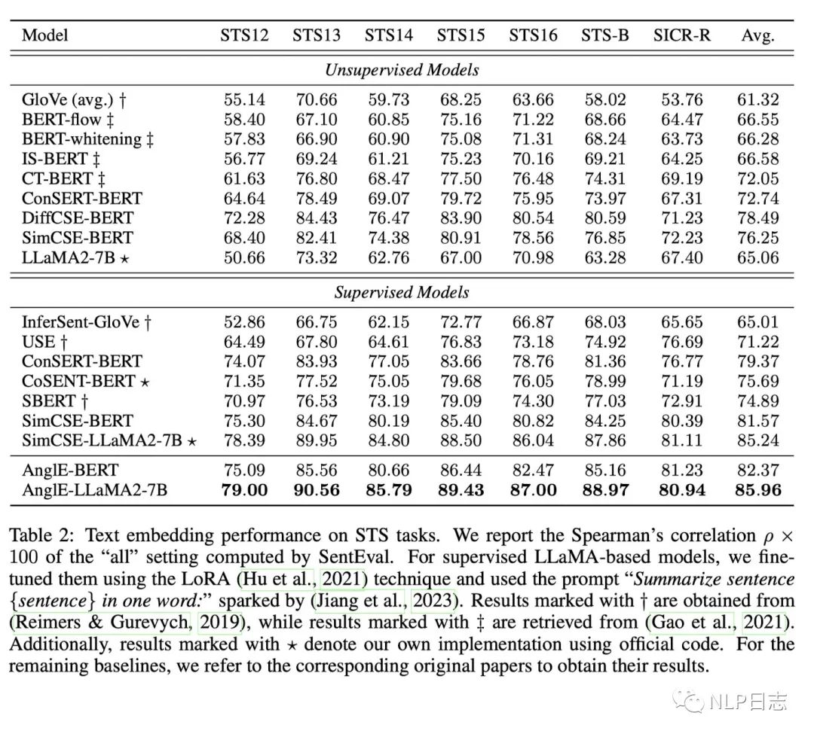

# 1. 简介

- 模型下载：https://huggingface.co/WhereIsAI/UAE-Large-V1
- 论文：ANGLE-OPTIMIZED TEXT EMBEDDINGS
  - https://arxiv.org/pdf/2309.12871.pdf
- Github (295 stars): https://github.com/SeanLee97/AnglE

研究人员认为现存的句向量模型面临的一个通用挑战就是梯度消失，
而这主要是由于优化目标严重依赖余弦函数而导致的。所以研究人员提出一种新的训练方案AnglE，
在现有基础上，引入一个新的在基于复数空间知识的损失函数angle optimization，
新的方案在多个任务上都取得明显提升。

# 2. 原理

AnglE是一种句向量模型训练方案，可以支持大部分语言模型，包括Bert, Roberta或者LLaMA。
获得句向量的方式跟以往方法一致，首先利用padding得到固定长度的模型输入，
输入到语言模型得到句子的隐藏表征，将其作为对应的句向量。
    
相对于其他方法，AnglE包括三个不同的损失，利用加权求和的方式得到最终损失，
前面两个损失都是利用余弦相似度来度量句子相似度，而第三项损失Angle 
objective则是基于复数空间的知识所提出的，是AnglE最特别的地方。

## 2.1 cosine objective

通过优化这项损失，希望那些高度相似的句子对之间的余弦相似度能大于那些低相似度的句子对之间的余弦相似度。

## 2.2 2.2 In-batch negative objevtive

相比于simcse这类利用数据增强来生成正样本的方法，AngIE只使用标注好的正样本。
通过优化这项损失，可以提高句子b跟其对应的正样本的余弦相似度，并且降低句子b跟
其他句子的正样本之间（其他句子的正样本可以认为是句子b的负样本）的相似度。在这个过程中，
还需要识别同个batch是否存在一样的句子，避免引入可能的噪声。

## 2.3 Angle objective

研究人员认为余弦函数存在相对饱和的区域（梯度接近于0），从而容易带来梯度消失问题，
于是提出一个新的目标angle difference来度量句子相似度，angle difference在原本
余弦函数接近于0的区域会有明显不同，从而缓解优化过程中的梯度消失问题。

利用复数空间的极坐标信息跟复数本身的除法计算，重新定义了句子的相似度度量angle difference。
进而提出了一个新的目标函数angle objective，通过优化这个目标函数，希望高度相似的句子对的angle 
difference高于那些低相似度的句子对。这里可以简单理解为提出了一个新的相似度度量方法angle 
difference，该方法是基于复数知识推出的，有明确的数学意义，同时跟余弦相似度有明显区别。

# 3 实验结论

a) AngIE在STS任务上，无论是领域微调还是迁移能力，效果都超过simcse等对比学习方法，
并且模型规模越大，效果也会有所提升。

b) 通过消融实验发现，对于 AnglE而言，angle objective的重要性跟cosine objective相当，
两者叠加可以有进一步提升，这也说明了angle difference充当了另外一种文本相似度的度量工具，
可以从其他角度去计算文本之间的距离，但是又跟传统的余弦相似度有明显差异。
无论是angle objective还是cosine objective，在模型优化过程汇总所起到的作用都远超
In Batch negative objective。

# 4 讨论

AnglE在句向量模型训练过程中提出一种新的文本相似度度量方法angle difference，
这种优化思路是之前分享的几种句向量方法所不涉及的，从想法跟实验结果上看，在模型优化过程中，
提供更多视角的相似度度量手段对于整体确实是有所帮助的。

但是基于AnglE的MTEB榜一UAE-Large-V1，不仅训练方法有所创新，同时训练数据也涵盖了
600多万的高质量标注数据，所以霸榜第一的原因到底有多少是训练方法的创新所带来的，就很难估量了。
另外AnglE文中强调自身是一种有监督的方法，但是在对比学习中加入额外的angle 
objective这种相似度度量方法不就可以融入到目前主流的无监督对比学习+有监督对比学习的分阶段训练中呢？

# 参考

[1] AnglE: MTEB新晋榜一的训练方法，https://mp.weixin.qq.com/s/63rr--N4DmPodZlcO6fmZw