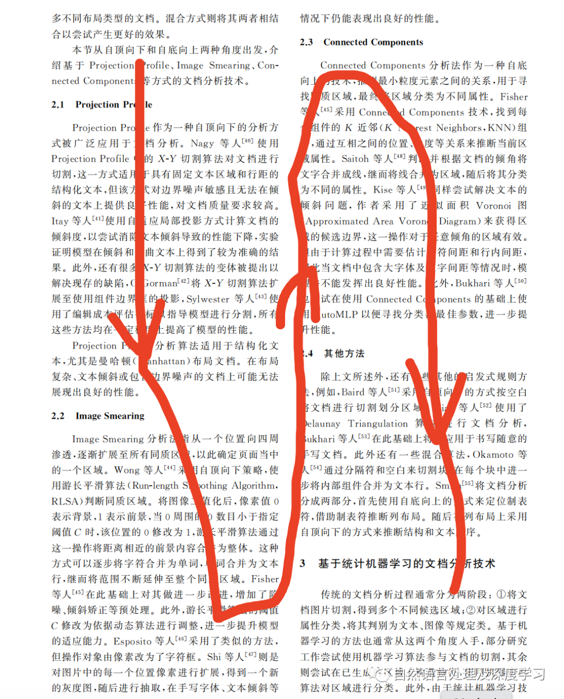

# 1. 简介

注入领域知识从方法论上，可以分成领域微调［增量预训以及领域微调］与上下文注入［外挂知识库］ 两类方法。

# 2. 文档拆分工具

1. 文档拆分：langchain

   - 通常会使用特定的分隔符进行切分，如句号，换行符，问号等。
   - 我们来看看langchain中都有哪些文本拆分的方案。可以参考的链接是源代码：https://github.com/hwchase17/langchain/blob/master/langchain/text_splitter.py

    langchain的内置文本拆分模块设定了几个参数：
    - chunk_size：文本块的大小，即文本块的最大尺寸；
    - chunk_overlap：表示两个切分文本之间的重合度，文本块之间的最大重叠量，保留一些重叠可以保持文本块之间的连续性，可以使用滑动窗口进行构造，这个比较重要。
    - length_function：用于计算文本块长度的方法，默认为简单的计算字符数；

    

# 3. 使用详解
## 3.1 传统工具
### 3.1.1 PDF解析工具


1. PyPDF2提取txt

   ```python
   import PyPDF2
   def extract_text_from_pdf(pdf_path):
       with open(pdf_path, 'rb') as file:
           pdf_reader = PyPDF2.PdfFileReader(file)
           num_pages = pdf_reader.numPages
           text = ""
           for page_num in range(num_pages):
               page = pdf_reader.getPage(page_num)
               text += page.extractText()
       return text
   
   pdf_path = 'example.pdf'
   extracted_text = extract_text_from_pdf(pdf_path)
   print(extracted_text)
   ```

2. pdfplumber提取text：

   ```python
   import pdfplumber
   
   text = ""
   with pdfplumber.open('example.pdf') as pdf:
       for page in pdf.pages:
           text += page.extract_text()
       print(text)
   ```

3. pdfminer提取text

   pdfminer是一款非常强大的pdf文档解析工具，值得根据自身的场景重写其中的部分工具函数。
   pdfminer通过布局分析返回的PDF文档中的每个页面LTPage对象。这个对象和页内包含的子对象，
   形成一个树结构，如图所示：结构如图：

   

   ```python
   from pdfminer.pdfinterp import PDFResourceManager, PDFPageInterpreter
   from pdfminer.converter import TextConverter
   from pdfminer.layout import LAParams
   from pdfminer.pdfpage import PDFPage
   from io import StringIO
   
   # 打开PDF文件
   with open('example.pdf', 'rb') as file:
       # 创建一个PDFResourceManager对象
       resource_manager = PDFResourceManager()
       # 创建一个StringIO对象，用于存储提取的文本内容
       output = StringIO()
       # 创建一个TextConverter对象
       converter = TextConverter(resource_manager, output, laparams=LAParams())
       # 创建一个PDFPageInterpreter对象
       interpreter = PDFPageInterpreter(resource_manager, converter)
       # 逐页解析文档
       for page in PDFPage.get_pages(file):
           interpreter.process_page(page)
       # 获取提取的文本内容
       text = output.getvalue()
       print(text)
   ```

4. pymupdf提取text

   ```python
   import fitz
   
   def MuPDF_extract_text_from_pdf(path):
       doc = fitz.open(path)
       all_content = []
       page_nums = 0
       for i in doc.pages():
           page_nums += 1
           all_content.append(i.get_text())
       text = '\n'.join(all_content)
       # text = ''.join(text.split('\n'))
       return text
   ```

5. papermerge：EMNLP 2023 最佳 Demo

   ```python
   from papermage.recipes import CoreRecipe
   
   recipe = CoreRecipe()
   doc = recipe.run("example.pdf")
   for page in doc.pages:
       for row in page.rows:
           print(row.text)
   ```

#### 3.1.1.1 PDF表格解析

有很多的包能支持从pdf中抽取表格，比如说tablula、pdfplumber、camelot等等，camelot还可以提取复杂的表格格式。
但是一般用于问答，还需要表的摘要信息，才能方便问答的检索，可以把表格+表格前后文本输入大模型，让大模型总结出摘要，
后续就可以用RecursiveRetrieval查询得到表的数据了。另一种就是期望向量模型能准确的编码表信息，直接通过向量来检索到相关的表。

在llama index中有以下示例，步骤如下：

- 使用 Unstructured 从 10-K 文档中解析出表和“非表”元素。
- 使用 LLM 从每个表中提取一个“标题”
- 这些标题与其余的文本块一起构建索引。这些标题包含对基础表的引用！

```text
https://github.com/run-llama/llama_index/blob/main/docs/examples/query_engine/sec_tables/tesla_10q_table.ipynb
```

这里需要注意的是，Unstructured 使用的输入是html格式，如果丢一个pdf文本进去，会发现抽不到表格。

所以一个选择是，需要找一个开源工具将pdf转成html格式，如pdf2htmlEX

```text
import subprocess

def convert_pdf_to_html(pdf_path, html_path):
    command = f"pdf2htmlEX {pdf_path} --dest-dir {html_path}"
    subprocess.call(command, shell=True)

input_pdf = "./data/test.pdf"
output_pdf = "./data/test.htm"

convert_pdf_to_html(input_pdf, output_pdf)
```

### 3.1.2 doc/docx解析工具

1. Python-dox

   Python-dox：优点：能够解析docx格式文档；缺点：doc格式文档无法直接解析，
   需要进行转换为docx格式间接解析
   
   ```python
   import docx
   
   def extract_text_from_word_document(file_path):
       document = docx.Document(file_path)
       text = '\n'.join([paragraph.text for paragraph in document.paragraphs])
       return text
   
   file_path = 'example.docx'
   text = extract_text_from_word_document(file_path)
   print(text)
   ```

2. tika

   Python Tika是一个基于Apache Tika的python库，可以解析各种格式的文档，如PDF、
   Microsoft Office、OpenOffice、XML、HTML、TXT等等。它提供了一种非常方便的方法来获取文档内容，
   包括元数据、正文、各种格式、图片、表格等等。（注意：需要依赖java环境）

   ```python
   from tika import parser
   
   parsed = parser.from_file('example.pdf')
   content = parsed['content']
   print(content)
   ```

### 3.1.3 图片型文档解析工具

1. paddleocr

   ```python
   from paddleocr import PaddleOCR
   
   ocr = PaddleOCR(use_angle_cls=True, lang="ch")
   img_path = 'example.jpg'
   result = ocr.ocr(img_path, cls=True)
   for idx in range(len(result)):
       res = result[idx]
       for line in res:
           print(line)
   ```

### 3.1.4 表格解析

#### 3.1.4.1 Table Transformer

微软新发布的模型Table Transformer为在图像中检测表格提供了一个不错的解决方案。

结合Table Transformer以及多模态模型如GPT4-V也可以做到更好的文档问答系统。在多模态模型爆火之后，
基于多模态模型的RAG系统，可以分为以下几个选择：

- 检索相关图像（PDF页面）并将其输入到GPT4-V以生成问题的答案。
- 将每个PDF页面视为图片，让GPT4-V对每个页面进行图片推理。为图片推理构建文本向量存储索引。对图像推理向量存储进行查询。
- 使用Table Transformer从检索到的图像中裁剪表格信息，然后将这些裁剪后的图像发送到GPT4-V进行生成问题的答案。
- 裁剪后的表格图像先用OCR识别文字信息，并将数据发送到GPT4/GPT-3.5来回答。

方法1的效果比较差，模型难以正确回答问题。

方法2的步骤如下：

- 提取并将每个PDF页面分离为图像文档
- 让GPT4V识别表格并从每个PDF页面提取表格信息
- 将GPT4V的理解建立到到Image Reasoning Vector Store 索引中中
- 从这个图像推理向量存储中检索答案 一个简单示例如下：

```python
openai_mm_llm = OpenAIMultiModal(
    model="gpt-4-vision-preview", api_key=OPENAI_API_TOKEN, max_new_tokens=1500
)

image_prompt = """
    Please load the table data and output in the json format from the image.
    Please try your best to extract the table data from the image.
    If you can't extract the table data, please summarize image and return the summary.
"""
response = openai_mm_llm.complete(
    prompt=image_prompt,
    image_documents=[documents_images_v2[15]],
)

print(response)
```

测试发现：

- GPT4V 在识别表格并从图像中提取表格内容方面并不稳定，特别是当图像中混合了表格、文本和图片时。这在 PDF 格式中很常见。
- 将 PDF 文件拆分成单个图像，让 GPT4V 理解/总结每个 PDF 页作为单个图像，然后基于 PDF 图像转换为文本索引来构建 RAG。
  这种方法在这个任务中表现不佳。

方法三基于Table Transformer：

```python
model = AutoModelForObjectDetection.from_pretrained(
    "microsoft/table-transformer-detection", revision="no_timm"
).to(device)

structure_model = AutoModelForObjectDetection.from_pretrained(
    "microsoft/table-transformer-structure-recognition-v1.1-all"
).to(device)
```

可以很好的回答表格问题

方法四 先使用OCR提取，但是OCR错误太多，导致最终也不能正确回答用户问题。

#### 3.1.4.2 ChatDOC

ChatDOC PDF解析器可以看到整个图片。它能准确识别表格和段落，甚至理解表格内部的结构。这意味着它可以将文档划分为定义明确、
   完整的信息单元，保留文档的预期含义和结构。

## 3.2 基于深度学习工具

### 3.2.1 版面分析

1. ppstructure
   基于开源项目的版面分析：ppstructure：
   项目地址：https://github.com/PaddlePaddle/PaddleOCR/blob/release/2.7/ppstructure/docs/quickstart.md

   ```python
   import os
   import cv2
   from paddleocr import PPStructure,save_structure_res
   
   table_engine = PPStructure(table=False, ocr=False, show_log=True)
   
   save_folder = './output'
   img_path = 'ppstructure/docs/table/1.png'
   img = cv2.imread(img_path)
   result = table_engine(img)
   save_structure_res(result, save_folder, os.path.basename(img_path).split('.')[0])
   
   for line in result:
       line.pop('img')
       print(line)
   ```
2. chatdoc
   
   ChatDOC PDF解析器可以看到整个图片。它能准确识别表格和段落，甚至理解表格内部的结构。这意味着它可以将文档划分为定义明确、
   完整的信息单元，保留文档的预期含义和结构。

   他的流程图如下：

   - 文字定位的OCR
   - 识别物理布局
   - 找出正确的阅读顺序
   - 理解逻辑结构

3. 自己训练

   基于自有场景的版面分析：常见的思路主要为，训练版面分析模型用于识别文档中各个信息区块，
   然后通过ocr工具解析特定区块中的文字信息。如果涉及复杂版面（如：双栏等），则需要根据启
   发式规则（根据bbox排序）进行信息区块的排序。常见的如：XY-CUT算法，xy_cut算法如：

   ```python
   import numpy as np
   
   def xy_cut(bboxes, direction="x"):
       result = []
       K = len(bboxes)
       indexes = range(K)
       if len(bboxes) <= 0:
           return result
       if direction == "x":
           # x first
           sorted_ids = sorted(indexes, key=lambda k: (bboxes[k][0], bboxes[k][1]))
           sorted_boxes = sorted(bboxes, key=lambda x: (x[0], x[1]))
           next_dir = "y"
       else:
           sorted_ids = sorted(indexes, key=lambda k: (bboxes[k][1], bboxes[k][0]))
           sorted_boxes = sorted(bboxes, key=lambda x: (x[1], x[0]))
           next_dir = "x"
   
       curr = 0
       np_bboxes = np.array(sorted_boxes)
       for idx in range(len(sorted_boxes)):
           if direction == "x":
               # a new seg path
               if idx != K - 1 and sorted_boxes[idx][2] < sorted_boxes[idx + 1][0]:
                   rel_res = xy_cut(sorted_boxes[curr:idx + 1], next_dir)
                   result += [sorted_ids[i + curr] for i in rel_res]
                   curr = idx + 1
           else:
               # a new seg path
               if idx != K - 1 and sorted_boxes[idx][3] < sorted_boxes[idx + 1][1]:
                   rel_res = xy_cut(sorted_boxes[curr:idx + 1], next_dir)
                   result += [sorted_ids[i + curr] for i in rel_res]
                   curr = idx + 1
   
       result += sorted_ids[curr:idx + 1]
       return result
   
   
   def augment_xy_cut(bboxes,
                      direction="x",
                      lambda_x=0.5,
                      lambda_y=0.5,
                      theta=5,
                      aug=False):
       if aug is True:
           for idx in range(len(bboxes)):
               vx = np.random.normal(loc=0, scale=1)
               vy = np.random.normal(loc=0, scale=1)
               if np.abs(vx) >= lambda_x:
                   bboxes[idx][0] += round(theta * vx)
                   bboxes[idx][2] += round(theta * vx)
               if np.abs(vy) >= lambda_y:
                   bboxes[idx][1] += round(theta * vy)
                   bboxes[idx][3] += round(theta * vy)
               bboxes[idx] = [max(0, i) for i in bboxes[idx]]
       res_idx = xy_cut(bboxes, direction=direction)
       res_bboxes = [bboxes[idx] for idx in res_idx]
       return res_idx, res_bboxes
   
   
   bboxes = [[58.54924774169922, 1379.6373291015625, 1112.8863525390625, 1640.0870361328125],
             [60.1091423034668, 483.88677978515625, 1117.4927978515625, 586.197021484375],
             [57.687435150146484, 1098.1053466796875, 387.9796142578125, 1216.916015625],
             [63.158992767333984, 311.2080993652344, 1116.2508544921875, 365.2145080566406],
             [138.85513305664062, 144.44039916992188, 845.18017578125, 198.04937744140625],
             [996.1032104492188, 1053.6279296875, 1126.1046142578125, 1071.3463134765625],
             [58.743492126464844, 634.3077392578125, 898.405029296875, 700.9544677734375],
             [61.35755920410156, 750.6771240234375, 1051.1060791015625, 850.3980712890625],
             [426.77691650390625, 70.69780731201172, 556.0884399414062, 109.58145141601562],
             [997.040283203125, 903.5933227539062, 1129.2984619140625, 921.10595703125],
             [59.40523910522461, 1335.1563720703125, 329.7382507324219, 1357.46533203125],
             [568.9025268554688, 14.365530967712402, 1087.898193359375, 32.60292434692383],
             [998.1250610351562, 752.936279296875, 1128.435546875, 770.4116821289062],
             [59.6968879699707, 947.9129638671875, 601.4513549804688, 999.4548950195312],
             [58.91489028930664, 1049.8773193359375, 487.3372497558594, 1072.2935791015625],
             [60.49456024169922, 902.8802490234375, 600.7571411132812, 1000.3502197265625],
             [60.188941955566406, 247.99755859375, 155.72970581054688, 272.1385192871094],
             [996.873291015625, 637.3861694335938, 1128.3558349609375, 655.1572875976562],
             [59.74936294555664, 1272.98828125, 154.8768310546875, 1295.870361328125],
             [58.835716247558594, 1050.5926513671875, 481.59027099609375, 1071.966796875],
             [60.60163116455078, 750.1132202148438, 376.1781921386719, 771.8764038085938],
             [57.982513427734375, 419.16058349609375, 155.35882568359375, 444.25115966796875],
             [1017.0194091796875, 1336.21826171875, 1128.002197265625, 1355.67724609375],
             [1019.8740844726562, 486.90814208984375, 1127.482421875, 504.61767578125]]
   
   res_idx, res_bboxes = augment_xy_cut(bboxes, direction="y")
   print(res_idx)
   # res_idx, res_bboxes = augment_xy_cut(bboxes, direction="x")
   # print(res_idx)
   
   new_boxs = []
   for i in res_idx:
       # print(i)
   
       new_boxs.append(bboxes[i])
   
   print(new_boxs)
   ```

常见的单模态（目标检测）深度学习模型方法：Yolo系列、mask-RCNN、faster-CNN等

常见的多模态深度学习模型方法：layoutlmv3等，【文档智能】多模态预训练模型及相关数据集汇总


## 3.3 文本分割模型

在经过以上的解析工具解析文本时，都会丢失文本原始的信息，包括：段落语义信息、字体、
字号等文本特征信息。如何恢复原始的文本段落显得尤其重要，这关系到后续对文档的进一步的处理和分析。

一般的，通过启发式规则根据坐标信息排列和聚合出段落，如：字坐标、行坐标等。
但过程往往非常复杂且效果一般。因此，基于文本分割模型的版面分析算法显得尤为重要。
最初的想法来源于序列标注模型，那么是否能应用序列标注的方法，来预测文本行之间的跳转概率？
答案是肯定的，以pdf为例，具体实施步骤如下：


1. 从pdf读取程序或ocr引擎中得到文本行及其坐标；
2. 使用神经网络对第i行的文本进行编码，得到文本嵌入向量text_emb(i)；
3. 提取对应行的图像，得到图像嵌入向量img_emb(i)；
4. 提取字号、文字长度特征，并进行归一化得到特征向量；
5. 聚合步骤2、3、4得到的向量，得到行嵌入line_emb(i)；
6. 使用神经网络对行向量序列[line_emb(i)]进行序列标注。

整体方案流程图如下：


## 3.4 单双栏区分

无论是文档parser还是版面分析的方法，解析后的信息区块都不是按照顺序进行返回的。
因此需要重新组织“阅读顺序”。对于单栏文档，按照y坐标升降序就能完成顺序的组织，但是对于双栏文档，就需要进一步的分析处理。

在一些学术文档中，比较好办，一般找到文档的所有信息块的中心店坐标即可，
用这一组横坐标的极差来判断即可，双栏论文的极差远远大于单栏论文，
因此可以设定一个极差阈值。那么区别“阅读顺序”先找到中线，
中线横坐标由求极差的横坐标+得到，然后将左右栏的区块分开，按照纵坐标排序即可。



对于更复杂的布局文档解析，这一块是一个难点，有相关资料是寻找信息区块的视觉间隙，从而切开重排信息区块。

# 4. 总结

本文介绍了一些常见的文档解析工具和实现方法以及文本分割模型在文档解析中的充当的角色，
并提供了相关技术实现思路。当然，如果粗糙的进行文档处理也是可以的，常见的有，
基于LangChain的文档处理方式，但其底层技术很多都是上述文档parser工具的集成。

在面对复杂文档，解析时还是存在一定的困难，基于布局的多模态版面分析是值得研究的点。
虽然目前百模支撑的上下文长度能cover一本书的长度，但真正落地实施起来效果一般。

并且，一些目前一些常见的LLM应用，如：DocQA，通常将文本切片后进行向量化存入向量数据库，
然后基于检索召回与query相关的片段输入到LLM中，LLM与向量数据库还是分离的形式，做出来的文档问答系统自然效果也就一般。

因此，文档解析后，如何进行重新划分并得到完整的语义块值的进一步的探索。


# 参考

[1] 也谈langchain大模型外挂知识库问答系统核心部件：如何更好地解析、分割复杂非结构化文本, 
    https://mp.weixin.qq.com/s?__biz=MzAxMjc3MjkyMg==&mid=2648401563&idx=1&sn=af4bddce6f3701050266221b2dd495a5&chksm=838375ceb4f4fcd857e4142cc746e72d4c9a2ce714848c09fcfab02d32e9863227be52c86a7f&scene=178&cur_album_id=2120957806534033409#rd
[2] 大模型RAG问答下的实用开源文档解析工具总结及技术思考：从文档版本分析到单双栏处理，
    https://mp.weixin.qq.com/s?__biz=MzAxMjc3MjkyMg==&mid=2648406194&idx=2&sn=94a37b28dcad1501b3abe88d847ca0d6&chksm=83836be7b4f4e2f1b5a222ab12f14294555a4fa675f90188ef2d7696d121de7b3da0f759777e&scene=132&exptype=timeline_recommend_article_extendread_samebiz#wechat_redirect
[3] 【文档智能】多模态预训练模型及相关数据集汇总，
    https://mp.weixin.qq.com/s?__biz=Mzg4NjI0NDg0Ng==&mid=2247484335&idx=1&sn=f5f9236ef8ef361d7d9cf594c472f543&scene=21#wechat_redirect
[4] 浅析RAG系统非结构化数据中的表格处理，https://mp.weixin.qq.com/s?__biz=MzkyOTU5NzY1Mw==&mid=2247485014&idx=1&sn=09bc0cc328687b8a9c47b3c4196f5138&chksm=c38ef4b8845148f794a932e8691213b554b5bdd69bbacee1352814dadd9e0fe9d8599a553788&scene=132&exptype=timeline_recommend_article_extendread_samebiz#wechat_redirect