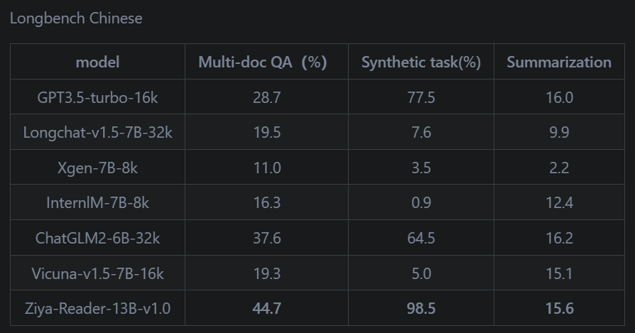
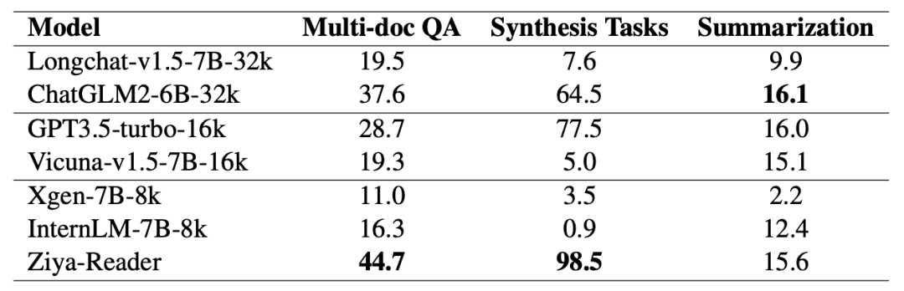
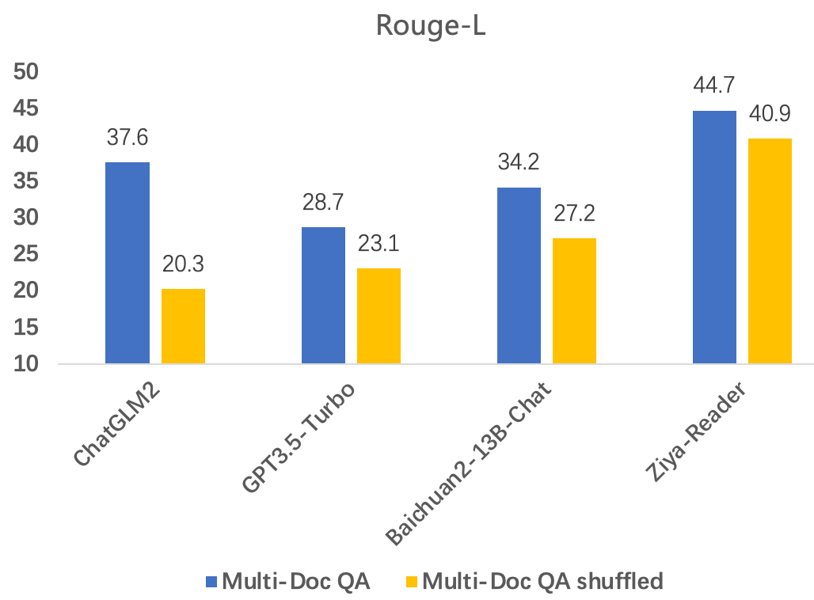

# 1. 简介
姜子牙-知识问答大模型-13B-v1.0

- 模型下载（ModelScope）：https://modelscope.cn/models/Fengshenbang/Ziya-Reader-13B-v1.0/summary
- 模型下载（Hugging Face）：https://hf.co/IDEA-CCNL/Ziya-Reader-13B-v1.0
- 论文（2023）：Never Lost in the Middle: Improving Large Language Models via Attention Strengthening Question Answering
- 论文（2023）：Fengshenbang 1.0: Being the Foundation of Chinese Cognitive Intelligence

Ziya-Reader-13B-v1.0是一个知识问答模型给定问题和知识文档可以准确回答问题，用于多文档或单文档问答。
该模型具有8k的上下文窗口，相比其他具有更长窗口的模型，我们在多个长文本任务的评测中胜出。包括多文档问答、合成任务（文档检索）长文本摘要。

该模型主要解决多文档问答中当正确信息不在首个或末尾文档中时，回答准确率大幅降低的问题。

另外，模型的通用能力同样出众，可以进行通用问答。它在我们的通用能力评估集上的效果超过了Ziya-Llama-13B-v1.1.



Multi-doc QA是多文档问答任务，给定问题和多个文档，根据其中含有正确信息的文档回答问题。该任务衡量模型的相关性判断和记忆力，
以及问答的能力。在该任务上Ziya-Reader-13B-v1.0大幅领先所有模型，包括更长窗口的模型。

Synthetic task是合成的相关文档查找任务，给定一个摘要，从众多文档中找出与它对应文档。
该任务衡量模型的语义匹配能力。在该任务上，我们的模型超越了所有开源模型，达到98.5%。

Summarization是长文本摘要任务，给定包含多个说话人的会议记录，生成出超长上下文的会议总结。
在该任务上我们的模型非常有竞争力，在只有8k的上下文窗口情况下，与16k或更长窗口的模型差距不到1%，在8k窗口中最强。

我们发现Multi-doc QA中的文档都按照相关性从高到低排列，正确答案往往在第一或前几个，并不能反映模型的相关性判断能力。
因此我们对该测试集打乱文档的顺序，再测试各个模型的效果。结果发现目前大多数模型的效果均显著下降，从5%到17%不等，
而我们的模型非常鲁棒，降幅不到4%。

我们使用了位置插值（PI）的方式，在精选的长文档语料上进行微调，扩展上下文到8k大小。其次，模型靠数据喂养，
我们从近千万数据中筛选高质量数据，仅用层层过滤的10万量级的数据即可将一个平平无奇的模型培养成知识问答小钢炮。
另外，我们为搜索任务量身定做了特殊的任务，精心制作了数据，让模型学会从中寻找相关文档并回答问题。

# 2. 原理

近来，越来越多拥有超长上下文窗口的LLM被提出，LLM甚至可以处理达到200k token的长序列内容。虽然窗口长度得到极大的扩展，
但是在需要识别输入上下文中相关信息的任务中，当相关信息出现在输入上下文的中间部分时性能会有明显的下降，
如下图所示，改变相关信息的位置（正确段落的位置），LLM会产生一个U型的性能曲线。这也就是有名的“Lost in the Middle“
问题[2]，即使是GPT-3.5-turbo-16k、Claude-1.3-100k、Longchat-13b-16k等优秀的长窗口LLM也存在这一问题。
这使得我们使用LLM在进行检索增强的知识问答任务时，存在明显的性能缺陷。


为了克服这一问题，我们提出了注意力增强的多文档问答（Attention Strengthenning Multi-doc QA，ASM QA）
的训练方法，它通过显式地在训练中引入类似CoT机制的多步推理回答过程，让模型能够更加注意到与位置无关的正确上下文信息。
它在仅仅使用了8k窗口的情况下，就能在多项长文本任务中超过拥有16k或者32k窗口的其他优秀模型。

Ziya-Reader 的注意力增强机制主要通过以下几个方面来实现：

- 位置编码：在处理长文本时，位置信息对于模型来说至关重要。Ziya-Reader 采用了一种改进的位置编码方法，
  让模型能够更好地理解长文本中的位置信息，从而更好地聚焦于关键内容。
- 自适应注意力权重：传统的注意力机制通常会赋予所有输入相同的权重。然而，在处理长文本时，
  不同部分的输入信息对于模型的重要性是不同的。Ziya-Reader 采用了一种自适应注意力权重的方法，
  让模型能够根据输入信息的重要性动态调整注意力权重，从而更加聚焦于关键信息。
- 上下文信息融合：在处理长文本时，上下文信息对于理解整个文本至关重要。Ziya-Reader 
   通过将上下文信息融入注意力机制中，让模型能够更好地理解上下文语义，从而更加准确地捕捉关键信息。
- 层次化注意力：为了使模型更好地处理长文本中的不同层次的信息，Ziya-Reader 采用了一种层次化的注意力机制。
  这种机制让模型能够根据不同的任务需求，自适应地关注不同层次的信息，从而更加全面地理解长文本内容。

通过以上几个方面的改进，Ziya-Reader 成功地实现了注意力增强，从而在多项长文本任务中取得了优异的成绩。
在实际应用中，Ziya-Reader 的表现也证明了其有效性。无论是处理新闻、小说还是专业文献等不同类型的长文本数据，
Ziya-Reader 都能表现出色，为用户提供准确、高效的信息提取和分析服务。

总结起来，Ziya-Reader 的注意力增强机制是其取得优异成绩的关键所在。通过位置编码、自适应注意力权重、
上下文信息融合和层次化注意力等方面的改进，Ziya-Reader 成功地提升了长文本任务的性能表现。
这种技术的应用将有助于推动自然语言处理领域的进一步发展，为人类提供更加智能、高效的信息处理服务。
同时，Ziya-Reader 的成功也为我们提供了一个宝贵的启示：在处理复杂任务时，通过创新性的技术手段提升模型的注意力能力是至关重要的。


## 2.1 注意力增强的问答任务设计

我们将ASM QA任务，分解成一个多步推理的过程，并显式地在训练中让模型学会这种推理范式。

第一步，我们在指令的输出中，让模型先进行问题（question）的复述，这使得模型在阅读了一段
非常长的上下文信息后，也不会因为距离衰减的原因忘记原始的提问，因而在生成答案时，更加能够关注到问题。

第二步，我们构造了上下文段落的下标预测的任务，即让模型尝试预测相关上下文信息中正确上下文段落的索引下标。
通过这种方式，我们让模型能够更加关注于正确的上下文段落。

最后，在以上两步的输出基础上，我们让模型输出最后的答案总结。我们使用一些提示前缀（prefix）来关联这三部分的输出，
使其更符合自然语言表达的习惯。整体的流程如下图所示。


## 2.2 任务数据构造

我们构造了两个阶段的训练数据来训练Ziya-Reader。在第一阶段我们进行通用能力的有监督微调
（Supervised Finetuning，SFT）训练，并将窗口扩充到8k token。在第二阶段，我们构造ASM QA数据，并继续使用8k窗口进行SFT训练。

在第一阶段中，我们精选了300k条通用的指令数据，包括常识问答、阅读理解、角色扮演、写作、
代码生成、翻译、头脑风暴等任务，并混合了部分预训练数据，进行Language Modeling任务的训练
（即计算整个文本序列的交叉熵损失）。我们将所有的任务数据拼接起来，使得拼接后的样本都尽量具有8k的窗口长度。

在第二阶段中，我们从DuReader2.0[3]和WebCPM[4]中过滤了约50k的数据，并按照任务设计中的形式构造了样本。
特别地，我们使用了一个奖励模型（Reward Model）来进行数据的过滤，使得我们挑选出来的50k数据都具有非常高的数据质量。

为了使得模型对上下文的注意力得到进一步的增强，让模型更加注意到位于不同位置的正确的上下文段落，
我们构造了位置无关的高难度样本。我们将所有的文档向量化后灌入向量搜索引擎中，并在70%的数据中，
根据问题和文档的相似度构造了不相关但相似的上下文负例。在另外30%的数据中，我们进行随机采样来构造不相关的上下文负例。
我们还构造了少部分样本，这一部分样本中没有任何相关的正确上下文段落，这部分样本的输出是“根据以上内容，
我不知道正确的答案“。最后，我们在构造样本时，保证样本的长度是均匀分布的，
并正确的上下文段落会被随机分配到任何位置，这就保证了模型可以关注到任何位置的正确上下文段落。

## 2.3 实验与分析

我们在中文权威的长文本评测基准LongBench[5]上进行了实验并重点评测了Multi-doc QA、
Synthesis Task和Summarization三个和RAG紧密相关的任务。评测结果如下：



相比于其他的拥有更长窗口的模型，例如32k窗口的ChatGLM2-6B-32k，以及16k窗口的GPT-3.5-turbo-16k，
Ziya-Reader在Multi-doc QA和Synthesis Tasks两项任务中都达到了SOTA效果，在Summarization任务中也
仅比最好的模型效果低0.5%。说明即使仅有8k的窗口长度，也能具备非常扎实的长文理解效果。

与此同时，我们将Multi-doc QA评测中的正确上下文段落进行了随机的顺序打乱，使得其能够出现在上下文中的任何位置，
重新构造了评测集Multi-doc QA shuffled。在这个评测集上，Ziya-Reader基本保持了优秀的多文档问答能力，
而其他的长窗口模型均出现了非常明显的性能下降。这说明Ziya-Reader极大地缓解了前文提到的
“Lost in the middle”的问题。具体的评测指标如下图所示。



我们也进行了详尽的消融实验，结果表示我们的ASM QA任务构造方式，能够明显地提升模型的相关信息检索和多文档问答能力，
优于普通的多文档问答训练方式，让模型对问题和上下文的注意力得到增强。详细的分析结论请参阅我们的技术报告。


最后，我们也评测了Ziya-Reader的通用能力，如下图所示。我们使用匿名Side-by-Side的评测方式，
在写作、QA、推理、代码、自然语言理解等多个方面的评估中，基本与Baichuan2-13B-Chat持平，
并大幅胜出与Ziya-Llama-13B-v1.1。说明Ziya-Reader不仅可以作为QA模块中的一部分，也可以作为一个Agent，在整个RAG链路中发挥更大的价值。


# 3. 使用

通用问答时，直接在问题前后加"<human>:"和"\n<bot>:"即可。

进行阅读理解类问答时： 问题请放在前面，然后放上下文（知识文档），instruction放到最后。多个检索结果时，
每个检索结果用”<eod>\n“分隔，开头使用方括号标识序号。如"[1] xxxxxxx<eod>\n"。

生成结果偶尔会有“根据上面编号为xx的信息”，真正答案从“我的答案是”后开始，解码时请截断前面语句。 dtype：Bfloat16

```python
from modelscope import AutoTokenizer, AutoModelForCausalLM,snapshot_download
import torch

device = torch.device("cuda")

prompt='<human>: 给定问题：交强险过期不上路会不会被罚？\n 检索结果：[1] 交强险过期不上路会不会被罚|法律分析：由于交强险是由保险公司对被保险机动车发生道路交通事故造成受害人(不包括本车人员和被保险人)的人身伤亡、财产损失，在责任限额内>予以赔偿的强制性责任保险。因此一旦交强险到期没续费，发生事故车主还会面临巨额赔偿。车险到期未交有处罚。法律依据：《机动车交通事故责任强制保险条例》 第三十八条 机动车所有人、管理人未按照规定投保机动车交通事故责任强制保险的，由公安机关交通管理部门扣留机动车，通知机动车所有人、管理人依照规定投保，处依照规定投保最低责任限额应缴纳的保险费的2倍罚款。 机动车所有人、管理人依照规定补办机动车交通事故责任强制保险的，应当及时退还机动车。<eod>\n请阅读理解上面多个检索结果，正确地回答问题。只能根据相关的检索结果或者知识回答，禁止编造；如果没有相关结果，请回答“都不相关，我不知道”。\n<bot>:'

model_dir = snapshot_download('Fengshenbang/Ziya-Reader-13B-v1.0', revision = 'v1.0.0')
model = AutoModelForCausalLM.from_pretrained(model_dir,torch_dtype=torch.bfloat16).to(device)
tokenizer = AutoTokenizer.from_pretrained(model_dir, use_fast=False)
input_ids = tokenizer(prompt, return_tensors="pt").input_ids.to(device)
generate_ids = model.generate(
            input_ids,
            max_new_tokens=512, 
            do_sample = True, 
            top_p = 0.8, 
            temperature = 0.85, 
            repetition_penalty=1., 
            eos_token_id=tokenizer.encode("</s>"), 
            )
output = tokenizer.batch_decode(generate_ids)[0]
print(output)
```

# 4. 总结

我们所提出的ASM QA训练方法，能够极大地增强LLM的长文本问答能力，
缓解“Lost in the middle”的问题。我们也将这一工作进行了开源，希望Ziya-Reader能够对大模型的应用落地带来真正的帮助。

未来，我们计划继续Ziya-Reader系列的研发，探索在更大的模型尺寸、更长的上下文窗口上，
进一步提升与知识整合和知识创造相关的任务的效果，持续探索大模型的应用边界。我们也将持续为社区提供先进的大模型基座，
分享先进的技术及经验，共同推进大模型生态的发展。

# 参考

[1] 社区供稿 | 多项长文本任务第一，揭秘 Ziya-Reader 训练技术：注意力增强，https://hub.baai.ac.cn/view/32706  
[2] https://modelscope.cn/models/Fengshenbang/Ziya-Reader-13B-v1.0/files
[3] 揭秘 Ziya-Reader 训练技术：注意力增强的秘密武器，https://developer.baidu.com/article/details/2704053
