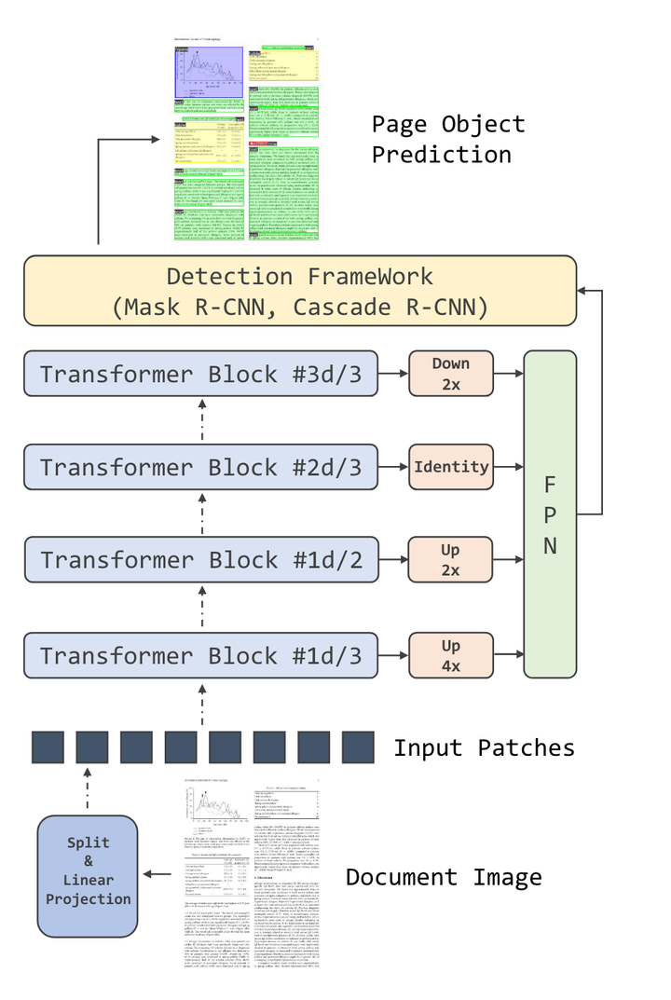
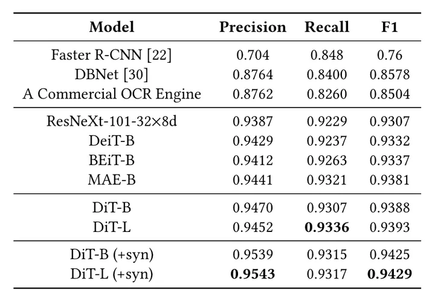

# 文档AI-DiT：文档图像Transformer的自监督预训练(2022)

# 摘要

Image Transformer最近在自然图像理解方面取得了重大进展，无论是使用监督（ViT、DeiT等）还是自监督（BEiT、MAE等）
预训练技术。在本文中，提出了DiT，这是一种自监督的预训练文档图像Transformer模型，使用大规模未标记文本图像来执行文档AI任务，
这是至关重要的，因为由于缺少人类标记的文档图像，因此从未存在过受监督的副本。利用DiT作为各种基于视觉的文档AI任务的骨干网络，
包括文档图像分类、文档布局分析、表格检测以及OCR文本检测。实验结果表明，自监督预训练DiT模型在这些下游任务上取得了最新的结果，
例如文档图像分类（91.11→ 92.69）、文档布局分析（91.0→ 94.9）、表格检测（94.23→ 96.55）和OCR文本检测（93.07→ 94.29）。

# 1. 介绍

图1：具有不同布局和格式的视觉丰富的业务文档，用于预训练DiT

论文提出了DiT，这是一种用于一般文档AI任务的自监督预训练文档图像Transformer模型，它不依赖任何人类标记的文档图像。
受最近提出的BEiT模型的启发，论文采用了使用文档图像的类似预训练策略。首先将输入文本图像的大小调整为224×224，
然后将图像分割为16×16块的序列，作为图像Transformer的输入。不同于BEiT模型，其中视觉标记来自DALL-E中的离散VAE，
论文用大规模文档图像重新训练离散VAE（dVAE）模型，以便生成的视觉标记与文档AI任务更相关。预训练的目标是使用BEiT中
的掩码图像模型（MIM）基于损坏的输入文档图像从dVAE中恢复视觉标记。通过这种方式，DiT模型不依赖于任何人类标记的文档图像，
而仅利用大规模的未标记数据来学习每个文档图像中的全局图像块关系。论文在四个公开可用的文档AI基准上评估了预训练的DiT模型，
包括用于文档图像分类的RVL-CDIP数据集、用于文档布局分析的PubLayNet数据集、用于表检测的ICDAR 2019 
cTDaR数据集以及用于OCR文本检测的FUNSD数据集。实验结果表明，预训练的DiT模型优于现有的监督和自监督的预训练模型，
并在这些任务上实现了新的最先进水平。

# 2. 文档图像Transformer
## 2.1 模型架构

图2:MIM预训练的DiT模型体系结构
继ViT之后，我们使用vanilla Transformer架构作为DiT的主干。将文档图像划分为不重叠的图像块，
并获得图像块嵌入序列。在添加1d位置嵌入之后，这些图像块被传递到具有多头注意力的Transformer块的堆栈中。
最后，将Transformer编码器的输出作为图像块的表示，如图2所示。

## 2.2 预训练

受BEiT的启发，论文使用掩码图像模型（MIM）作为预训练目标。在此过程中，图像分别在两个视图中
表示为图像块和视觉标记（visual tokens）。在预训练期间，DiT接受图像块作为输入，并使用输出表示预测视觉标记。

像自然语言中的文本标记一样，图像可以表示为由图像标记器获得的离散标记序列。BEiT使用DALLE的离散变
分自编码器（dVAE）作为图像标记器，该标记器在包括4亿张图像的大型数据集上进行训练。然而，
自然图像和文档图像之间存在域不匹配，这使得DALL-E标记器不适用于文档图像。因此，
为了获得文档图像域的更好的离散视觉标记，我们在IIT-CDIP数据集上训练了一个dVAE，该数据集包括4200万个文档图像。

为了有效地预训练DiT模型，在给定图像块序列的情况下，使用特殊词元[mask]随机掩码输入子集。
DiT编码器通过添加位置嵌入的线性投影嵌入掩码的图像块序列，然后使用Transformer块堆栈。
需要该模型来预测视觉标记的索引以及来自掩码位置的输出。掩码图像模型任务要求模型预测图像
标记器获得的离散视觉标记，而不是预测原始像素。

## 2.3 微调

论文根据四个文档AI基准对模型进行了微调，包括用于文档图像分类的RVL-CDIP数据集、
用于文档布局分析的PubLayNet数据集、表检测的ICDAR 2019 cTDaR数据集和用于文本检测的FUNSD数据集。
这些基准数据集可以形式化为两个常见任务：图像分类和目标检测。

图像分类。对于图像分类，使用平均池化来聚合图像块的表示。接下来，将全局表示传递到一个简单的线性分类器中。

图3：在不同的检测框架中将DiT作为主干网络的示例
目标检测。对于目标检测，如图3所示，利用Mask R-CNN和Cascade R-CNN作为检测框架，并使用基于ViT的模型作为主干。
论文的代码是基于Detectron2实现的。论文在四个不同的Transformer块处使用分辨率修改模块，以使单尺度ViT适应多尺度FPN。
设置 是块的总数，1 /3th 使用具有2步长2×2转置卷积的模块上采样到 4×。对于1 /2th，使用单步2×2转置卷积上采样到2×。
输出2 /3th块无需额外的操作。最后，3 /3th的输出使用步长2 2x2 最大池化降采样到2×。

# 3. 实验

## 3.1 任务

RVL-CDIP。RVL-CDIP数据集由16个类别的400000张灰度图像组成，每个类别25000张。
有320000张训练图像、40000张验证图像和40000张测试图像。这16门课包括{信件、表格、电子邮件、
手写、广告、科学报告、科学出版物、说明书、文件夹、新闻文章、预算、发票、演示、问卷、简历、备忘录}。评估指标是总体分类精度。

PubLayNet。PubLayNet是一个大型文档布局分析数据集。通过自动解析PubMed XML文件构建了超过360000个文档图像。
生成的注释涵盖了典型的文档布局元素，如文本、标题、列表、图形和表格。模型需要检测指定元素的区域。
论文使用边界框的分类和总体平均精度（MAP）@intersection over union（IOU）[0.50:0.95]作为评估度量。

ICDAR 2019 cTDaR。cTDaR数据集由两个轨道组成，包括表检测和表结构识别。在本文中，论文将重点放在跟踪A上，
其中提供了带有一个或多个表注释的文档图像。此数据集有两个子集，一个子集用于存档文档，另一个子集则用于现代文档。
档案子集包括600张训练图像和199张测试图像，其中显示了各种表格，其中包括手绘会计账簿、股票交易清单、火车时刻表、
生产普查等。现代子集由600张训练图像和240张测试图像组成，其中包含不同类型的PDF文件，如科学期刊、表格、财务报表等。
数据集包含各种格式的中文和英文文档，包括扫描文档图像和born数字格式。评估这项任务的指标是精度、召回率和F1-score，
这些分数是根据模型的排名输出以及不同的Intersection over Union (IoU) 阈值计算得出的。计算IoU阈值分别为
0.6、0.7、0.8和0.9的值，并将其合并为最终加权F1-score：

这项任务进一步要求模型将现代和档案集结合为一个整体，以获得最终的评估结果。

FUNSD。FUNSD是一个有噪声的扫描文档数据集，标记了三项任务：文本检测、光学字符识别（OCR）
文本识别和表单理解。在本文中，关注FUNSD中的任务#1，该任务旨在检测扫描表单文档的文本边界框。
FUNSD包括199个完全注释的表单，包含31485个单词，而训练集包含150个表单，测试集包含49个表单。
评估指标是精度、召回率和F1-score IoU@0.5。

## 3.2 设置

预训练设置。在IIT-CDIP测试集合1.0上对DiT进行了预训练。通过将多页文档拆分为单页来预处理数据集，
并获得4200万张文档图像。还引入了随机调整大小的裁剪，以在训练期间增加训练数据。论文使用与ViT基础相同的架构来训练DiT-B模型：
一个具有768个隐藏尺寸的12层Transformer，以及12个注意力头。前馈网络的中间大小为3072。更大的版本DiT-L也使用24层、
1024个隐藏大小和16个注意力头进行训练。前馈网络的中间大小为4096。

dVAE Tokenizer。BEiT借用了DALL-E训练的图像标记器，它与文档图像数据不一致。在这种情况下，
论文充分利用IIT-CDIP数据集中的4200万个文档图像，并训练文档dVAE图像标记器以获得可视标记。
与DALL-E图像标记器一样，文档图像标记器具有8192的码本维度和具有三层的图像编码器。每个层由步幅为2的2D卷积和ResNet块组成。
因此，标记化器最终具有8的下采样因子。在这种情况下，给定一个112×112的图像，其结果是一个14×14的离散token映射，
与14×14输入patches对齐。

图4：使用不同标记器的文档图像重建。从左到右：原始文档图像，使用自训练的dVAE标记器进行图像重建，使用DALL-E标记器进行的图像重建

论文从开源DALL-E实现中实现了dVAE代码库，并使用包含4200万个文档图像的整个IITCIP数据集训练dVAE模型。
使用MSE损失和困惑损失的组合来训练新的dVAE标记器，以重建输入图像，并增加量化码本表示的使用。
输入图像大小为224×224，以5e-4的学习速率和1e-10的最低温度训练标记器3个epochs。通过重建来自下游任务的文档图像样本，
将dVAE标记器与原始DALL-E标记器进行了比较，如图4所示。论文从文档布局分析数据集PubLayNet和表检测数据集ICDAR 
2019CTDaR中对图像进行了采样。在DALLE和我们的标记器重建后，DALL-E的图像标记器很难区分线和标记的边界，
但论文的dVAE的图像标记更接近原始图像，边界更清晰。更好的标记器可以生成更准确的标记，更好地描述原始图像。

配备了预训练数据和图像标记器，对DiT进行了500K步预训练，批次大小为2048，学习率为1e-3，预热步数为10K，
权重衰减为0.05， 1和 2分别为0.9和0.999。采用随机深度0.1比率，如BEiT预训练中那样不使用dropout。
论文还在DiT的预训练中应用分块掩码，40%的patches被掩码。

微调RVL-CDIP。在RVL-CDIP上评估预训练的DiT模型和其他图像主干，以用于文档图像分类。对90个epochs的图像Transformer进行微调，
批次大小为128，学习率为1e-3。对于所有设置，使用RandomResizedCrop操作将原始图像调整为224×224。

对ICDAR 2019 cTDaR进行微调。论文评估了ICDAR 2019数据集上预训练的DiT模型和其他图像主干，用于表检测。
由于目标检测任务的图像分辨率远大于分类，将批次大小限制为16。存档和现代子集的学习率分别为1e-4和5e-5。
在初步实验中，论文发现，当微调DiT时，直接使用档案子集中的原始图像会导致性能不佳，因此应用OpenCV实现的自适应图像二
值化算法对图像进行二值化。预处理的示例如图5所示。在训练期间，将DETR中使用的数据增强方法作为多尺度训练策略。
具体地，以概率0.5将输入图像裁剪为随机矩形图像块，然后再次调整其大小，使得最短边至少为480像素，
最多为800像素，而最长边最多为1333像素。

FUNSD上的微调。论文使用相同的对象检测框架来微调预训练的DiT模型和FUNSD中文本检测任务的其他骨干。
在文档布局分析和表检测中，在检测过程中使用锚框大小[32，64，128，256，512]，因为检测到的区域通常是段落级别的。
与文档布局分析不同，文本检测旨在定位文档图像中单词级别的较小对象。因此，在检测过程中使用锚框尺寸[4、8、16、32、64]。
批次大小设置为16，学习率对于基本模型为1e-4，对于大模型为5e-5。

与论文的DiT-B相比，选择作为基线的图像主干模型具有相当数量的参数。它们包括以下两种：CNN和图像Transformer。
对于基于CNN的模型，选择ResNext101-32×8d。对于图像Transformer，选择了DeiT、BEiT和MAE的基础版本，
它们在ImageNet-1K数据集上进行了预训练，输入大小为224×224。重新运行所有基线的微调。

## 3.3 结果

表1:RVLCDIP上的文档图像分类精度（%），其中所有模型使用224×224分辨率的纯图像信息（不含文本信息）

RVL-CDIP。RVLCDIP上的文档图像分类结果如表1所示。为了进行公平比较，表中的方法仅使用数据集中的图像信息。DiT-B
的性能明显优于所有选定的单一模型基线。由于DiT与其他图像Transformer基线共享相同的模型结构，较高的分数表明文档特定预
训练策略的有效性。更大的版本DiT-L在单一模型设置下获得了与之前的SOTA集成模型相当的分数，这进一步突出了其在文档图像上的建模能力。

表2:PubLayNet验证集上的文档布局分析mAP@IOU[0.50:0.95]。ResNext-101-32×8d简称为ResNext，Cascade简称为C

PubLayNet。PubLayNet上的文档布局分析结果如表2所示。由于该任务具有大量训练和测试样本，并且需要对常见文档元素进行全面分析，
因此它清楚地展示了不同图像Transformer模型的学习能力。据观察，DeiT-B、BEiT-B和MAE-B明显优于ResNeXt-101，
并且DiT-B甚至比这些强大的图像Transformer基线更强。根据结果，改进主要来自列表和图类别，并且在DiT-B的基础上，
DiT-L给出了高得多的mAP分数。论文还研究了不同对象检测算法的影响，结果表明，更先进的检测算法（Cascade R-CNN）
可以将模型性能提升到更高的水平。论文还将Cascade R-CNN应用于ResNeXt-101-32×8d基线，DiT在基础和大型
设置中分别超过其1%和1.4%的绝对分数，表明DiT在不同检测框架上的优势。

表3：ICDAR 2019 cTDaR的表格检测精度（F1）

ICDAR 2019 cTDaR。ICDAR 2019 cTDaR数据集的表检测结果如表3所示。该数据集的大小相对较小，
因此它旨在评估低资源场景下模型的few-shot学习能力。论文首先分别分析了存档和现代子集上的模型性能。
在表3b中，DiT超过了除存档子集的BEiT之外的所有基线。这是因为在BEiT的预训练中，它直接使用DALL-E dVAE，
它在具有400M个不同颜色图像的超大数据集上训练。而对于DiT，图像标记器使用灰度图像进行训练，这可能不足以用于具有颜色的历史文档图像。
当从Mask R-CNN切换到Cascade R-CNN时，也观察到了类似于PubLayNet设置的改进，并且DiT仍然显著优于其他基线。
结论与表3c中现代子集的结果相似。进一步将两个子集的预测组合成一个集合。3a中的结果显示，DiT-L在所有Mask 
R-CNN方法中获得了最高的wF1分数，证明了DiT在不同类别文档下的通用性。值得注意的是IoU@0.9这意味着DiT
具有更好的细粒度对象检测能力。在所有三种设置下，论文将SOTA结果提高了2%以上（94.23→96.55）的绝对wF1分数。

表4：文本检测精度(IoU@0.5)在FUNSD任务#1中，Mask R-CNN与不同主干（ResNeXt、DeiT、BEiT、MAE和DiT）
一起使用。“+syn”表示DiT使用包含1M文档图像的合成数据集进行训练，然后使用FUNSD训练数据进行微调

FUNSD（文本检测）。FUNSD数据集上的文本检测结果如表4所示。由于OCR的文本检测一直是一个长期存在的现实问题，
从一个流行的商业OCR引擎获得了单词级文本检测结果，以设置高级基线。此外，DBNet是在线OCR引擎广泛使用的文本检测模型，
还使用FUNSD训练数据微调预训练的DBNet模型，并评估其准确性。两人在F1比赛中的得分都在0.85分左右IoU@0.5.接下来，
使用Mask R-CNN框架来比较不同的骨干网络（CNN和ViT），包括ResNeXt-101、DeiT、BEiT、MAE和DiT。结果表明，
由于先进的模型设计和更多的参数，基于CNN和基于ViT的文本检测模型显著优于基线。论文还观察到，与其他模型相比，
DiT模型获得了新的SOTA结果。最后，使用包含100万张文档图像的合成数据集进一步训练DiT模型，从而通过DiT-L模型实现0.9429的F1。

# 参考

[1] 文档AI-DiT：文档图像Transformer的自监督预训练(2022)，https://zhuanlan.zhihu.com/p/588154808