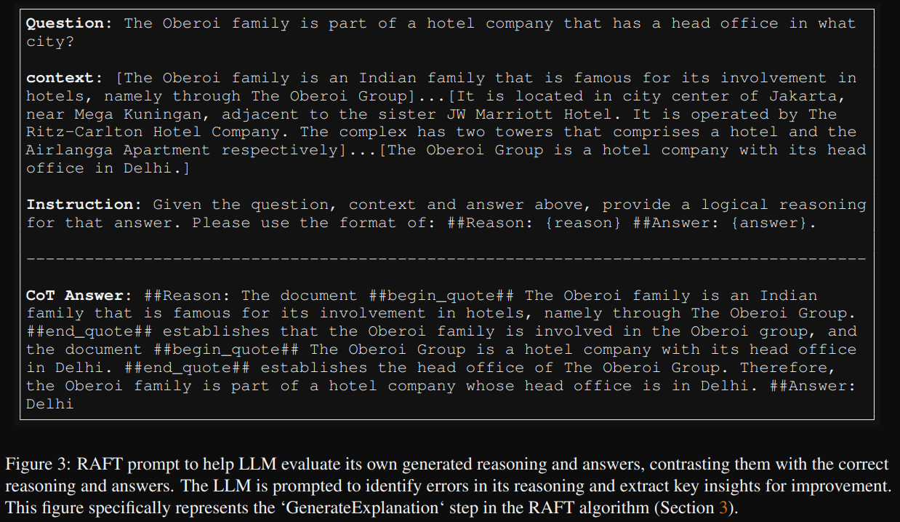
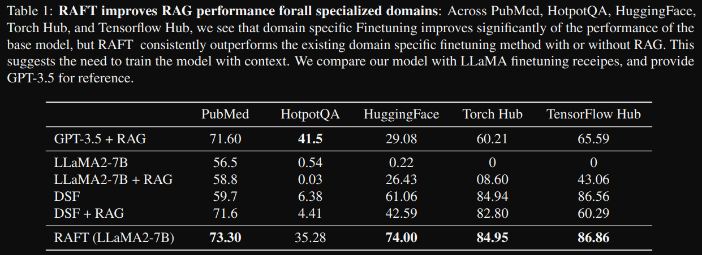
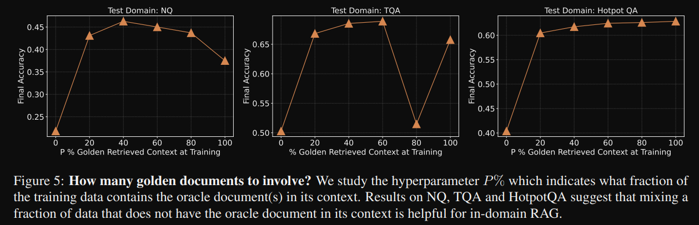

# 1. 简介

RAFT: Adapting Language Model to Domain Specific RAG
- https://arxiv.org/pdf/2403.10131.pdf
- （Github 9.3k stars）https://github.com/ShishirPatil/gorilla/tree/main/raft

# 2. 问题分析

提出了检索增强微调（RAFT），这是一种训练方法，可以提高模型在“开卷”的特定领域环境中回答问题的能力。
如何最好地为考试做准备？(a) 基于微调的方法通过直接“记忆”输入文档或在不引用文档的情况下回答练习QA来实现“学习”。
(b) 另一方面，上下文检索方法未能利用固定领域所提供的学习机会，等同于在没有学习的情况下参加开卷考试。
虽然这些方法利用了领域内的学习，但它们未能为开卷考试做好准备。相比之下，(c) RAFT在模拟的不完美检索环境中引用文档，
同时利用问题-答案对进行微调——从而有效地为开卷考试设置做好了

# 3. 原理

# 3.1 方案架构

一句话：按照RAG方式训，相关文档+无关文档-->给出答案

RAFT通过结合检索增强生成（RAG）和监督式微调（SFT），训练模型忽略那些对回答问题没有帮助的文档（称为干扰文档），并引用相关文档中正确的序列来回答问题。这种方法还包括链式思维（Chain-of-Thought）风格的响应，以增强模型的推理能力。
RAFT的核心思想是在训练数据中包含问题（Q）、一组文档（Dk）和从其中一个文档（D*）生成的答案（A*），其中区分了Golden文档（包含答案的文档）和干扰文档。在训练过程中，模型被训练以在存在干扰文档的情况下，从提供的文档和问题中生成答案。RAFT的训练方法不仅使模型能够通过微调学习特定领域的知识，还确保了对不准确检索的鲁棒性。
RAFT方法概述，左上角的图表展示了提出的方法，即让大型语言模型（LLMs）适应从一组正面和负面文档中阅读解决方案，这与标准的RAG设置形成对比，在标准的RAG设置中，模型是基于检索器的输出进行训练的，这种输出是记忆和阅读的混合体。在测试时，所有方法都遵循标准的RAG设置，提供上下文中检索到的前k个文档。

# 3.2 数据构建

参考文档中一定比例包含文档，一定比例不包含相关文档，这样训练模型忽略对回答问题没有帮助的文档（干扰文档）

 incorporating
a portion of the training data without the oracle document
in the context (P = 80%) appears to enhance the model’s
performance on RAG tasks

* P % of data: Q + D∗ + D2 + . . . + Dk → A∗
* (1 − P) % of data: Q + D1 + D2 + . . . + Dk → A∗
 
we demonstrate that creating a full reasoning chain and in
addition, clearly citing sources enhances the model’s accuracy in answering questions

D∗ + 3D and it is D∗ + 1D documents with Hotpot QA

通过LLM合成推理过程

# 4. 实验结果

# 4.1 性能
实验结果表明，RAFT在PubMed、HotpotQA和Gorilla数据集上的性能一致优于监督式微调模型，无论是使用RAG还是没有使用RAG。

和domain-specifically fine-tuned (DSF)对比

# 4.2 消融实验

COT对性能影响

无关相关文档比例影响

无关相关文档数量比例影响

# 参考

[1] RAFT: Adapting Language Model to Domain Specific RAG, https://arxiv.org/pdf/2403.10131.pdf
[2] RAFT：一种适应特定领域RAG的大模型训练新方法！，https://mp.weixin.qq.com/s/lCUFx8XGTBqvR4kKvNDnXg