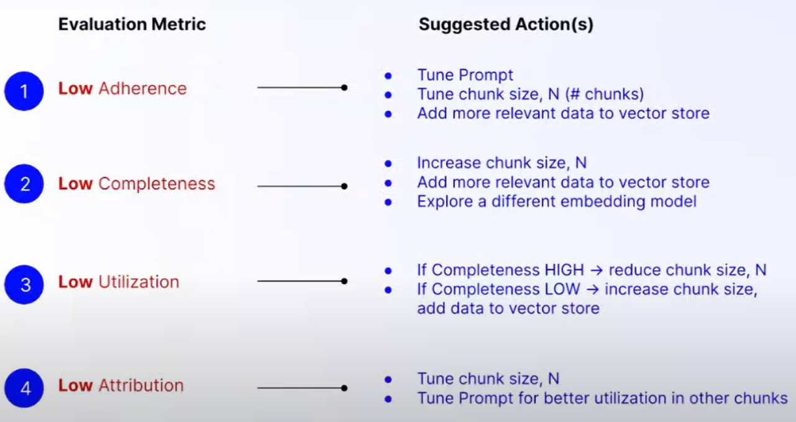

# 1. 简介

- 视频教程：https://www.youtube.com/watch?v=njN_Wu8dLfE
- Galileo使用文档：https://docs.rungalileo.io/galileo/how-to-and-faq/ml-research-algorithms/rag-quality-metrics?utm_campaign=Events%20Follow%20Up&utm_medium=email&_hsmi=295299158&_hsenc=p2ANqtz-9vAP1eVx_ySiAnAyzgvCMN-Q5E_eeMA5XyUh5nEQRdZE_RbN1a1hRqbui1sSNVxbzXJfIaNG-clqNY7M1Epr5l4qMKEQ&utm_content=295299158&utm_source=hs_email
- 论文介绍：https://www.rungalileo.io/blog/chainpoll?utm_campaign=Events%20Follow%20Up&utm_medium=email&_hsmi=295299158&_hsenc=p2ANqtz-8-24T6KuN3n5y6kk6eFY1lLMjUQdzbrIxX2F5TTATdwHBt-1sR6LWKv0IamShi6nMAnR75TAy5DFa4NrhpdSenMe8t0A&utm_content=295299158&utm_source=hs_email
- 论文：Chainpoll: A high efficacy method for LLM hallucination detection：https://arxiv.org/abs/2310.18344
- Galileo提供可视化的RAG质量评估工具，用于评估RAG模型的质量。

# 2. 原理

训练专用的模型用于评估，相比使用GPT-4评估，评估质量和成本都有所提升。

评估指标

- Context Adherence
- Completeness
- Chunk Atribution
- Chunk Utilization

基于指标的改进建议

