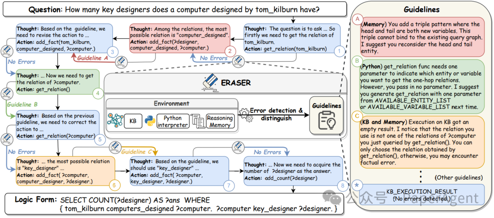
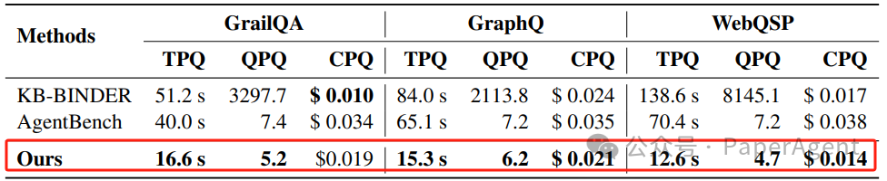

# 1. 简介

QueryAgent: A Reliable and Efficient Reasoning Framework with Environmental Feedback based Self-Correction 
https://arxiv.org/pdf/2403.11886.pdf
https://github.com/cdhx/QueryAgent

# 2. 问题

大型语言模型（LLMs）在知识库问答（KBQA）任务中的应用，尤其是在处理结构化数据时的推理能力。尽管LLMs在多项任务上表现出色，但在可靠性和效率方面仍有不足，特别是在遇到幻觉（hallucinations）时。现有的方法，如基于上下文学习（ICL）和基于Agent的系统，要么缺乏可解释性，容易出错，要么在迭代过程中容易累积错误，导致性能不佳。

QueryAgent与采用大型语言模型（LLMs）的两种主流知识库问答（KBQA）范式相比较

为了解决上述挑战，提出了一个名为QueryAgent的框架，该框架将KBQA建模为一个多轮生成任务，通过工具逐步构建目标查询，并执行逐步自我修正。QueryAgent的核心是ERASER（EnviRonmental feedbAck SElfcoRrection），这是一种基于环境反馈的自我修正方法。ERASER利用中间步骤中的环境反馈（例如，知识库执行结果、Python解释器执行状态、先前推理记忆）来检测错误，并根据反馈提供潜在错误原因和一般性修正指导。这种方法与传统的自我修正方法不同，它不是无目的地修正每个生成结果，而是根据丰富的环境反馈主动识别和区分各种错误，并为不同错误类型提供定制化的指导。
一个QueryAgent和ERASER的例子。在每一步中，大型语言模型（LLM）根据之前的步骤生成思考和行动。基于行动的执行状态（知识库和Python）以及推理记忆，ERASER检测是否存在错误。如果没有检测到错误，这一步的观察结果是在知识库上的执行结果。否则，观察结果将是相应的指导方针。

在多个KBQA数据集上对QueryAgent和ERASER进行了广泛的实验评估。结果表明，QueryAgent在使用单一示例的情况下，显著优于所有以前的少样本方法，特别是在GrailQA和GraphQ数据集上。此外，QueryAgent在效率方面也表现出色，与ICL-based方法相比，减少了运行时间和查询开销，与基于代理的方法相比，减少了API调用成本和运行时间。通过将ERASER应用于另一个基线系统（AgentBench），进一步证明了ERASER的可迁移性，显著提高了性能。
在GrailQA、GraphQ、WebQSP和MetaQA-3Hop上的整体结果。所有数据集都通过F1分数进行评估。对于少样本设置，Pangu对所有数据集使用100-shot。KB-BINDER和KB-Coder对GrailQA使用40-shot，对GraphQ和WebQSP使用100-shot。KB-BINDER对MetaQA-3Hop使用5-shot。

与KB-BINDER和AgentBench的效率比较。TPQ、QPQ和CPQ分别代表每个问题的时间成本、SPARQL查询次数和gpt-3.5-turbo调用成本。

# 参考

[1] 微软QueryAgent：通过逐步解决问题并利用环境反馈进行自我修正的KBQA框架，https://mp.weixin.qq.com/s?__biz=Mzk0MTYzMzMxMA==&mid=2247485274&idx=1&sn=0966670bcf6874ed863ad96950357f30&chksm=c2ce3d2bf5b9b43dfb6f26245489ab4400a8fffc3656f65ca15e68231a5be7cc6aff5127567d&cur_album_id=3256352785986404355&scene=189#wechat_redirect