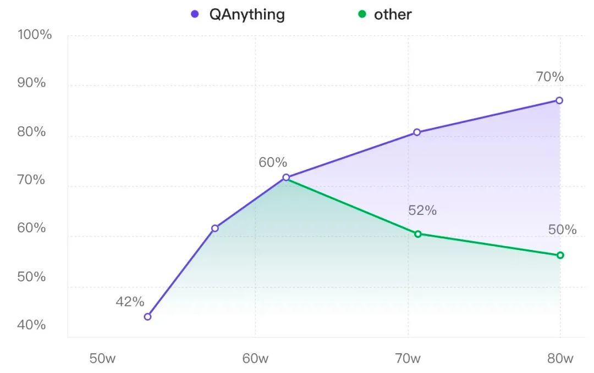

# 1. 简介

开源了有道自研的RAG（Retrieval Augmented Generation) 引擎QAnything。
该引擎允许用户上传PDF、图片、Word、Excel、PowerPoint等多种格式的文档，并实现类似于ChatGPT的互动问答功能，
其中每个答案都能精确追溯到相应的文档段落来源。QAnything 支持纯本地部署，上传文档数量无上限，问答准确率高。

AnythingLLM
- Github (7.9k Stars): https://github.com/Mintplex-Labs/anything-llm
- Demo and Official Website: https://useanything.com/
- 对应产品：有道速读(https://read.youdao.com)
- 主要注重UI设计和交互体验、数据管理
- 提供托管服务

# 2. 原理

## 2.1 架构

开源包括了模型和系统等所有必要的模块。模型方面包括ocr解析、embedding/rerank，以及大模型。系统方面包括向量数据库、
mysql数据库、前端、后端等必要的模块。整个引擎的功能完整，用户可以直接下载，不需要再搭配其他的模块即可使用。
系统可扩展性也非常好，只要硬盘内存足够，就可以一直建库，支持无上限的文档。

系统的工作流程主要包含三个环节：

- 索引（indexing）：文本索引的构建包括以下步骤：文档解析、文本分块、Embedding向量化和创建索引。
    先将不同格式的原始文件解析转换为纯文本，再把文本切分成较小的文本块。通过Embedding为每一个文本块生成一个向量表示，
    用于计算文本向量和问题向量之间的相似度。创建索引将原始文本块和Embedding向量以键值对的形式存储，以便将来进行快速和频繁的搜索。

- 检索（Retrieval）：使用Embedding模型将用户输入问题转换为向量，计算问题的Embedding向量和
  语料库中文本块Embedding向量之间的相似度，选择相似度最高的前K个文档块作为当前问题的增强上下文信息。

- 生成（Generation）：将检索得到的前K个文本块和用户问题一起送进大模型，让大模型基于给定的文本块来回答用户的问题。

## 2.2 BCEMBEDDING模型

在我们的业务场景下，外部的embedding效果并不如宣传的那么好。openai的embedding接口除了效果不好外，还很慢。
很多开源的embedding模型在mteb等地方刷傍刷的很高，但是那些刷榜的分值并不完全能反映真实的效果。第三，我们业务场景有很多混合语言的情况，
比如库里面放的是英文的文档，用户用中文去问答。这种跨语种的能力，现有模型支持不好。第四，单纯的embedding在检索排序上天花板比较低，
所以我们在embedding的基础上又做了rerank，共享同样的底座，head不一样。

在我们的场景下(客服问答以及一些toB客户的场景），openai的ada2 embedding的检索准确率只有60%，
而经过训练的bcembedding检索准确率可以达到95%。

总的来讲有两个特色：

- 中英双语和跨语种能力   
  我们收集开源数据集（包括摘要、翻译、语义改写、问答等），来实现模型通用的基础语义表征能力。
  为了实现一个模型就可以实现中英双语、跨语种的检索任务，我们依赖网易有道多年积累的强大的翻译引擎，对数据进行处理，
  获得中英双语和跨语种数据集。实现一个模型就可以完成双语和跨语种任务。
- 多领域覆盖  
   我们分析现有市面上常见或可能的应用场景，收集了包括：教育、医疗、法律、金融、百科、科研论文、客服(faq)、
   通用QA等场景的语料，使得模型可以覆盖尽可能多的应用场景。同样的依靠网易有道翻译引擎，获得多领域覆盖的中英双语和跨语种数据集。
   实现一个模型就可以支持多业务场景，用户可以开箱即用。

我们在训练的过程中，发现一个有意思的现象，数据标签的构建对模型的效果影响非常大。相信大家一定听过“难例挖掘”的概念，
在机器学习中模型性能上不去时候，经常是因为一些例子比较难，模型训练时候见的比较少，多挖掘一些难例给模型，就能够提升模型的性能。
但是在embedding训练的时候，我们发现难例挖掘反而会降低模型的性能。我们猜测原因是embedding模型本身的能力有限，不应该给过难的任务。
我们想要让模型做多领域覆盖，多语种、跨语种覆盖（还要覆盖代码检索和工具检索），这已经给Embedding增加很多负担了，
应该想想怎么给Embedding“减负”。

因为Embedding模型是dual-encoder，query和passage在“离线”地语义向量提取时没有信息交互，全靠模型将query和passages
“硬”编码到语义空间中，再去语义检索。而rerank的阶段，cross-encoder可以充分交互query和passage信息，潜力大的多。
所以我们定了目标，embedding尽可能提高召回，rerank尽可能提高精度。

我们在Embedding模型训练中，不使用难负样例挖掘，只在Reranker中使用。以下是我们的几点看法，供参考。
1. 我们在训练Embedding模型时发现，过难的负样本对模型训练有损害，训练过程中会使模型“困惑”，影响模型最终性能[19]。
    Embedding模型算法本身性能上限有限，很多难负样本只有细微差异，“相似”程度很高。就像让一个小学生强行去学习微积分，这种数据对Embedding训练是“有毒”的。
2. 在大量的语料库中，没有人工校验的自动化难负样例挖掘，难免会“挖到正例”。语料库很大，里面经常会混有正例，
   利用已有Embedding模型去挖掘正例，经常会挖到正例，毒害模型训练。应该有不少调参工程师有这种惨痛经历。
3. 其实所谓的“正例”和“难负样例”应该是根据你业务的定义来的。RAG场景下，之前人们认为的难负样例可能就成为了正例。
   比如要回答“小明喜欢吃苹果吗？”，RAG场景下召回“小明喜欢吃苹果”和“小明不喜欢吃苹果”都是符合目标的，
   而学术定义的语义相似这两句话又是难负样例。

所以回归我们业务目标和好检索器的“评判标准”，Embedding模型应该能尽量召回相关片段，不要将精排Reranker要干的事强压在Embedding身上，
“越俎代庖”终究会害了它。

## 2.3 检索排序效果

评测方式：
- LlamaIndex博客对市面上常用的embedding和reranker模型进行RAG流程的评测，吸引广泛关注。
- https://blog.llamaindex.ai/boosting-rag-picking-the-best-embedding-reranker-models-42d079022e83
- 评测只使用了llama v2（https://arxiv.org/abs/2307.09288） 
  这一篇英文论文来进行评测的，所以该评测是在纯英文、限定语种（英文）、限定领域（人工智能）场景下进行的。

LlamaIndex博客评测复刻

如上表所示，

- 在没有Reranker模块的设置下，bce-embedding-base_v1显著优于其他常见的开源和闭源英文embedding模型。
- 在相同reranker配置下（竖排对比），bce-embedding-base_v1也都是优于其他开源、闭源embedding模型。
- 在相同的embedding配置下（横排对比），利用reranker模型可以显著提升检索效果，印证前面所述二阶段检索的优势。bce-reranker-base_v1比其他常见的开源、闭源reranker模型具备更好的精排能力。

综上，bce-embedding-base_v1和bce-reranker-base_v1的组合可以实现最好的效果。

LlamaIndex博客评测有些局限，为了兼容更真实更广的用户使用场景，评测算法模型的 领域泛化性，双语和跨语种能力，
我们按照该博客的方法构建了一个多领域（计算机科学，物理学，生物学，经济学，数学，量化金融等领域）
的中英双语种和中英跨语种评测数据，CrosslingualMultiDomainsDataset
（https://huggingface.co/datasets/maidalun1020/CrosslingualMultiDomainsDataset）。

多领域、多语种和跨语种RAG评测

我们针对市面上最强的常用开源、闭源embedding和reranker模型，进行系统性评测分析，结果如上图所示。

- 竖排对比，bce-embedding-base_v1的表现和之前一样，具备很好的效果，语种支持和领域覆盖都很不错。
  最新的openai-embed-3和bge-m3表现出顽强的性能，具备良好的多语种和跨语种能力，具备良好的领域泛化性。
  Cohere和e5的多语种embedding模型同样表现出不错的效果。而其他单语种embedding模型表现却不尽如人意
  （JinaAI-v2-Base-zh和bge-large-zh-v1.5稍好一些）。
- 横排对比，reranker模块可以显著改善检索效果。其中CohereRerank和bge-reranker-large效果相当，
  bce-reranker-base_v1具备比前二者更好的精排能力。

综上，bce-embedding-base_v1和bce-reranker-base_v1的组合可以实现最好的检索效果（93.46/77.02），
比其他开源闭源最好组合（bge-m3-large+bge-reranker-large， 89.94/70.17），hit rate提升3.53%，mrr提升6.85%。

# 3. Rerank

QAnything在知识库的数据越多，准确率越高。而一般搭建的RAG，如果没有rerank这一环节，在数据输入多了以后，效果反而下降了。

我们在做升学问答的时候，遇到一个有趣的现象：
我们分批往RAG知识库中灌入数据，每加一批数据都做一次评测，观察随着数据量变大，问答效果的变化情况：
- baseline：第一批数据加入后问答正确率有42.6%，此时有一些问题没回答上来是因为确实缺少相关资料。我们继续加数据…
- 迎来上涨：第二批加了更多数据，覆盖知识范围更广。准确率提升到了60.2%，提升非常明显，看来加数据确实还是挺有用的。
- 坏消息：当加入第三批数据的时候，我们最担心的事情还是发生了。正确率急剧下降，跌了将近8个百分点。

这个现象在最近的一篇论文：The Power of Noise: Redefining Retrieval for RAG Systems （arXiv:2401.14887v2）
也有一些解释，对于RAG系统，如果喂给大模型的输入是相近容易混淆的话，对正确性的影响是最大的。

以我们遇到的一个case为例，大连医科大学怎么样？这个问题在v2版本（加入第三批数据前）是能回答对的，v3版本（加入第三批数据后）
回答错了。看了一下送到LLM的文本片段，居然全部都是大连理工大学相关的信息。

主要原因是第三批加入的某些文档中恰好有 "大连理工大学xxx怎么样？" 的句子，和query "大连医科大学怎么样？" 
表面上看起来确实非常像，Embedding给它打了比较高的分。

而类似大连医科大学师资介绍这样的片段相关性就稍微低了些。LLM输入token有限制，前面两个最相关但是实际并不能回答query
问题的片段就已经占满了token的窗口，只能把他俩送进LLM里。结果可想而知，啥都不知道。

文本片段与query的相似性和文本片段是否包含query的答案（相关性）是两回事。RAG中一个非常重要的矛盾点在于检索召回的片段比较多，
但是LLM输入token是有限制，所以必须把能回答query问题的片段（和问题最相关）给LLM。
 
Embedding 可以给出一个得分，但是这个得分描述的更多的是相似性。Embedding本质上是一个双编码器，两个文本在模型内部没有任何信息交互。
只在最后计算两个向量的余弦相似度时才进行唯一一次交互。所以Embedding检索只能把最相似的文本片段给你，
没有能力来判断候选文本和query之间的相关性。但是相似又不等于相关。
 
如下图所示，从某种程度上，Embedding其实就是在算两个文本块中相似字符的个数占比，它分不清query中的重点是大连医科大学，
在它看来每个字符的重要性都是一样的。感兴趣的话可以计算一下下图中红字部分的占比，和最后余弦相似度的得分基本是吻合的。

# 参考

[1] 有道QAnything背后的故事---关于RAG的一点经验分享，https://mp.weixin.qq.com/s/R2hoszQDMAS0ibChNAxOcQ