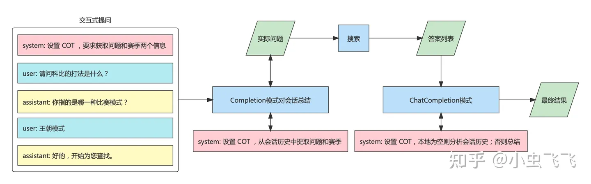

# 1. 方案简介


LLM。主要功能有以下几点：

- 完成对用户问题的预处理。纠正语法错误，提取关键点，通过交互方式引导用户补充问题足够多的信息等。
- 对本地搜索系统的原始答案进行二次处理。比如内容过多，可以进行概括；也可以进行简单推理。
- 提供上下文交互的能力。一个常见的例子是 “比较”，比如游戏中贩售道具，倚天剑和屠龙刀。
  原始知识系统只会提供两件兵器的基础属性，但不会提供各属性的对比和总体评价。提问的过程可以是：

不同检索方法：

本地搜索系统。解决查询匹配的问题，在Search: Query Matching via Lexical, Graph,
and Embedding Methods 一文中介绍了三种基本方式：
- Lexical-based search。通过归一化、拼写纠错、扩展、翻译等方式对查询请求中的词进行替换。
  性能好、可控性强，尽管存在一些语义鸿沟问题，但仍被广泛的应用在现有的搜索引擎架构中。
- Graph-based search。以图的形式描述知识点以及相互间的关系，然后通过图搜索算法寻找与查询请求匹配的结果。
- Embedding-based search。将文字形式的查询请求，编码为数值向量的形式，体现潜在的关系。该文介绍了 Word Embedding 的一些技术实现。


落地方案示意图：Redis 实现嵌入向量匹配，ChatGPT 实现自然语言处理

说明如下：

1. 使用 OpenAI 的 Embedding 接口将专业领域知识转化为向量，连同原始材料一并保存在 Redis 中。
2. 用户提问的搜索处理：
   - 使用 OpenAI API对用户的问题进行 Embedding，获得向量。
   - 使用问题向量在 Redis 中搜索，找到与之最匹配的若干记录。将这些记录的原始材料返回。
3. 使用OpenAI 的 Completion API 对这些原始材料进行加工完善，并将最终结果返回。

# 2. 方案详解

## 2.1 领域知识注入

该过程的主要目的是：将原始知识库分拆为若干知识点，并生成与之对应的字典：

- key 是知识点Embedding 之后生成的向量
- value 是知识点的原始记录

该字典的作用是用户提问时，通过 Embedding 之后的向量比对，实现问题和答案的匹配。具体过程涉及以下几点，如图所示：


1. 数据源可能来自于网络（游戏已经对外的攻略）、本地文本文件（技术文档、设计稿）或者数据库
  （业务自己维护的 UGC，比如用户帖子、评论等）。采用合适的方式收集这些数据并整理为纯文本的格式。
   这里提供一个python 库textract，支持从多种类型文件中提取文字信息，普通文本文件自不必说，
   其它各种常用格式文件也都支持，比如：Microsoft 全家桶 docx, xlsx；图像gif, jpg等；音频文件mp3, ogg等。
2. 生成分词器 tokenizer，将文本分成一个个词元，保证各个词元拥有相对完整和独立的语义，
   以供后续任务比如 Embedding 使用。tiktoken是一种 Byte Pair Encoding(BPE) 分词器，
   有多种编码方法可选，如：r50k_base, p50k_base, cl100k_base等。面向 OpenAI 的gpt-4, 
   gpt-3.5-turbo和text-embedding-ada-002模型通常使用cl100k_base编码方法。
3. 分片。将原始知识库拆分为若干个独立、较短的知识点。每个知识点会作为问答的最小记录，与问题进行匹配。在实际使用过程中有以下几点建议：
   - 原始内容在编写、组织时最好原子化、正交化。对于树状结构的知识点，可以按层级关系表示，最好不要混为一谈。
     比如倚天剑可能基础属性，也有适合的打法，偏向的英雄天赋，那么三者应该独立描述，而不要混杂在一起。
   - 可以在原始语料中设计明确的分片标记，简化处理过程。对于 html、markdown 等类型的文档而言，天然结构化处理会简单一些。
   - 基本的分片方式。粒度从细到粗可以使用，标点符号、段落、章节等进行区分。分片粒度过细，
     知识点会比较零碎影响了相互间的关系；分片粒度过粗，在匹配时可能会携带冗余信息，另外对 Embedding、处理、索引的效率也有影响。
   - 分片要使用 tokenizer，原始文本经过分词然后再进行 embedding，分片大小需要考虑分词之后生成的 token 数量。
     基本目标是：分片不能破坏知识点的完整性，生成的分片对应的 token 数量应该在预设范围内，不要过小或过大。
4. 词嵌入(Embedding)。使用 OpenAI API 对每个分片后的每个知识点进行处理，获得向量化的结果。
   这里需要调用 openai.Embedding.create 接口。
5. 存储。将 Embeddings 生成的向量连同原始分片（知识点），以 kv 形式存储，便于后续快速匹配索引。
   专业的解决方案是 vector database，但实际上很多传统的数据库或存储中间件也已经提供了支持，比如：

- RediSearch 提供的 Vector Similarity ，支持使用向量字段和向量相似性查询。
  它可以加载、索引和查询存储在 Redis 哈希或 JSON 文档（通过与 RedisJSON 模块集成）
  中的向量。Vector Similarity 提供了实时向量索引、实时向量更新/删除、K-最近邻（KNN）搜索和范围过滤等功能。
- pgvector基于 PostgresQL，提供了类似的向量索引支持。和 Redis 的基本功能差不多，
  在向量距离计算方面，也提供了：L2、点积和 COSINE 这三种方法。

使用 Redis 比较简单高效，接口和文档非常丰富，如果没有特别要求可以直接使用。

## 2.2 搜索

搜索的核心流程包含两步：

1. 将用户的问题通过 OpenAI API openai.Embedding.create进行 embedding 得到向量。
2. 向 redis 发起查询获得与之最匹配（距离最近、相似度最高）的若干答案。

除此外，也可以利用 LLM对用户的问题进行预处理，常见的方式有：

- 简化概括用户的问题
- 利用思维链(Chain-Of-Thought, COT)提示的能力，提供范本，让 LLM按样例和用户进行交互，
  将问题逐步完善，直到获取足够的信息为止。以游戏 NBA2K为例，球员的打法在不同比赛模式中是不同的，
  比如王朝 5v5和街头 3v3就不一样。用户可能并未意识到这一点，希望LLM 能够自动和玩家交互直到获得：
  问题和比赛模式两个信息，再进行处理。细节可以参考知乎的文章ChatGPT 系列教程—提问篇：
  Prompt 的高级概念，本文不再赘述。这里仅提供一个示例，告知 ChatGPT 使用案例中的样式和玩家交互：
  
  ```text
  你是一个游戏客服。你需要在和用户的交流过称中提取一个问题和比赛模式这两个信息。 请按照下面的方式一步步思考：
  - 玩家问了一个问题
  - 如果问题中没有包含比赛模式，你需要请他提供比赛模式信息，比如可以问他：你指的是哪一种比赛模式？
  - 一旦你获得了比赛模式，那么说：好的，开始为您查找。
  例子：
  User：请问科比的打法是什么？
  Assistant：你指的是哪一种比赛模式？
  User: 王朝模式
  Assistant: 好的，开始为您查找。
  ```

对于 ChatGPT 而言，上述这种预设对话行为来引导用户的方式称之为 ChatCompletion，
可以 openai.ChatCompletion.create api，将多轮会话的上下文整合起来，对提问和回答过程提供更加强大、灵活的定制能力。比如：

- 要求用户的提问必须提供足够的指定类型的信息。
- 为用户提供的多轮信息进行进行总结。

交互式会话中， 提供了三种不同的角色(role)：user，system，assistant。

- user 代表用户，记录用户的提问
- system 用于向 chatgpt 发出指令，定义其应答行为
- assistant 代表 chatgpt 返回的结果

具体可以参考 ChatGPT API Transition Guide | OpenAI Help Center

## 2.3 结果整合

结果整合的主要作用是将本地搜索系统返回的结果进行二次加工，比如发挥 LLM 的：

- 总结、概括
- 格式整理
- 去重、翻译
- 从会话历史中，提取上下文，进行分析处理等能力

实现的方法还是基于 ChatCompletion ，方式很多，业务完全可以结合场景自由发挥。这里提供一个在 NBA2K Online2中实现的方式：



提问、搜索、答案整理完整流程示意图

- 首先交互式提问完成后，对会话历史进行总结，让 ChatGPT 用一句话概括，须包含问题和赛季信息。
- 基于该问题，进行 Embedding 并在本地搜索，搜索的结果可能有多条，也可能没找到。
  如果找不到则返回特殊语言标记，比如：本地知识库找不到。
- 以 ChatCompletion 的方式和 OpenAI 交互，让 ChatGPT 基于本地搜索结果和历史会话，
  进行总结整理。需要以 system 的身份，注入 Prompt 定义 ChatGPT 的应答行为。具体方法是：
  - 基于用户的请求 user_query 触发本地搜索，获得答案 search result
  - 将答案以 system role 的身份插入 conversation history 中，要求对于用户发出的请求 user_query 使用 search result 回复
  - 将包含本地搜索答案的 system 指令和用户问题依次推入 conversation history
  - 交给 chatgpt 的 ChatCompletion 处理：
    - 本地 search result 有效，可能有多条最贴近的知识点，则整理总结作为最终结果。
    - 本地 search result 返回特殊标记，比如：本地知识库找不到，则基于 conversation history 分析；如果还是找不到则提示找不到。
- 另外一个比较特殊的情况是，本地搜索的结果不满足要求比如相似度过低，那么尝试基于会话历史让 chatgpt 进行处理。


# 3. 效果展示

基础能力

对问题在本地进行搜索，找到多条匹配语料，然后自动整合使用无序列表的形式返回。

- 问题：关于詹姆斯的打法。
- 本地 Redis 搜索命中的关联度最大的若干条答案：


Redis向量匹配命中的原始语料列表

整合后的反馈：


基于会话历史的问答

知识库中仅保存了：奥拉朱旺、科比、詹姆斯三人各自的打法信息，并没有直接提供三者的比较。
所以如果仅通过一个问题要求比较三人的打法差异，是无法在 Redis 中直接匹配命中的。
但是可以使用会话历史，当本地无法命中时，让 ChatGPT 基于过往的信息自动进行整合，如下所示：


# 4. 总结

本文针对特定领域知识问答系统的问题，进行方案比较和选型。不难发现：传统的搜索模式、LLM 的 
Fine-Tuning、Prompt Engineer 等方式均存在不同程度的缺陷。经过分析比较后，
决定探索 LLM +搜索 的方式进行处理，并在 NBA2K Online2 攻略应用场景进行验证。该方法：

- 将本地知识通过传统搜索框架进行处理，并作为答案的基础数据源。这保证了答案的精准和可靠。
- 同时基于 Prompt Engineering 激发 LLM 的自然语言理解、生成和简单推理能力，
  对用户的问题预处理、对原始答案进行加工。从而提供了更加智能和友好的交互方式。

在实践过程中，选择 ChatGPT 作为 LLM 的经典实现，使用 RediSearch 提供的 Vector Similarity 
作为问题答案的匹配索引框架。但LLM+搜索的方式在框架上是非常通用的，不局限于上述选择，
业务完全可以基于自身场景使用其他基础模型和搜索方案。另外业务在和 LLM 
交互过程中也可以定制更加灵活、智能的提示词来引导交互过程。本文的细节实践仅供参考，希望可以起到抛砖引玉的效果。


# 参考

[1] 基于大语言模型构建知识问答系统, https://zhuanlan.zhihu.com/p/627655485