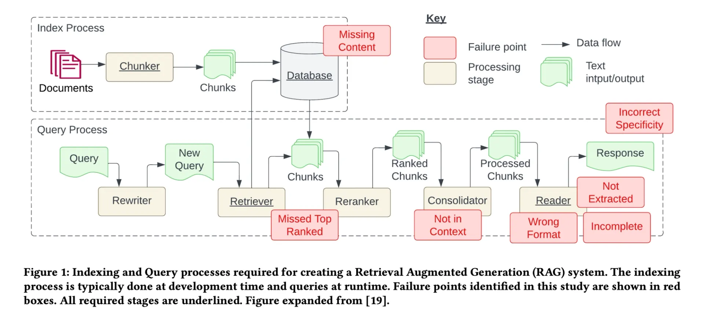
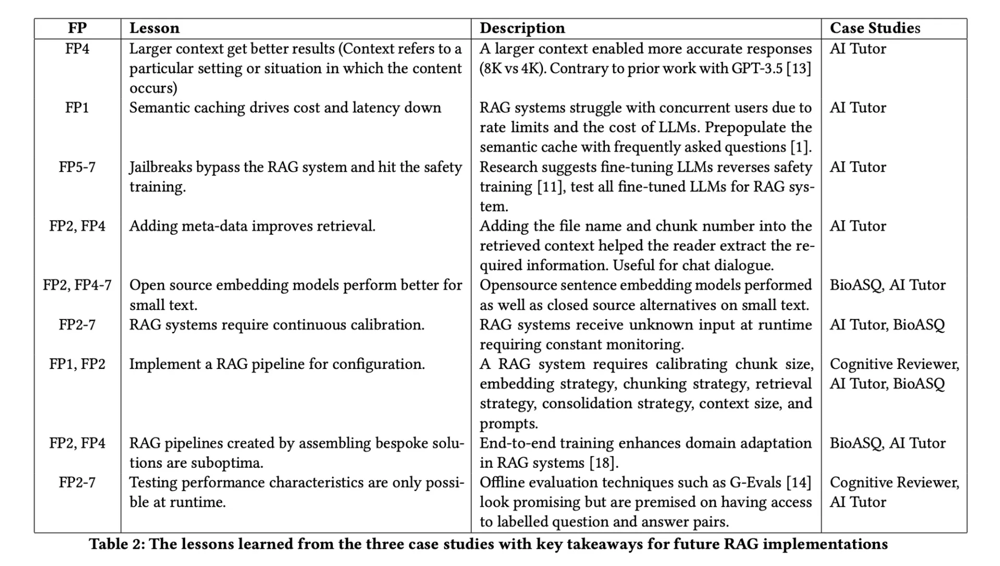

# 如何构建企业级RAG系统

# 1. 介绍

文章来自Galileo, llama-index CEO推荐


RAG的7个故障点



- Missing content (FP1)： 现有文档无法回答
- Missed the top ranked documents (FP2)：参考文档排序不在前
- Not in context - consolidation strategy limitations (FP3)：文档不在上下文中
- Not extracted (FP4)：文档无法提取
- Wrong format (FP5)：文档格式错误，如表格或列表
- Incorrect specificity (FP6)：回答不够具体
- Incomplete (FP7)：回答缺失信息



# 2. 方案
## 2.1 用户验证

问题：

- 用户授权
- 数据安全
- 隐私保护
- 合规

解决方案：

AWS Cognito or Firebase Authentication可以用于验证和授权 

## 2.2 输入校验

问题：

有害或者涉及隐私的问题需要被过滤，否则容易导致大模型越狱。

- 匿名化：对姓名、地址和联系方式匿名化，以保护隐私同时避免泄露敏感信息
- 严格化字符串：SQL注入和XSS攻击，避免出现不必要的输出
- 限制主题：避免暴力、攻击性和冒犯的主题
- 避免输入可执行代码
- 限制输入语言
- 避免prompt注入：避免用户输入误导或者有害的prompt可以操作系统或者影响LLM的表现
- 限定token数量：避免资源耗尽一级避免（DoS）攻击
- 毒性检测：检测并阻止有害和辱骂性语言

解决方案：

- Llama Guard: 
  - 介绍首页：https://llm-attacks.org/
  - 训练了一个模型来检测和阻止有害和辱骂性语言，避免用户输入误导或者有害的prompt可以操作系统或者影响LLM的表现
  - 论文：Universal and Transferable Adversarial Attacks on Aligned Language Models
    - https://arxiv.org/abs/2307.15043
  - Github (2.6k Stars): https://github.com/llm-attacks/llm-attacks
- Safeguarding Your RAG Pipelines: A Step-by-Step Guide to Implementing Llama Guard with LlamaIndex
  - 使用Sagemaker服务
  - https://towardsdatascience.com/safeguarding-your-rag-pipelines-a-step-by-step-guide-to-implementing-llama-guard-with-llamaindex-6f80a2e07756

## 2.3 输入重写

输入在校验通过后，进入输入重写阶段。输入重写是为了提高LLM的表现，避免输入的歧义和模糊性。

方案：

1. 基于历史重写

   样例如下：

   ```text
    Query History:

    "How many credit cards do you have?"
    
    "Are there any yearly fees for platinum and gold credit cards?"
    
    "Compare features of both."
    
    We must identify the context evolution based on the user's query history, discern the user's intent and relationship between queries, and generate a query that aligns with the evolving context.
    
    Rewritten Query: "Compare features of platinum and gold credit cards."
    ```

2. 构造子问题
   
   复杂问题很难回答，将问题拆解。

   llama-index参考样例：https://docs.llamaindex.ai/en/stable/examples/query_engine/sub_question_query_engine.html
    
   样例如下：

   ```text
   Given the query "Compare features of platinum and gold credit card," the system generates subqueries for each card that focus on individual entities mentioned in the original query.

    Rewritten Subqueries:
    
    "What are the features of platinum credit cards?"
    "What are the features of gold credit cards?"
    ```

3. 构造相似的问题

   提升检索的覆盖率

   样例如下：

   ```text
    Generated Similar Query:

    “I want to know about platinum credit cards” -> "Tell me about the benefits of platinum credit cards."
    ```

# 3. Encoder

把原始和改写的问题，转换成向量进行检索查询。

向量模型MTEB评测基准：https://huggingface.co/spaces/mteb/leaderboard

选择embedding模型需基于自己的测试集评估进行选择。

定制化评估：
- 选择一个基准标注数据集，对如下指标进行评估：Mean Reciprocal Rank (MRR) and Normalized Discounted Cumulative Gain (NDCG) 
- 通过模型评估：但人工评估更准确
- 通过聚类评估：HDBSCAN聚类算法，查看向量的聚类效果

使用本地还是在线模型：
- 向量生成费用
- 检索费用
- 存储费用
- 语言支持 (使用多语种模型，或者翻译模型+向量模型)
- 时延：使用低维向量，费用更低
- 隐私：本地模型更安全

# 4. 知识管理系统

- 知识管理系统是一个数据库，用于处理和存储文档。
- 文件被分割成chunk，每个chunk被编码成向量，然后存入数据库方便索引
- 文件解析器：支持处理各类文档格式，如PDF、Word、Excel、PPT、HTML、XML、JSON、CSV、TXT、RTF、Markdown、LaTeX、图片、音频、视频等
- 表格识别：表格被解析成结构化数据，然后存入数据库
  - 可以使用table-transformer: https://huggingface.co/spaces/nielsr/tatr-demo
- 图像识别：使用OCR提取文本
- 原始信息：如标题、作者、日志、类型、日期、标签等

# 5. 分割器

分割器是一个模型，用于将文档分割成chunk，然后编码成向量。分割对检索效果有很大影响。

问题：
- 文档过长，会包含过多噪声
- 文档过短，会丢失信息

优化方案：
- 优化方案 （降噪、文本大小、编码和存储成本）：https://www.youtube.com/watch?v=qaPMdcCqtWk
- 分块优化策略：https://www.rungalileo.io/blog/mastering-rag-advanced-chunking-techniques-for-llm-applications


# 6. 检索器

用于给文档建立索引，搜索和抽取文档。包括增删改查。

问题和挑战

- 随着文档数量的增加，可扩展性成为挑战。
- 实时索引，由于文档频繁更新，实时索引成为挑战。
- 连续性和原子性：随着文档的更新和修改，连续和原子性会成为挑战
- 存储优化
- 安全和访问控制
- 监控和维护：比如监控索引失败、资源瓶颈或者过期的索引，需要鲁棒的监控和维护流程


# 参考

[1] mastering-rag-how-to-architect-an-enterprise-rag-system， https://www.rungalileo.io/blog/mastering-rag-how-to-architect-an-enterprise-rag-system?utm_medium=email&_hsmi=295778713&_hsenc=p2ANqtz-85wuBy2znSxOZGLNZu0n1UrH7Dwv32mKo8aChlTaZLJ-1LxzhZdx9QoRbar3nICeS82IoUbL8ogLGFcQN5EVYByozrmA&utm_content=295779191&utm_source=hs_email