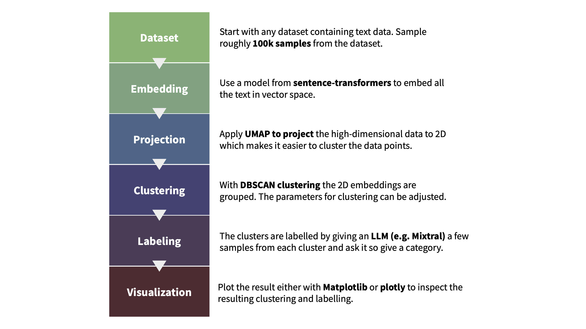

1. huggingface/text-clustering
   - Github (336 stars): https://github.com/huggingface/text-clustering
   - 使用DBSCAN算法对文本进行聚类
   - 

2. gpu-dbscan
   - Github (50 stars): https://github.com/karthikv2k/gpu_dbscan

3. SinglepassTextCluster
   - Github (55 stars): https://github.com/liuhuanyong/SinglepassTextCluster

4. TopicCluster
    - Github: https://github.com/liuhuanyong/TopicCluster