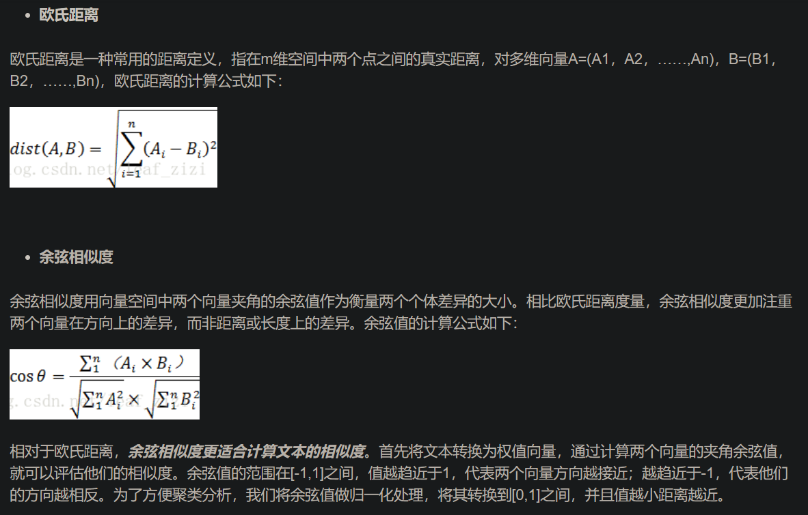
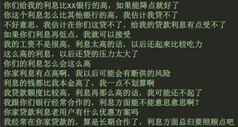
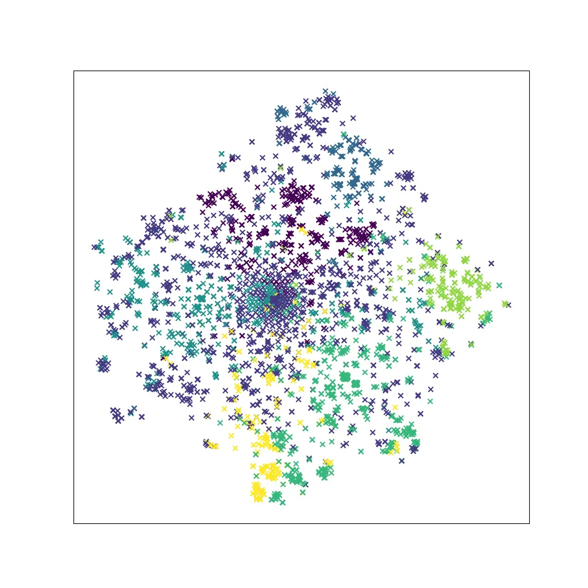

# 1. 简介

对于无监督学习来说，聚类算法对于数据挖掘、NLP处理等方向都有着非常重要的地位。常见的聚类算法比如K-means、BIRCH（Balanced Iterative Reducing and Clustering Using Hierarchies）、GMM（Gaussian mixture model）、GAAC（Group-average Agglomerative Clustering）等，但是用得最普遍的还是K-means算法，其时间复杂度低且实现的效果较好受到广泛的应用。

本文代码的相关环境为：

python3以上
sklearn 机器学习常用包
jieba 中文分词
matplotlib 可视化



# 2. 准备语料

语料格式为每行表示一个文档（语句、文章等需要聚类的文本），行数表示需要聚类的所有文本。
类似这样的：



# 3. 代码实现

导入相关包

```python
from sklearn.feature_extraction.text import CountVectorizer, TfidfTransformer
from sklearn.manifold import TSNE
from sklearn.cluster import KMeans
from data_utils import *
import jieba
import matplotlib.pyplot as plt
```

加载语料

```python
# bigram分词
segment_bigram = lambda text: " ".join([word + text[idx + 1] for idx, word in enumerate(text) if idx < len(text) - 1])
# 结巴中文分词
segment_jieba = lambda text: " ".join(jieba.cut(text))

'''
    1、加载语料
'''
corpus = []
with open("sanhu.txt", "r", encoding="utf-8") as f:
    for line in f:
        # 去掉标点符号
        corpus.append(segment_jieba(remove_punc(line.strip())))

'''
```

代码中定义了两种分词方式，一种是单纯的使用bi-gram分词，一种是使用jieba进行中文分词，两份分词方式根据效果自己选择使用哪种。加载语料的时候把标点符号去掉，这对于文本聚类几乎没有作用。还可以去掉自己定义的一些类似“你”、“我”、“他”等大量口语化中均会出现的停止词，这类词语往往对聚类也起不到作用。

计算TF-IDF权重

```python
'''
    2、计算tf-idf设为权重
'''

vectorizer = CountVectorizer()
transformer = TfidfTransformer()
tfidf = transformer.fit_transform(vectorizer.fit_transform(corpus))

''' 
    3、获取词袋模型中的所有词语特征
    如果特征数量非常多的情况下可以按照权重降维
'''

# this function may be not exist and will give out error
word = vectorizer.get_feature_names()
print("word feature length: {}".format(len(word)))

''' 
    4、导出权重，到这边就实现了将文字向量化的过程，矩阵中的每一行就是一个文档的向量表示
'''
tfidf_weight = tfidf.toarray()
```

关于TF-IDF网上有很多教程都有详细的解释。这里解释下为什么用这个值作为权重。
将文本向量化的方式其实有很多，最简单的就是one-hot方式，在之前的文章中也讲过这种方式的实现原理，如果不用TF-IDF设置权重，那么，后面进行文本向量化之后的矩阵值只有0、1两种，词与词之间的权重没有进行区分，所以用这种方式设置权重。

文本聚类

```python
'''
    5、对向量进行聚类
'''

# 指定分成7个类
kmeans = KMeans(n_clusters=7)
kmeans.fit(tfidf_weight)

# 打印出各个族的中心点
print(kmeans.cluster_centers_)
for index, label in enumerate(kmeans.labels_, 1):
    print("index: {}, label: {}".format(index, label))

# 样本距其最近的聚类中心的平方距离之和，用来评判分类的准确度，值越小越好
# k-means的超参数n_clusters可以通过该值来评估
print("inertia: {}".format(kmeans.inertia_))
```

k-means的缺陷之一就是需要自己指定需要分类的族数，也就是代码中的n_clusters，选择超参数的过程中，可以使用kmeans.inertia_值作为评估标准，其值越小越好。

可视化

```python
'''
    6、可视化
'''

# 使用T-SNE算法，对权重进行降维，准确度比PCA算法高，但是耗时长
tsne = TSNE(n_components=2)
decomposition_data = tsne.fit_transform(tfidf_weight)

x = []
y = []

for i in decomposition_data:
    x.append(i[0])
    y.append(i[1])

fig = plt.figure(figsize=(10, 10))
ax = plt.axes()
plt.scatter(x, y, c=kmeans.labels_, marker="x")
plt.xticks(())
plt.yticks(())
# plt.show()
# if error, remove aspect=1
plt.savefig('./sample.png', aspect=1)
```

前面将文本向量化之后，每个文档的维度非常高，进行可视化之前需要对其降维，降维算法也有很多，这里使用T-SNE算法，其优点就是准确度比较高，但是耗时比较长，如果接受不了耗时长，可以使用PCA算法。
对降维后的数据decomposition_data用plt进行可视化。

效果显示



# 参考

[1] 使用K-means及TF-IDF算法对中文文本聚类并可视化，https://www.jianshu.com/p/622222b96f76