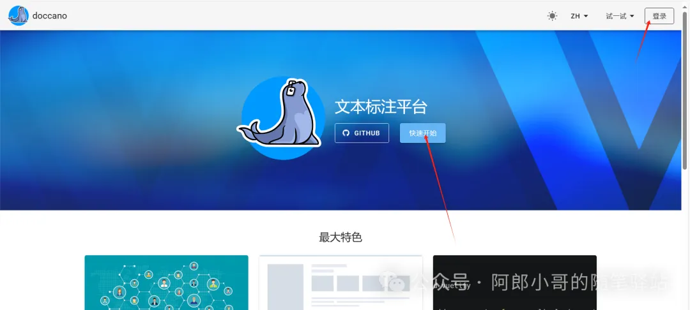
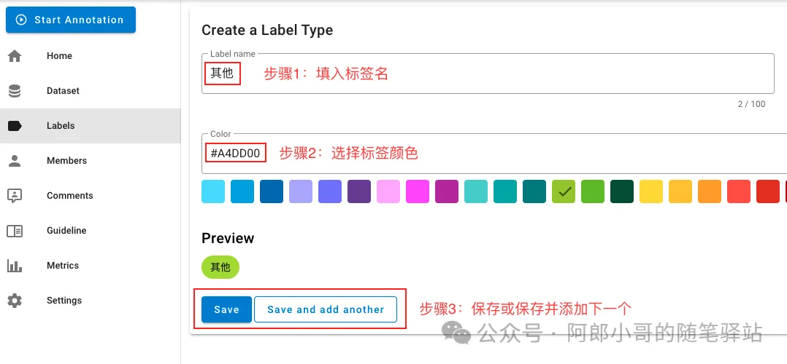

# 1. 简介

doccano: https://github.com/PaddlePaddle/PaddleNLP/blob/develop/applications/text_classification/doccano.md

doccano支持TextFile、TextLine、JSONL和CoNLL四种数据上传格式，文本分类本地数据集定制训练中统一使用TextLine这一文件格式，即上传的文件需要为txt等格式，且在数据标注时，该文件的每一行待标注文本显示为一页内容。上传的文件为txt等格式，每一行为一条待标注文本。

上传数据类型选择TextLine，选择待标注文本或拖拽文本导入doccano项目中，点击导入，导入待标注数据集。

# 2. 安装和使用

```shell
# 安装依赖
pip install doccano==1.6.2

# 初始化数据库
doccano init

# 创建用户
doccano createuser --username admin --password pass

# 开启web服务
doccano webserver --port 8000

# 在另一个中端启动任务队列
doccano task
```

在浏览器打开http://127.0.0.1:8000/[4]，输入用户名和密码登录，开始使用doccano进行标注。





可以导出数据，用于PaddleNLP的后续训练

# 参考

[1] 聊聊层次多标签分类NLP任务的实践，https://mp.weixin.qq.com/s/0HfD7-AIBcolMeHh6KC1Bw
