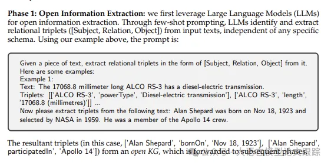
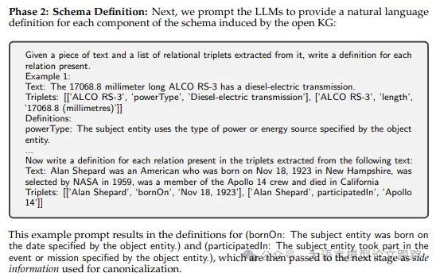

# 1. 资源

Extract, Define, Canonicalize: An LLM-based Framework for Knowledge Graph Construction

https://arxiv.org/abs/2404.03868

# 2. 概要

本研究致力于探索从文本中自动构建知识图谱的自动化技术。随着大型语言模型的发展，已有研究尝试将其应用于知识图谱构建，如采用零次或少次提示的方法。尽管在小型特定数据集上取得了进展，但这些模型在处理现实世界应用中的大量文本时仍显不足。主要挑战在于，现有方法需要将知识图谱模式嵌入到语言模型的提示中以生成有效的三元组，而复杂或庞大的模式往往会超出模型的上下文处理能力。为此，我们提出了一个新颖的三步策略——提取-定义-规范化（EDC）框架，它先进行开放信息提取，再定义模式，最后进行规范化处理。EDC 框架的优势在于其灵活性，无论是在已有预设模式还是无预设模式的情况下都能适用；在无预设模式的情况下，它能自动构建模式并进行自我规范化。此外，我们还引入了一个训练有素的组件，用以提取与输入文本紧密相关的模式元素，从而在无需调整参数的前提下，显著提升了模型在三个知识图谱构建基准测试中的三元组提取质量，并能处理比以往工作更庞大复杂的模式。

# 3. 方法

## 3.1 EDA 概要

基于上面的现状，作者提出了一种新的知识图谱构建框架：EDC。所谓EDC即 Extract-Define-Canonicalize。把KGC（Knowledge Graph Creation）任务划分为三个步骤，每个步骤都发挥了Agent应用的优势（如下图）：

• 第一个阶段（提取：Extraction）：先从文本中开放式的抽取出实体与关系的组合

• 第二个阶段（定义：Define）：在模式定义阶段，为每个抽取的实体和关系赋予明确的定义（如上图所示的Phase 2）

• 第三个阶段（标准化：Canonicalize）：在模式规范化阶段，确保语义相近的实体和关系用统一的词汇来表达

这一系列标注操作流程不仅提高了信息提取的精确度，还减少了结果中的冗余和歧义，使得知识图谱的构建更为高效和准确。

传统的KGC往往遵循既定的模式来生成三元组，但是开放式信息提取（）OIE）一般不遵循既定的模式。大语言模型Agent应用在OIE任务中优势明显，但是这类应用没有对提取的三元组进行标准化，导致开放知识图谱中存在重复的知识，所以往往需要对提取的知识进行标准化。标准化策略一般又称为对齐。比如过去有尝试使用WordNet来作为辅助信息来源进行对齐。或者使用聚类的方法，但是聚类往往会导致过度泛化，比如把不属于同一类的归到同一类去。

相较之下，EDC框架更具普适性，无论是否存在目标模式都能适用。它不依赖于WordNet这类静态的外部资源，而是使用LLMs生成的丰富上下文和语义信息。此外，EDC通过让LLMs验证转换的可能性，而不仅仅依赖嵌入的相似度，从而减轻了以往方法中的过度泛化问题。

## 3.2 Prompts

第一步：开放式提取关系，作者使用了few shot来帮助模型学习如何提取三元组数据

第二步：定义实体间关系，同样的，作者也是用了few shot来帮助模型学习应该如何定义关系

第三步：关系标准化。这个阶段主要是将提取的三元组关系进行标准化，剔除多余的信息和不确定性。首先把关系进行向量化处理，然后按照以下两个路径寻找是否存在目标关系。

 目标关系对齐：如果存在现成的目标关系时，会直接从现有关系里面找到最接近的。为了避免过度泛化，会利用大语言模型对每次转换进行合理性评估。

• 自我标准化：把语义相近的关系进行合并，精简知识图谱结构。

第四步：优化 （EDC + R）

优化流程借助EDC产出的数据提升三元组提取的精准度。

候选实体：前一阶段由EDC抽取的实体，以及大语言模型Agent应用从文本中识别的实体；候选关系：上一轮由EDC抽取的关系，以及通过关系检索工具从标准化关系库中检索到的关系。

通过整合大语言模型Agent应用和模式检索工具提供的实体与关系，我们为大语言模型Agent应用构建了一个更完善的候选资源库，有效解决了因实体或关系缺失而导致的效率降低问题。

# 4. 评估

# 参考

[1] EDC: 如何自动化构建知识图谱，基于大型语言模型知识图谱构建新框架，https://mp.weixin.qq.com/s/vIUu0qj5jkgL7jf6hfBkgQ