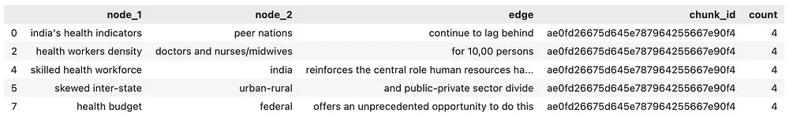
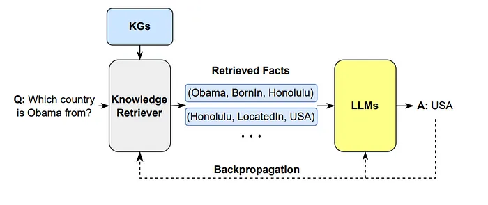

# 1. 图谱构建

构建知识图谱有如下四个步骤，但这将根据业务需求和用例场景而有所不同。

1. 从内容中识别和捕获概念和实体。这些元素表示系统中的节点；
2. 识别概念之间的关系，形成结构的边缘；
3. 使用已识别的节点（概念）和边（关系）填充图形数据结构或图形数据库；
4. 将构建的图形可视化，以获得分析见解和潜在的艺术享受。

语料库数据流图如下所示，此流将根据您使用的数据库模型而有所不同。例如，如果您使用图形数据库和数据科学数据库，数据将存储在后端系统中。如果你使用内存中的占位符，那么你可以使用Pandas DataFrame等。

在初始阶段，首先对文本语料库进行分段，每个片段被分配一个唯一的chunk_id。在此之后，使用语言模型（LLM）从每个文本块中提取概念及其语义关系，为这些关系分配W1的权重。需要注意的是，同一对概念之间可能存在多种关系。

随后，考虑同一文本块内的上下文相关度，从而在概念之间建立权重为W2的附加关系。不同块中相同的概念对也可以建立权重为W2的附加关系。为了简化数据，对相似的对进行分组，它们的权重进行求和，并把它们的关系进行拼接。结果是一个统一的表示，每个不同的概念对都有一条边，并以特定的权重和关系列表作为其标识符。

现在，让我们对DataFrame的每个文本块运行这个GenAI模型，并将json转换为Pandas DataFrame，如下所示。

如果您使用的是后端数据库，那么实体如下所示：

每一行表示一对概念之间的关系，充当连接图中两个节点的边。同一对概念之间可能存在多个边或关系。data frame的count表示权重，任意设置为4。

# 2. LLM融合

将KG与LLM-RAG集成

知识图谱（KGs）与大型语言模型（LLM）的集成有望显著增强检索增强生成（RAG）过程，从而改进知识表示和推理。这种协作方法有助于动态知识融合，确保真实世界的知识保持最新，并与文本空间不同。因此，在推理过程中提供的信息仍然是最新的和相关的。

# 2.1 动态知识融合

将知识图谱（KG）视为大型语言模型（LLM）可访问的动态数据库，用于查询最新的相关信息。事实证明，这种方法在回答问题等任务中非常有效，在这些任务中，保持最新信息至关重要。这些知识与LLM的集成是通过高级架构实现的，促进了文本标记和KG实体之间的深刻交互。这通过结构化的事实数据丰富了LLM的响应，提高了生成信息的质量。

# 2.2 KG增强型RAG

使用知识图谱提升RAG技术包括在知识图谱中搜索相关事实，并将其作为上下文信息呈现给LLM。这种方法能够生成精确、多样和真实的内容。例如，当LLM的任务是对最近的事件做出回应时，它可以在制定回复之前先咨询KG了解最新的事实。

此外，LLM在制作准确描述KG信息的高质量文本方面发挥了重要作用。这对于产生真实的叙事、对话和故事具有巨大的潜力。无论是通过利用LLM的知识还是构建广泛的KG文本语料库，这一过程都显著增强了KG到文本的生成，特别是在训练数据有限的情况下。

# 参考

[1] https://mp.weixin.qq.com/s?__biz=MjM5ODkzMzMwMQ==&mid=2650441640&idx=4&sn=0d17d778e3528e31c2189873a63d029c&chksm=bfa716d4ef42b00aaeb2a05a3169091a764298c43420b32536f427d33dc0c7d1a46893c27cf1&scene=132&exptype=timeline_recommend_article_extendread_samebiz&show_related_article=1&subscene=0&scene=132#wechat_redirect
[2] https://regupathit.medium.com/gen-ai-vilimiai-rag-with-knowledge-graph-8a8a6bdcd222