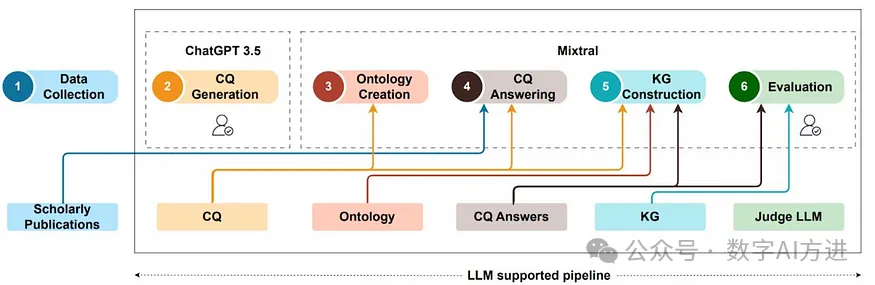

# 1. 资源

Github (31 stars): https://github.com/fusion-jena/automatic-KG-creation-with-LLM

论文：
- From human experts to machines: An LLM supported approach to ontology and knowledge graph construction
- https://arxiv.org/html/2403.08345v1?_immersive_translate_auto_translate=1

# 2. 介绍

在这个项目中，我们探索利用大型语言模型（LLMs）生成知识图（KG）的潜力。这项工作探索了开源 LLMs 促进的知识图谱（KG）的（半）自动构建。我们的流程包括制定能力问题（CQ）、基于这些 CQ 开发本体（TBox）、使用开发的本体构建知识图谱，并在人类专家极少参与或不参与的情况下评估生成的知识图谱。我们利用学术出版物创建深度学习方法的知识图谱，展示半自动化管道的可行性。为了评估通过检索增强生成（RAG）生成的答案以及使用LLMs自动提取的KG概念，我们设计了一个校准LLM，它根据基本事实来校验。该存储库包含各种组件，包括数据预处理代码、LLMs使用的提示词、实验中使用的数据集以及获得的相应结果。

# 3. 方法

这个神奇的（半）自动化KG构建过程如下图所示：

这里构建了一个（半）自动管道，该管道包含六个主要组件：数据收集、CQ 生成、本体创建、CQ 回答、KG构建和评估。

各个组件的作用及其对应的模块，如下：

1. 数据收集，人工整理。
2. CQ生成，由领域专家通过ChatGPT-3.5 Web 界面生成。
3. 本体创建：
   - Concepts_relations_generate(config)——从 CQ 中提取所有概念及其关系；
   - Ontology_creation(config)    ——     构建一个本体，通过提供一个包含基本本体结构的上下文示例、利用 PROV-O 本体作为重用的基础本体、并结合从 CQ 中提取的概念和关系来实现的。
4. RAG_CQ_answering(config)    ——     CQ回答，通过RAG（数据收集中人工整理的文档+FAISS向量库+LLM）获得CQ问题的答案。
5. KG_creation(config)    ——    KG构建，已处理的 CQ 答案及其各自的问题和 LLM 生成的本体作为 LLM 的输入。根据提示，我们指示LLM从答案中提取关键实体、关系和概念，并将它们映射到本体上以生成知识图谱。
6. Evaluate_RAG(config)    ——    评估，使用 LLM 作判断（使用提示词）根据人类评估者生成的基本事实为生成的内容打分（详见论文）。

上面每个过程都使用了大模型（Mixtral 8x7B MOE，MOE——专家混合网络——的概念后面【原理】系列中再讲），要么是通过提示词直接访问大模型，要么通过RAG方式（文本分割：块大小2,500 tokens，块重叠100 tokens，向量库用FAISS），详细内容可查看对应模块的源代码了解。