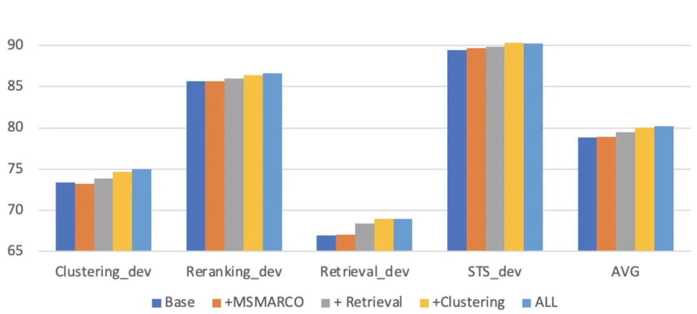
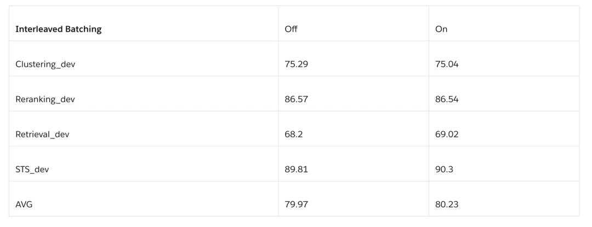

# 1. 技巧
## 1.1 Multi-task training

研究人员发现当模型接触过聚类任务后，检索性能会得到实质性地提高，并且其有效性可以通过别的任务的知识迁移而得到进一步提高。此外，通过采用多任务训练并使模型适应特定任务，可以增强泛化能力。这种方法不仅可以提高搜索结果的准确性，还可以确保模型对不同领域和任务的适应性，这对于实际应用场景至关重要。

Multi-task Training有利于提高泛化能力，这也跟目前LLM的instruction-tuning相似，让模型在训练时见识到更多任务或者更多数据模式，是有利于提高模型整体性能的。

## 1.2 Task-Homogenous Batching

同个batch里的所有样本来自于同个任务，这样可以保证对比学习的in-batch negative更具挑战性。从实验结果可以看到，这种设置能带来一定的提升，尤其是针对检索任务而言。

其实也能理解，在对比学习中把不同任务的数据混在一起去计算相似度意义不大，不同任务之间的数据模式本身就存在较大差异，这样导致in-batch negative其实是很容易就被识别出来的，对于模型训练并没有多大难度。

## 1.3 Impact of Hard Negative
strategy to eliminate false negative

之前的hard negative挖掘方法都是先通过检索将排序靠前前的文档作为hard negative，这样的话有可能混入部分false negative，影响模型训练结果。研究人员发现使用排序在30-100之间的文档作为hard negative能提升模型性能，而使用排序在0-100之间的文档则容易引入false negative，使用排序在50-100之间的文档则缺乏训练难度。

The number of hard negatives

实验表明hard negative的数量对于模型最终性能影响不大，这也跟大部分研究人员构建（query，positve document，hard negative）的三元组训练数据相吻合。

Impact of batch size

因为使用了对比学习，越大的batch size意味着可能包括更有难度的负样本，通常也会对应着更好的模型性能。

Teacher models for hard negative mining
    利用更加先进更加强大的模型可以获得更高质量的hard negative，最终获得更加强大的模型。站在巨人的肩膀上，能看得更远。

# 2. 讨论

无论是 SFR-Embedding-Mistral还是Linq-Embed-Mistral，他们提供的经验只是一个方向上的建议，针对不同的场景，任务，数据，最佳的训练配置都存在诸多差异。也就是说，虽然你搜集了了很多数据，但为了让这批数据能发挥最大的作用，你是需要针对可能每个任务，每个场景都找出一套最佳训练配置的。所以如何在这个过程找到一个合适的评估机制，能够自动评估不同训练设置对于最终模型性能的影响就显得至关重要了。

跟之前所有数据都在一起做大锅饭的方式不同，目前我看的的趋势是会针对数据本身的特性去选择更加合理的训练配置，尽可能利用到数据自身的信息，从而提升模型性能，但是目前这个选择的过程是需要人工介入的，如果存在更加智能化的方式，或许能进一步提升模型性能。

# 参考

[1] https://blog.salesforceairesearch.com/sfr-embedded-mistral/
[2] SFR-Embedding-Mistral: 都来看看吧，大佬们把炼丹秘籍都坦白了, https://mp.weixin.qq.com/s/CUyo6skclNV0q6mz4NAigQ

