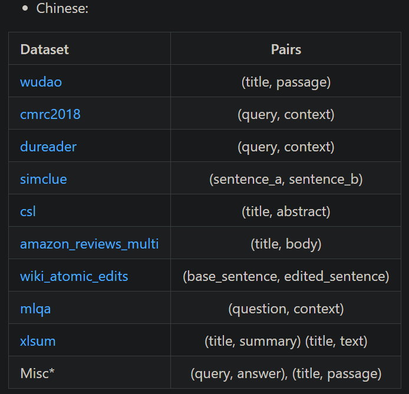
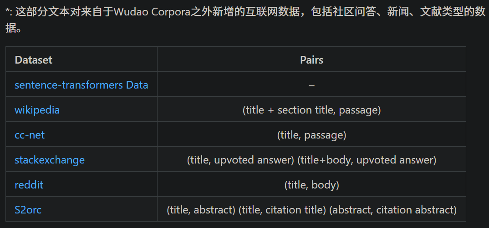

# 1. llm-embedder
- 下载：https://huggingface.co/datasets/namespace-Pt/projects/resolve/main/llm-embedder.tar.gz
- 大小15.7G
- Paper: Retrieve Anything To Augment Large Language Models
- 基于大模型过程中常用的6个任务微调:
  - Question Answering (qa)
  - Conversational Search (convsearch)
  - Long Conversation (chat)
  - Long-Range Language Modeling (lrlm)
  - In-Context Learning (icl)
  - Tool Learning (tool)

# 2. baai_general_embedding微调训练数

t2ranking, dulreader, mmarco, cmedqav2, mulit-cpr, nli-zh, ocmnli, and cmnli. For t2ranking, dulreader, and mmarco, we mine hard negatives; For nli-zh, ocmnli, and cmnli, we use the pairs whose label equal to 0 as negatives; For cmedqav2 and mulit-cpr, we randomly sample negatives.

# 3. BAAI-MTP

- 数据下载：https://data.baai.ac.cn/details/BAAI-MTP
- 北京智源人工智能研究院信息检索与知识计算组构建并对外发布数据集MTP（Massive Text Pairs）。MTP由总计3亿条中英文关联文本对构成；其中，中文记录达1亿条，英文数据达2亿条。MTP为迄今开源的最大规模中英文关联文本对数据集，为训练中英文语义向量模型提供了重要的基础。
- 数据构成
  - 
  - 
- 论文：
  - RetroMAE: Pre-Training Retrieval-oriented Language Models Via Masked Auto-Encoder
  - RetroMAE-2: Duplex Masked Auto-Encoder For Pre-Training Retrieval-Oriented Language Models

# 4. 蚂蚁金融语义相似度数据集

- 数据下载：https://modelscope.cn/datasets/modelscope/afqmc

本数据集包括训练集（34334）验证集（4316）测试集（3861）。其中，每一条数据有三个属性，分别是句子1，句子2，句子相似度标签。

其中label标签中，"1" ：表示sentence1和sentence2的含义类似；"0"：表示sentence1和sentence2的含义不同。

例子： {"sentence1": "双十一花呗提额在哪", "sentence2": "里可以提花呗额度", "label": "0"}

数据集可从https://www.cluebenchmarks.com/introduce.html 获取

范例

```text
A. 语义不同： {"sentence1":"双十一花呗提额在哪","sentence2":"哪里可以提花呗额度","label":"0"}

B. 语义相同： {"sentence1":"花呗如何还款","sentence2":"花呗怎么还款","label":"1"}
```