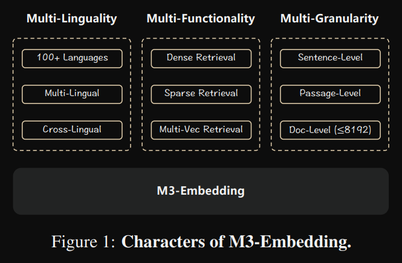
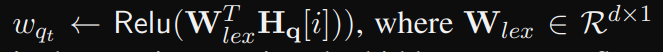
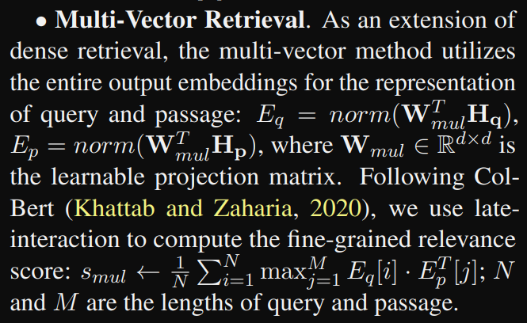
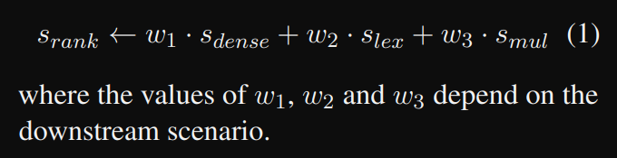
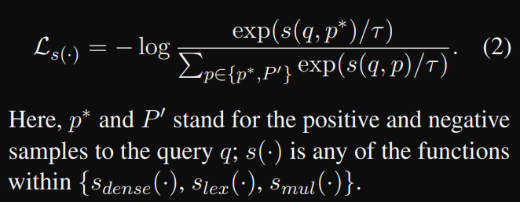
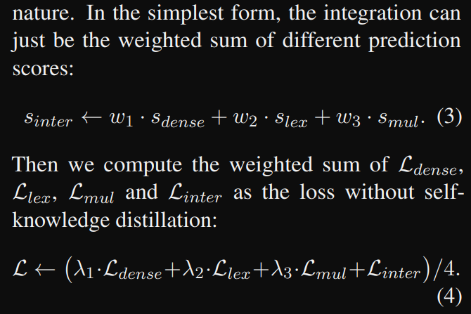
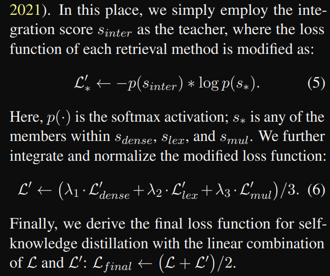
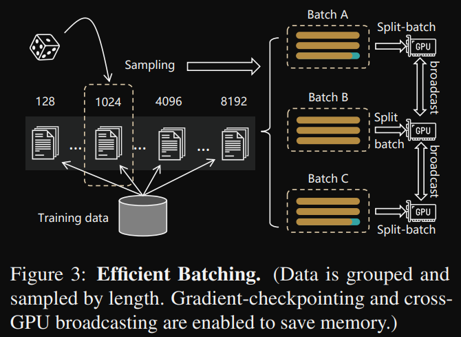

# 1. 资源

- 论文：BGE M3-Embedding: Multi-Lingual, Multi-Functionality, Multi-Granularity Text Embeddings Through Self-Knowledge Distillation
  - https://arxiv.org/abs/2402.03216
- 数据：https://huggingface.co/datasets/shibing624/nli-zh-al

应用：
- 支持bge-m3的dense/colbert/sparse多向量的向量库：[Vespa](https://github.com/vespa-engine/pyvespa/blob/master/docs/sphinx/source/examples/mother-of-all-embedding-models-cloud.ipynb) and [Milvus](https://github.com/milvus-io/pymilvus/blob/master/examples/hello_hybrid_sparse_dense.py)

第一个具有多功能、多语言和多粒度特性的文本检索模型，高效支持多语言（100+语言）、长文本（至多8192长度的输入文本）、和混合检索（稠密、稀疏、多向量）。

# 2. 原理

## 2.1 数据

多样的数据结构：
- 标题-正文
- 标题-前言
- 指令-输出

数据
- Wikipedia, S2ORC (Lo et al., 2020)
- xP3 (Muennighoff et al., 2023)
- mC4 (Raffel et al.,2020)
- CC-News (Hamborg et al., 2017) 
- the well-curated data from MTP (Xiao et al., 2023)

跨语种匹配
- NLLB (NLLB Team et al., 2022) 
- CCMatrix (Schwenk et al., 2021)

清洗后共1.2 billion 配对数据，共194种语言，2655交叉语种

微调数据
- 英文
  - HotpotQA (Yang et al., 2018)
  - TriviaQA (Joshi et al., 2017)
  - NQ (Kwiatkowski et al., 2019)
  - MS MARCO (Nguyen et al., 2016)
  - COLIEE (Kim et al., 2023)
  - PubMedQA (Jin et al.,2019), 
  - SQuAD (Rajpurkar et al., 2016)
  - NLI data from SimCSE (Gao et al., 2021b).
- 中文
  - DuReader (He et al., 2018)
  - mMARCO-ZH (Bonifacio et al., 2021)
  - T2-Ranking (Xie et al., 2023)
  - LawGPT(Liu et al., 2023)
  - CMedQAv2 (Zhang et al., 2018)
  - NLIzh2, and LeCaRDv2 (Li et al., 2023). 
- 其它语种
  - Mr. Tydi (Zhang et al., 2021b) 
  - MIRACL (Zhang et al., 2023c).
- 合成数据：用于长文档
  - MultiLongDoc （从Wikipedia, Wudao (Yuan et al., 2021) and mC4）随机采样文章片段，再用GPT3.5生成关于片段的问题

## 2.2 模型

采用混合检索，支持3种方式：
- 稠密检索：使用[CLS]输出
- 稀疏检索：评估每个词的重要性
  - 重要性计算公式
  - 如果一个词t出现多次，这只保留最大权重
  - 重要性计算，用query和passage的共同词相中
  - 
- 多向量检索
  - 利用了cobert方法，使用整个向量矩阵，而不是单个向量
  - 
- 加权计算最终得分
  - 

## 2.3 训练
### 2.3.1 自蒸馏

InfoNCE损失函数

为了让3种检索方式的权重更平衡，使用了自蒸馏方法，让每个检索方式的输出都能够自我监督。

使用加权得分作为老师，在每个检索方法的loss上进行修改

### 2.3.2 训练流程

使用 XLM-RoBERTa (Conneau et al., 2020)适配到RetroMAE (Xiao et al., 2022)

- 预训练阶段采用无监督对比学习，只是用稠密向量
- 微调阶段使用了3种检索方式，使用自蒸馏方法
  - 优于开始的训练不稳定，调整了参数
  - 

使用尽量大的batch (以便足够多的负例)

为了能再短的和长的文本上都有好的表现，使用了多尺度训练。
- 对长度进行预分组

# 参考

[1] BGE M3-Embedding: Multi-Lingual, Multi-Functionality, Multi-Granularity Text Embeddings Through Self-Knowledge Distillation, https://arxiv.org/abs/2402.03216