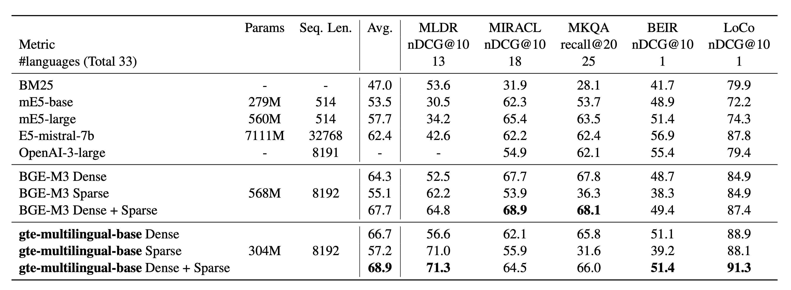
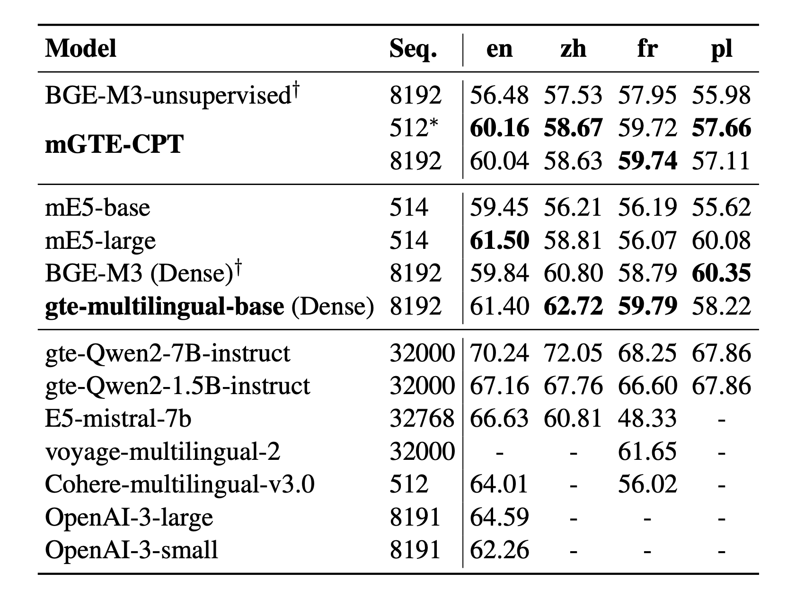

- 模型下载：https://modelscope.cn/models/iic/gte_sentence-embedding_multilingual-base
- 论文：Towards general text embeddings with multi-stage contrastive learning

特点：
- 高推理效率：采用Encoder-Only架构进行训练，使模型体积更小(300M)。LLM架构的向量模型(例如，gte-qwen2-7b-instruct)不同，该模型在推理时对硬件的要求更低，推理速度提高了10倍
- 长上下文：支持最多8192个token的文本长度
- 多语言能力：支持70多种语言
- 弹性向量维度：支持弹性的向量表示，同时保持下游任务的有效性，显著降低存储成本并提高了检索效率。
- 稀疏向量：除了连续向量表示外，还可以生成稀疏向量表示

评测

我们在多个下游任务上验证了GTE多语言表征模型的效果，包括多语言检索、跨语言检索、长文本检索，以及在MTEB多任务文本表征评测

检索任务
Retrieval results on MIRACL and MLDR (multilingual), MKQA (crosslingual), BEIR and LoCo (English)

