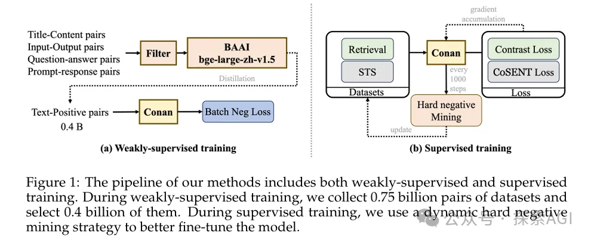
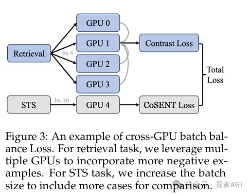
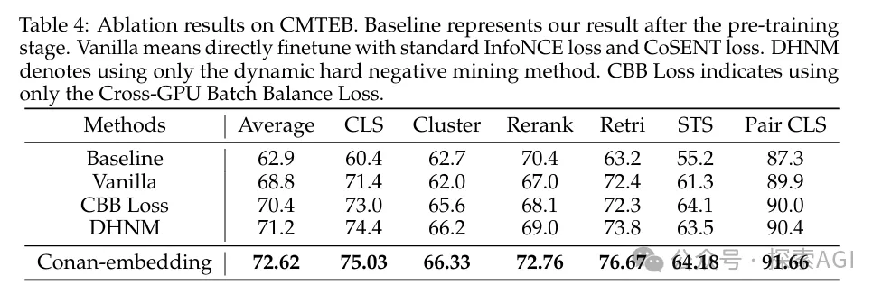

# 1. 资源

- Conan-embedding: General Text Embedding with More and Better Negative Samples
- 模型开源地址：https://huggingface.co/TencentBAC/Conan-embedding-v1

# 2. 方案

Conan-embedding模型，主要是提出了两个的新点子：Dynamic Hard Negative Mining和Cross-GPU Batch Balance Loss

- Dynamic Hard Negative Mining： 就是在训练过程中动态地挖掘难负例，每100次迭代检查一次，如果负例的分数乘以1.15小于初始分数且绝对值小于0.8，就认为这个负例不再困难，并用新的难负例替换它。

Cross-GPU Batch Balance Loss, CBB Loss： 对比学习需要尽可能多的负样本，但受到GPU内存限制。利用多个GPU引入更多的负样本，在多个任务之间平衡负样本的数量，提高训练效率和效果。

论文里还提到了，用LLM生成的prompt-response对来训练嵌入模型，这样可以让模型更聪明，处理起文本来更得心应手。

Conan-embedding在CMTEB的六个任务上都取得了优异的成绩，超越了之前所有的模型。消融研究也证明了动态硬负样本挖掘和CBB Loss这两个方法的有效性。

# 参考

[1] 腾讯开源Conan-embedding，登顶CMTEB，https://mp.weixin.qq.com/s/_zXtgDmVzyOtbiyPyWynVg
