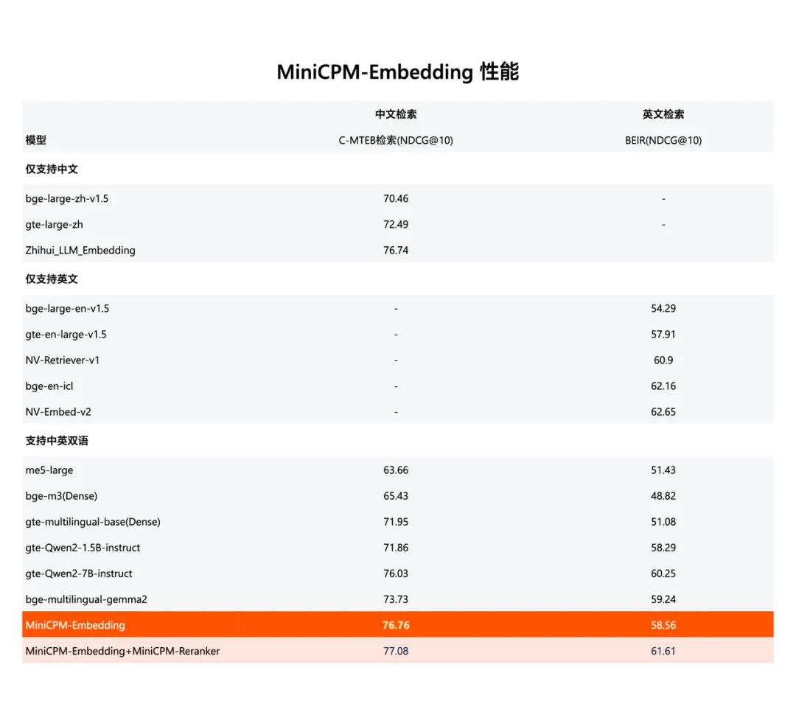

面壁一口气带来超强 RAG 外挂三件套：MiniCPM-Embedding（检索模型）、MiniCPM-Reranker（重排序模型）和面向 RAG 场景的 LoRA 插件（生成模型），款款优秀：

MiniCPM-Embedding（检索模型）中英跨语言检索取得 SOTA 性能，在评估模型文本嵌入能力的权威评测集 MTEB 的检索榜单上中文第一、英文第十三 ；

MiniCPM-Reranker（重排序模型）在中文、英文、中英跨语言测试上取得 SOTA 性能 ；

经过针对 RAG 场景的 LoRA 训练后，MiniCPM 3.0-RAG-LoRA 在开放域问答（NQ、TQA、MARCO）、多跳问答（HotpotQA）、对话（WoW）、事实核查（FEVER）和信息填充（T-REx）等多项任务上的性能表现，超越 Llama3-8B 和 Baichuan2-13B 等业内优秀模型。

