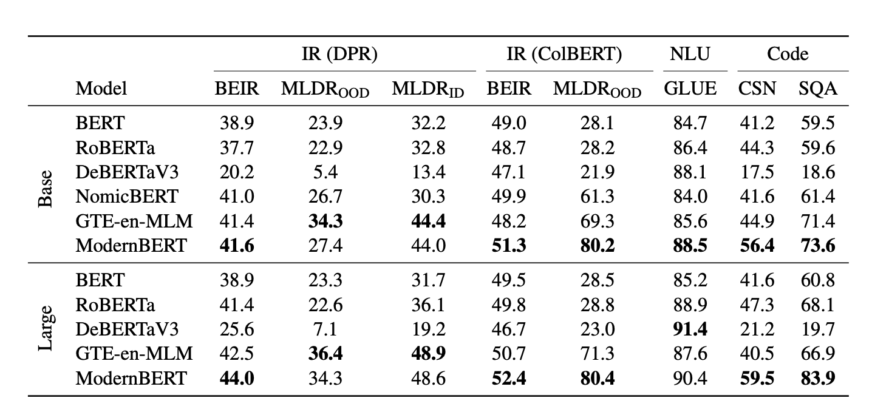
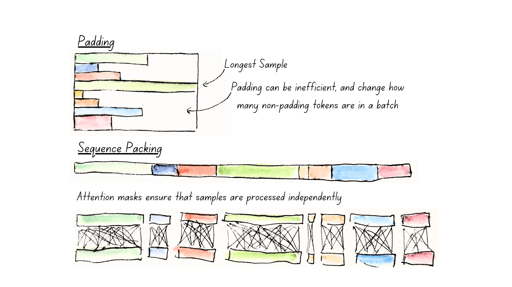

# 1. 资源

- 论文：Smarter, Better, Faster, Longer: A Modern Bidirectional Encoder for Fast, Memory Efficient, and Long Context Finetuning and Inference
  - 发布时间：2024.12.19
- Github (891 stars)： https://github.com/AnswerDotAI/ModernBERT
- 模型下载：https://huggingface.co/collections/answerdotai/modernbert-67627ad707a4acbf33c41deb
- 博客：https://huggingface.co/blog/modernbert

注意：
- 该模型只做了预训练masked Language Model, 没有给出微调后的模型。

如下为博客的翻译内容 （作者进行了少量的删改，让内容尽可能精简，突出重点）：

# 2. 介绍

本篇博客文章介绍了 ModernBERT，这是一系列最先进的仅编码器模型，使用了GPT大模型里最新的策略进行了该井，代表了对老一代编码器的全面改进，具有 8192 序列长度、更好的下游性能和更快的处理速度。

上图是文中的模型和其他模型的推理速度和性能对比。可以看到，ModernBERT 在处理速度和性能上都有很大的提升。

ModernBERT 可作为任何类似 BERT 的模型的插槽式替代品，具有基本 （139M 参数） 和大型 （395M 参数） 模型尺寸。

下图给出了不同模型性能对比图：

以下是 NVIDIA RTX 4090 上用于 ModernBERT 和其他解码器模型的内存（最大批量大小，BS）和推理（以每秒数千个令牌为单位）效率结果：

# 3. 改进点

通过三个主要方式做到了这一点：

- 现代化的 transformer 架构
- 特别注重效率
- 现代数据规模和来源

## 现代化的 transformer 架构

用 “rotary positional embeddings” （RoPE） 替换旧的位置编码：这使得模型更能理解单词彼此之间的关系，并允许我们扩展到更长的序列长度。
- 将原有的的 MLP 层激活函数换成 GeGLU，改进了原始 BERT 的 GeLU 激活函数。
- 通过删除参数中不必要的偏置项来简化架构，让我们更有效地使用参数预算
- 在 embedding 后添加额外的归一化层，这有助于稳定训练
- 使用pre-normalization帮助模型训练稳定

## 特别注重效率
利用 Flash Attention 2 的速度改进。我们的效率改进依赖于三个关键组成部分：交替注意力，以提高处理效率，取消填充和序列打包，以减少计算浪费，以及硬件感知模型设计，以最大限度地提高硬件利用率。

**交替注意力**
ModernBERT 最具影响力的功能之一是交替注意力，而不是完全的全局注意力。从技术上讲，这意味着我们的注意力机制每 3 层只关注一次完整的输入（全局注意力），而所有其他层都使用一个滑动窗口，其中每个 Token 只关注离自己最近的 128 个Token（局部注意力）。
随着注意力的计算复杂性随着每个额外的标记而膨胀，这意味着 ModernBERT 可以比任何其他模型更快地处理长输入序列。

**取消填充和序列打包**

另一个有助于提高 ModernBERT 效率的核心机制是它对 Unpadding 和 Sequence 打包的使用。

为了能够在同一批次中处理多个序列，编码器模型要求它们具有相同的长度，以便它们可以执行并行计算。传统上，我们依靠 padding 来实现这一点：找出哪个句子最长，并添加无意义的标记（padding tokens）来填充其他每个序列。

虽然 padding 解决了这个问题，但它并没有优雅地做到这一点：大量的计算最终被花费和浪费在 padding token 上，而 padding token 没有提供任何语义信息。

比较填充与序列打包。序列打包 （'unpadding'） 避免了在填充令牌上浪费计算，并且每批具有更一致的非填充令牌计数。样品仍然通过仔细掩蔽进行单独处理。

Unpadding 解决了这个问题：我们不是保留这些 padding token，而是将它们全部删除，并将它们连接成批量大小为 1 的小批量，避免所有不必要的计算。如果您使用的是 Flash Attention，那么我们的 unpadding 实现甚至比以前的方法更快，以前的方法在模型过程中严重依赖于 unpadding 和 readding 序列：我们更进一步，引入了我们自己的 unpadding 实现，这在很大程度上依赖于 Flash Attention 的 RoPE 支持的最新发展。这使得 ModernBERT 只需取消填充一次，并且可以选择在处理后重新填充序列，从而比以前的方法加快 10-20%。

为了进一步加快预训练速度，unpadding 在我们的模型中非常有用，因为我们将其与序列打包结合使用。这里的序列打包是合乎逻辑的下一步：由于我们将输入连接到单个序列中，并且 GPU 非常擅长并行化，因此我们希望最大限度地提高从单个前向模型传递中挤出的计算效率。为此，我们使用贪婪算法将单个序列分组为尽可能接近模型最大输入长度的串联序列。

**硬件感知模型设计**

我们试图平衡先前研究中强调的两个见解：

- 深&窄与宽&浅：研究表明，较深的模型具有较窄的层次，通常比具有较少、较宽层次的浅模型表现得更好。然而，这是一把双刃剑：模型越深，它的可并行化性就越低，因此，它在相同的参数计数下运行得越慢。
- 硬件效率：模型尺寸需要与 GPU 硬件保持一致，以实现最佳性能，不同的目标 GPU 会导致不同的约束。

遗憾的是，没有神奇的秘诀可以使模型在各种 GPU 上同样良好地运行，但有一本出色的食谱：The Case for Co-Designing Model Architectures with Hardware，其中仔细列出了为给定 GPU 优化模型架构的方法。我们想出了一个启发式方法，将他们的方法扩展到一篮子 GPU，同时尊重一组给定的约束。从逻辑上讲，第一步是定义所述约束，在我们的例子中：

- 将我们的目标 GPU 定义为常见的推理 GPU（RTX 3090/4090、A10、T4、L4）
- 粗略定义 ModernBERT-Base 的目标模型大小为 130 到 1.5 亿个参数，ModernBERT-Large 的目标模型大小为 350 到 420 个参数。
- 最终嵌入大小必须与原始 BERT 的尺寸匹配，base 为 768，large 为 1024，以最大限度地提高向后兼容性
- 设置性能约束，这些约束在 GPU 篮子中很常见

之后，我们通过约束网格搜索试验了多个模型设计，改变了层数和层宽。一旦我们确定了似乎最高效的形状，我们就确认我们的启发式方法与实际 GPU 性能相匹配，并确定了最终的模型设计。

## 现代数据规模和来源

ModernBERT 使用来自各种英文来源的数据进行训练，包括 Web 文档、代码和科学文章。它使用 2 万亿个令牌进行训练，其中大多数是唯一的，而不是以前的编码器中常见的标准 20 到 40 次重复。

# 4. 训练

任然使用了传统的Masked Language Model, 但我们删除了 Next-Sentence Prediction 目标，从那时起就被证明会增加开销但没有明显的收益，并将掩码率从 15% 提高到 30%。

这两个模型都使用三阶段过程进行训练。首先，我们使用 1.7T 标记进行训练，序列长度为 1024。然后，我们采用长上下文适应阶段，以 8192 的序列长度在 250B 令牌上进行训练，同时通过降低批次大小来保持每个批次看到的总令牌或多或少一致。最后，我们按照 ProLong 强调的长上下文扩展理想组合，对 500 亿个不同采样的代币进行退火。

分三个阶段进行训练是我们确保模型全面好的方式，这反映在其结果中：它在长上下文任务上具有竞争力，而不会影响其处理短上下文的能力......

…但它还有另一个好处：对于前两个阶段，一旦热身阶段完成，我们使用恒定的学习率进行训练，并且只对最后的 500 亿个代币执行学习率衰减，遵循梯形（或 Warmup-Stable-Decay）学习率。更重要的是：我们将从 Pythia 的启发下，从这些稳定阶段中发布每一个直接的中间检查点。我们这样做的主要原因是支持未来的研究和应用：任何人都可以自由地从我们的任何衰减前检查点重新开始训练，并针对其预期用途对适合领域的数据进行退火！

## 技巧

让我们从第一个开始，这很常见：由于初始训练步骤是更新随机权重，因此我们采用批量大小预热：我们从较小的批量开始，以便相同数量的标记更频繁地更新模型权重，然后逐渐增加批量大小到最终的训练大小。这大大加快了模型训练的初始阶段，在该阶段，模型将学习其对语言的最基本理解。

第二个技巧更为罕见：通过平铺对较大的模型大小进行权重初始化，其灵感来自 Microsoft 的 Phi 系列模型。这是基于以下认识：当我们有一组非常好的（如果我们自己敢这么说的话）ModernBERT-base 权重时，为什么要用随机数初始化 ModernBERT-large 的初始权重呢？

事实上，事实证明，将 ModernBERT-base 的权重平铺到 ModernBERT-large 上比从随机权重初始化效果更好。它还有一个额外的好处，即通过批量大小预热很好地堆叠，从而更快地进行初始训练。

