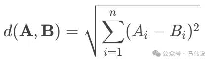
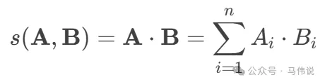
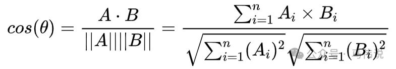

# 1. 简介

在RAG(Retrieval-augmented Generation)开发中，向量相似度计算是非常重要的步骤之一。例如，在 LangChain 中，可以通过DistanceStrategy枚举来设置相似度计算方式，如下示例代码所示：在RAG(Retrieval-augmented Generation)开发中，向量相似度计算是非常重要的步骤之一。例如，在 LangChain 中，可以通过DistanceStrategy枚举来设置相似度计算方式，如下示例代码所示：

```python
self.pg_vector = PGVector(
      embeddings=get_embedding_model(),
      collection_name=str(self.knowledge_name),
      distance_strategy=DistanceStrategy.MAX_INNER_PRODUCT,
      connection=PostgresqlVectorStorageKnowledgeService.engine,
      use_jsonb=True,
 )
 ```

同时，一定要注意DistanceStrategy的导入问题，否则将引起你所设置的相似检索方法失效。

如在PGVector中，你需要使用“from langchain_community.vectorstores.pgvector import DistanceStrategy”，它所支持的相似度计算方式如下：

```python
class DistanceStrategy(str, enum.Enum):
    """Enumerator of the Distance strategies."""
    EUCLIDEAN = "l2"
    COSINE = "cosine"
    MAX_INNER_PRODUCT = "inner"
```

而在Faiss中，你需要使用"from langchain.vectorstores.utils import DistanceStrategy",它所支持的相似度计算方式如下：

```python
class DistanceStrategy(str, Enum):
    """Enumerator of the Distance strategies for calculating distances
    between vectors."""
    EUCLIDEAN_DISTANCE = "EUCLIDEAN_DISTANCE"
    MAX_INNER_PRODUCT = "MAX_INNER_PRODUCT"
    DOT_PRODUCT = "DOT_PRODUCT"
    JACCARD = "JACCARD"
    COSINE = "COSINE"
```

# 2. 相似度计算方法
## 2.1 欧氏距离

欧氏距离是最常见的距离度量方法，用于计算两个向量在空间中的直线距离。它通过计算向量各维度差值的平方和，再开平方根，得到两个向量之间的几何距离。距离越小，表示向量越相似。计算公式如下：



它不适用于高维数据 , 容易受噪声维度影响，高维数据中可能失效（维度灾难）。因此，高维数据中需谨慎使用，可以用于如下场景：
- 机器学习：如K近邻算法（KNN）、聚类分析（K-means）；
- 图像处理：比较图像特征向量的相似度；
- 推荐系统：计算用户或物品的相似度；
- 低维稠密数据 : 在低维数据中 , 所有维度都有意义 , 它能捕捉全局差异 ;
- 需要绝对差异度量的场景：如：异常检测（检测与正常样本的偏差）、聚类分析（基于绝对距离的分组） 。

## 2.2 最大内积

最大内积通过计算两个向量的内积（点积）来衡量它们的相似性。内积反映了两个向量在方向上的对齐程度，值越大，表示向量越相似，常用于需要最大化相似度的场景。计算公式如下：



它直接度量了两个向量的相关性，适合需要精确量化相似性的场景。适合大规模高维数据，可以用于如下场景：

- 语义搜索：在自然语言处理中，内积可用于衡量词向量或句向量的相似性；
- 神经网络：在注意力机制中，内积用于计算查询向量与键向量的相关性；
- 推荐系统：用于计算用户偏好与物品特征之间的匹配度。

## 2.3 余弦相似度

相对于最大内积，余弦相似度是内积的归一化形式，它消除了向量长度的影响，而只关注于方向。

余弦相似度通过计算两个向量的夹角余弦值来衡量它们的相似性，计算公式如下：



余弦相似度的结果范围为 [−1,1]。值越接近1，表示向量越相似；值越接近-1，表示向量越不相似。即：

```text
1 ： 表示方向完全相同；
-1： 表示方向完全相反；
0 ：表示正交，无相似性。
```

因此，它无法反映向量的绝对距离。但不受向量长度影响，而只关注于向量的方向，适合于高维稀疏数据（高维数据中非零维度较少 , 它能有效忽略零值维度的影响），可以用于如下场景：
- 文本相似度计算：文本向量通常是高维稀疏的 , 如 : TF-IDF、词袋模型、BERT Embedding , 它能有效捕捉语义方向；
- 推荐系统：用于计算用户兴趣向量与物品特征向量之间的相似性；
- 图像识别：在特征向量比较中，余弦相似度可用于衡量图像的相似性。

# 参考

[1] RAG开发中的向量相似度计算：欧氏距离、最大内积与余弦相似度该怎么选？https://mp.weixin.qq.com/s/XCil5zbGVvHNcREwV2Z1TA