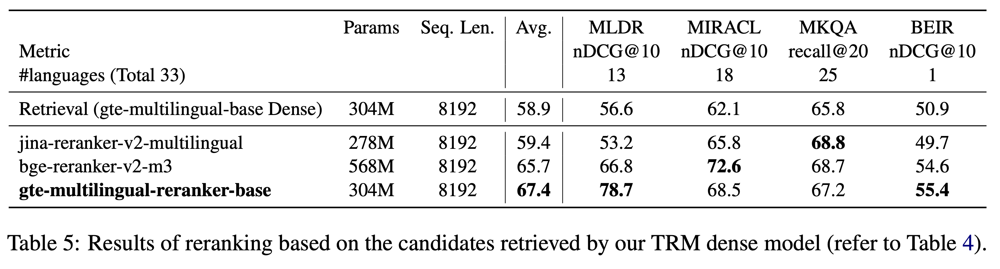

- 模型下载：https://modelscope.cn/models/iic/gte_passage-ranking_multilingual-base
- 论文：mGTE: Generalized Long-Context Text Representation and Reranking Models for Multilingual Text Retrieval

特点：
- 高推理效率：采用Encoder-Only架构进行训练，使模型体积更小(300M), 在保持效果的同时提供高效的推理性能，同时降低使用硬件的门槛
- 长上下文：支持最多8192个token的文本长度
- 多语言能力：支持70多种语言

