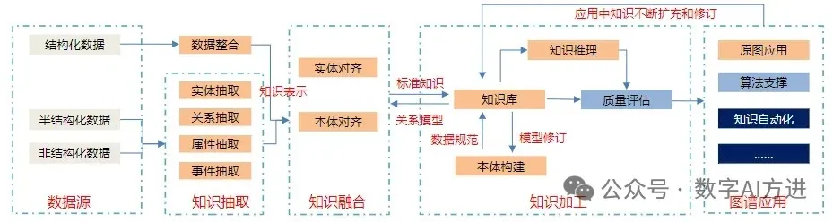
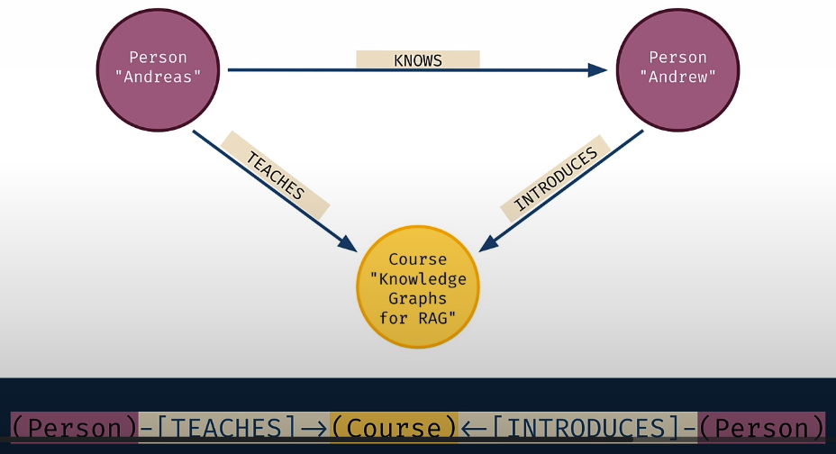

# 参考

[1] 【AIGC FREE】我的知识我来管——能救RAG的只有KG（四）构建KG！！！，https://mp.weixin.qq.com/s?__biz=MzI1MzE5MTIzNw==&mid=2247484293&idx=1&sn=918f76836a9dfac088ecb04f72bbdce9&chksm=e9d976afdeaeffb90ecd8b53d69e6c06ac5ef773975479055c708ba0949c53251cdbf17a238f&cur_album_id=3386851684844486669&scene=189#wechat_redirect
