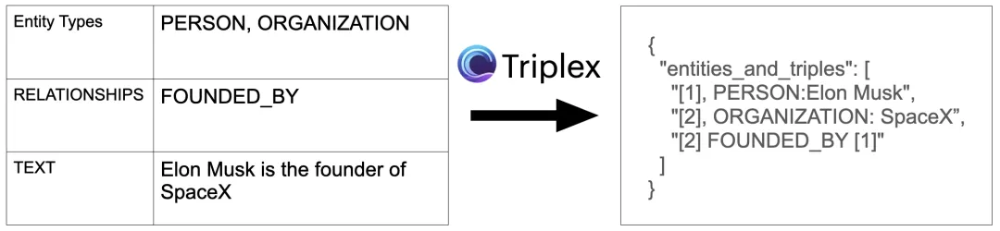
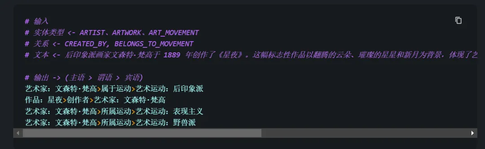
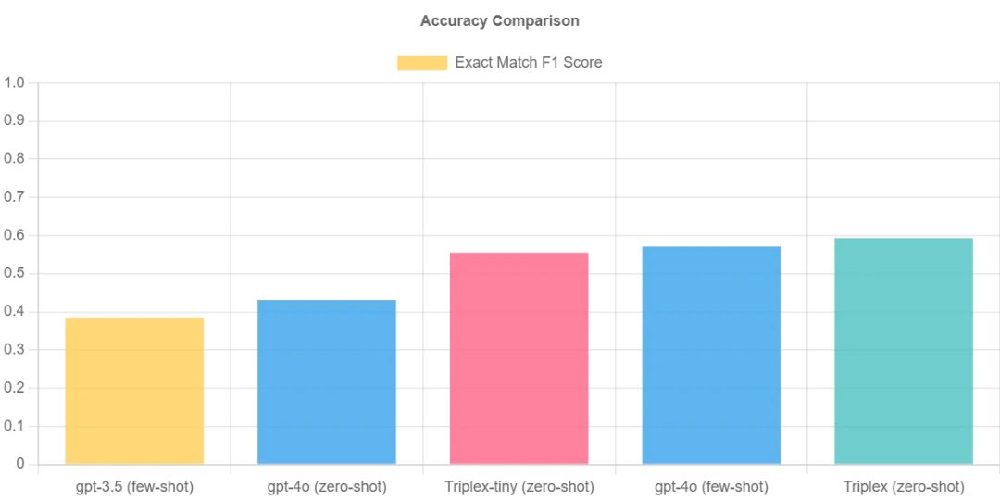

# 1. Triplex
- huggingface：https://huggingface.co/SciPhi/Triplex
- 博客： https://www.sciphi.ai/blog/triplex

Triplex 是 SciPhi.AI 开发的 Phi3-3.8B 的微调版本，用于从非结构化数据创建知识图谱。它的工作原理是从文本或其他数据源中提取三元组（由主语、谓语和宾语组成的简单语句）。

# 参考

[1] Triplex vs. GPT-4：将Graph RAG成本降低98%的革命性模型、知识图谱构建的 SOTA LLM！https://mp.weixin.qq.com/s/T-MxvP5jg3hcUWHlSMk87A