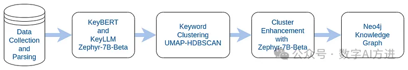

# 方法

https://github.com/SolanaO/Blogs_Content/tree/master/keyllm_neo4j

简要说明一下这个处理过程：

1. 收集并解析数据集，这里是arXiv数据集的一个子集，它本身就是json文件，大小3.8G，包含170 万篇学术论文的信息（包括文章标题、作者、类别、摘要、PDF 全文等），我们只保留文章标题和摘要这两个部分。
2. 使用 KeyBERT 提取候选关键词，然后再使用KeyLLM 对其进行改进，生成增强型关键词和关键短语列表。
   - KeyBERT 是一种从文本中提取关键词或关键短语的方法。它使用文档和词嵌入，通过余弦相似度找出与文档最相似的子词组。
   - KeyLLM 是另一种用于提取关键词的最小方法，但它是基于 LLM 的，这里用的LLM是Zephyr-7B-Beta—— 一种基于DPO技术对Mistral-7B微调产生的模型，而且是GPTQ 量化版本（为了能在Colab上运行）。
     （上面提到的概念在这都不做详细解释，后面【原理】系列中再讲，下同）
   - KeyBERT 与 KeyLLM 在这里是相辅相成的，后者对前者做微调，前者为后者提供基础并降低幻觉。
3. 使用 HDBSCAN 对上一步提取的关键词和关键短语进行聚类。
   - HDBSCAN，是一种高性能的无监督算法，它能根据密度和邻近度找到最佳聚类。HDBSCAN处理的数据维度不能太高（50左右最佳）。
   - 由于上一步的嵌入算法通常会产生数百维（比如768维等）的数据，因此需要先用UMAP（统一流形逼近和投影）算法进行降维。
4. 再次使用 Zephyr-7B-Beta模型，为每个聚类生成标签和描述。
5. 将这些元素写入到neo4j中，其中的节点代表文章、关键词和（聚类的）主题。

# 参考

[1] 【AIGC FREE】我的知识我来管——能救RAG的只有KG（四）构建KG！！！，https://mp.weixin.qq.com/s?__biz=MzI1MzE5MTIzNw==&mid=2247484293&idx=1&sn=918f76836a9dfac088ecb04f72bbdce9&chksm=e9d976afdeaeffb90ecd8b53d69e6c06ac5ef773975479055c708ba0949c53251cdbf17a238f&cur_album_id=3386851684844486669&scene=189#wechat_redirect
