# 1. 资源

项目地址：https://rahulnyk.github.io/knowledge_graph/

# 2. 知识图谱概念

知识图谱（Knowledge Graph）是用来表示现实世界中的实体及其关系的一种数据结构。

它通过节点（表示实体）和边（表示实体间的关系）来构建一个连通的网络。

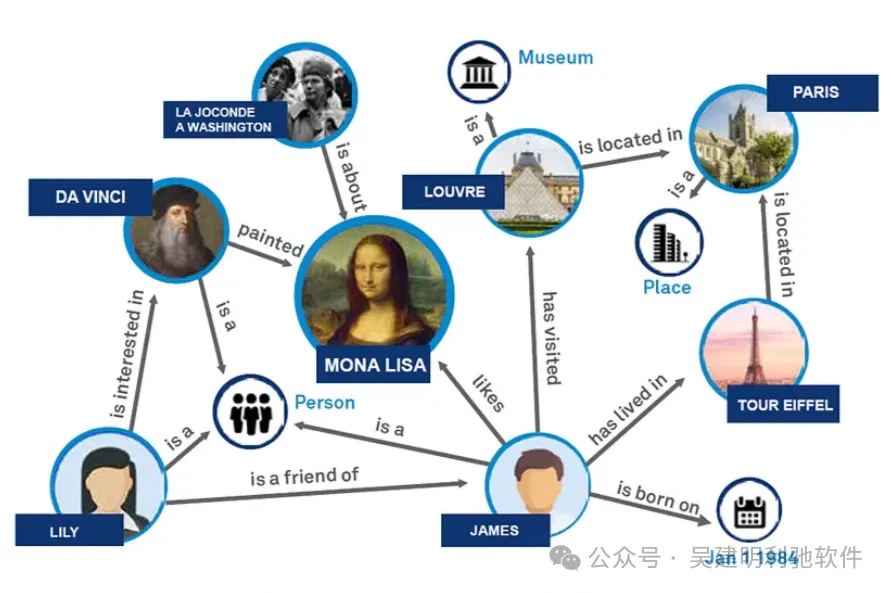

知识图谱的主要目的是将分散的数据组织成有结构的信息，使得机器能够理解和处理这些信息，从而在搜索、问答、推荐等应用中提供更智能的服务。

知识图谱的基本组成部分

1. 实体（Entity）：知识图谱中的基本单元，代表现实世界中的对象，比如人、地点、事物等。
2. 属性（Attribute）：描述实体的特征，比如人的姓名、年龄，地点的名称、坐标等。
3. 关系（Relation）：表示实体之间的连接，比如“Tom 是 Mary 的朋友”这类描述实体间的关系。

举个例子
```text
Mary had a little lamb，

You’ve heard this tale before；

But did you know she passed her plate，

And had a little more！
```

绘制成KG，如下：

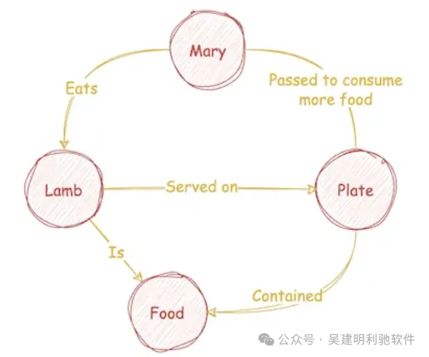

知识图谱在很多方面都很有用。

1、可以运行图算法并计算任何节点的中心性，以了解一个概念（节点）在整个工作体系中的重要性。

2、可以分析连接和断开的概念集合，或者计算概念群体，以深入理解主题内容。

3、还能理解看似不相关的概念之间的联系。

举例来说，仅仅依靠简单的语义相似性搜索来找到与查询最相关的上下文并不总是有效的，尤其是当查询没有提供足够的上下文来明确其真实意图，或者当上下文分散在大量文本中时。

比如，考虑这个查询：

告诉我《百年孤独》中何塞·阿尔卡迪奥·布恩迪亚的家谱。

这本书中记录了七代的何塞·阿尔卡迪奥·布恩迪亚，而且一半的人物都叫何塞·阿尔卡迪奥·布恩迪亚。

如果使用简单的 RAG 流程来回答这个查询，可能会非常具有挑战性，甚至可能无法实现。

另外，RAG 的另一个缺点是它无法引导你提出正确的问题。在很多情况下，提出正确的问题比获取答案更为关键。

图增强生成（Graph Augmented generation，GAG）在一定程度上可以解决 RAG 的这些缺点。

更好的是，我们可以灵活组合，构建一个图增强检索增强生成流水线，以融合两者的优点，达到事半功倍的效果。

# 3. 实现流程

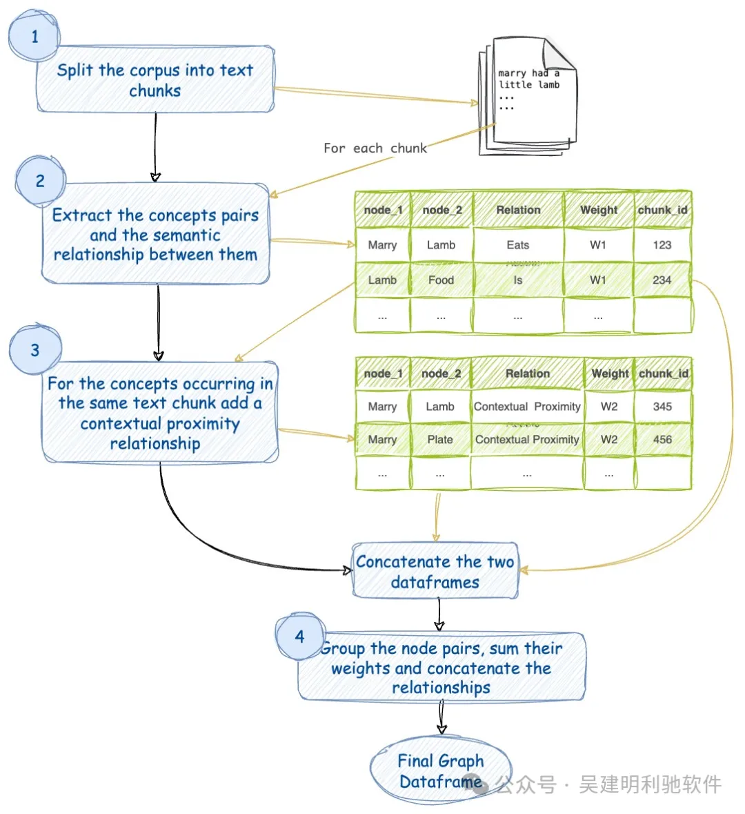

1、将文本语料库分割成块。为每个块分配一个 chunk_id。

2、针对每个文本块，使用大型语言模型提取概念及其语义关系。我们将这种关系赋予权重 W1。同一对概念之间可能存在多种关系。每种关系都是一对概念之间的边。

3、考虑到在同一文本块中出现的概念也会由于其上下文接近性而相关。我们将这种关系赋予权重 W2。请注意，同一对概念可能会在多个块中出现。

4、将相似的对组合起来，求其权重之和，并串联它们的关系。现在，对于任意不同的概念对之间只有一条边。该边具有一定的权重和一系列关系作为其名称。

5、它还计算每个节点的度数和节点的社区，分别用于调整图中节点的大小和着色。

# 4. 代码

1、初始化

```python
import pandas as pd
import numpy as np
import os
from langchain.document_loaders import PyPDFLoader, UnstructuredPDFLoader, PyPDFium2Loader
from langchain.document_loaders import PyPDFDirectoryLoader, DirectoryLoader
from langchain.text_splitter import RecursiveCharacterTextSplitter
from pathlib import Path
import random

## 输入数据目录
data_dir = "cureus"
inputdirectory = Path(f"./data_input/{data_dir}")

print(inputdirectory.absolute().as_uri())
## 生成的结果文件（以CSV格式）存储的位置
out_dir = data_dir
outputdirectory = Path(f"./data_output/{out_dir}")
```

2、加载文档

```python
loader = DirectoryLoader(inputdirectory, show_progress=True)

documents = loader.load()

splitter = RecursiveCharacterTextSplitter(
    chunk_size=1500,
    chunk_overlap=150,
    length_function=len,
    is_separator_regex=False,
)

pages = splitter.split_documents(documents)
print("chunks数量 = ", len(pages))
print(pages[3].page_content)
```

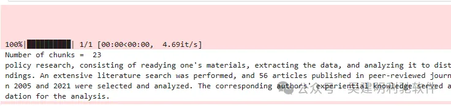

3、创建包含所有分块的数据框

```python
from helpers.df_helpers import documents2Dataframe
df = documents2Dataframe(pages)
print(df.shape)
df.head()
```

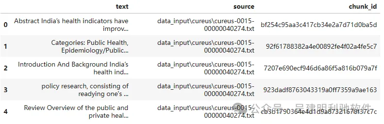

4、提取概念

```python
# 使用helpers/prompt函数从文本中提取概念
from helpers.df_helpers import df2Graph
from helpers.df_helpers import graph2Df
```

如果regenerate设置为True，则会重新生成数据框，并将它们以CSV格式写入，这样就无需再次计算。数据框分为两类：

dfne 是边的数据框（dataframe of edges）。

df 是块的数据框（dataframe of chunks）。

如果regenerate为False，则数据框将从输出目录读取，而不是重新计算。这意味着如果数据已经存在，程序将直接使用现有数据，无需再次处理。

```python
# 要使用大语言模型（LLM）重新生成图，将此设置为True。
regenerate = False

if regenerate:
    concepts_list = df2Graph(df, model='zephyr:latest')
    dfg1 = graph2Df(concepts_list)
    if not os.path.exists(outputdirectory):
        os.makedirs(outputdirectory)
    
    dfg1.to_csv(outputdirectory/"graph.csv", sep="|", index=False)
    df.to_csv(outputdirectory/"chunks.csv", sep="|", index=False)
else:
    dfg1 = pd.read_csv(outputdirectory/"graph.csv", sep="|")

dfg1.replace("", np.nan, inplace=True)
dfg1.dropna(subset=["node_1", "node_2", 'edge'], inplace=True)
dfg1['count'] = 4 
# 将关系的权重增加到 4。
# 当计算上下文 proximity 时，将分配权重 1。
print(dfg1.shape)
dfg1.head()
```

文章的每个文本块运行此操作并将 json 转换为 Pandas 数据帧：

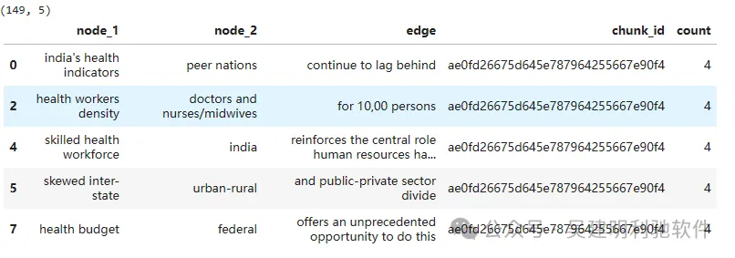

5、计算上下文 proximity（上下文相关性）

```python
def contextual_proximity(df: pd.DataFrame) -> pd.DataFrame:
    # 将数据框 melt（融化）为节点列表
    dfg_long = pd.melt(
        df, id_vars=["chunk_id"], value_vars=["node_1", "node_2"], value_name="node"
    )
    dfg_long.drop(columns=["variable"], inplace=True)

    # 用块ID作为键进行自连接，会在同一个文本块中出现的词之间创建关联。
    # 使用块ID作为键进行自连接将会创建一个在同一文本块中出现的术语之间的关联。
    dfg_wide = pd.merge(dfg_long, dfg_long, on="chunk_id", suffixes=("_1", "_2"))

    self_loops_drop = dfg_wide[dfg_wide["node_1"] == dfg_wide["node_2"]].index
    dfg2 = dfg_wide.drop(index=self_loops_drop).reset_index(drop=True)

    dfg2 = (
        dfg2.groupby(["node_1", "node_2"])
        .agg({"chunk_id": [",".join, "count"]})
        .reset_index()
    )
    dfg2.columns = ["node_1", "node_2", "chunk_id", "count"]
    dfg2.replace("", np.nan, inplace=True)
    dfg2.dropna(subset=["node_1", "node_2"], inplace=True)

    dfg2 = dfg2[dfg2["count"] != 1]
    dfg2["edge"] = "contextual proximity"
    return dfg2

dfg2 = contextual_proximity(dfg1)
dfg2.tail()
```

得到一个与原始数据框非常相似的数据框。

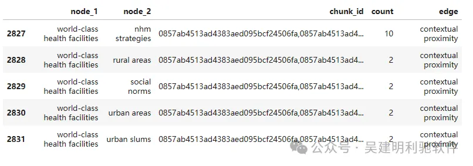

6、数据合并这2个Dataframe

```python
dfg = pd.concat([dfg1, dfg2], axis=0)
dfg = (
    dfg.groupby(["node_1", "node_2"])
    .agg({"chunk_id": ",".join, "edge": ','.join, 'count': 'sum'})
    .reset_index()
)
```

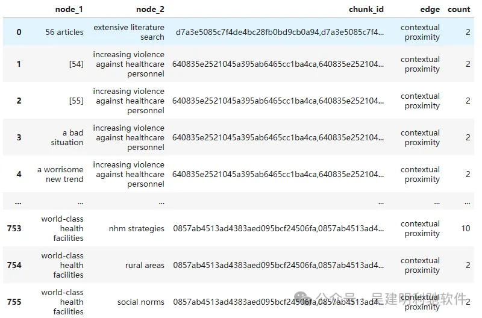

7、计算 NetworkX 图

```python
nodes = pd.concat([dfg['node_1'], dfg['node_2']], axis=0).unique()
nodes.shape
```

输出：(215,)

```python
import networkx as nx
G = nx.Graph()

## 添加节点
for node in nodes:
    G.add_node(
        str(node)
    )

## 添加边
for index, row in dfg.iterrows():
    G.add_edge(
        str(row["node_1"]),
        str(row["node_2"]),
        title=row["edge"],
        weight=row['count']/4
    )
```

8、对节点进行着色

```python
communities_generator = nx.community.girvan_newman(G)
top_level_communities = next(communities_generator)
next_level_communities = next(communities_generator)
communities = sorted(map(sorted, next_level_communities))
# 社区是指图中的一组节点
print("社区数量 = ", len(communities))
print(communities)
```

9、创建一个数据表（dataframe）来记录每个社区的颜色

```python
import seaborn as sns
palette = "hls"

## Now add these colors to communities and make another dataframe
# 在上一个问题中，我们已经创建了一个数据表 community\_colors，用于存储每个社区的唯一颜色。
# 现在，我们需要将这些颜色添加到社区检测算法的输出 results 中，并创建一个新的数据表 community\_info，其中包含每个节点的社区 ID 和社区颜色信息。
def colors2Community(communities) -> pd.DataFrame:
    ## Define a color palette
    p = sns.color_palette(palette, len(communities)).as_hex()
    random.shuffle(p)
    rows = []
    group = 0
    for community in communities:
        color = p.pop()
        group += 1
        for node in community:
            rows += [{"node": node, "color": color, "group": group}]
    df_colors = pd.DataFrame(rows)
    return df_colors


colors = colors2Community(communities)
colors
```

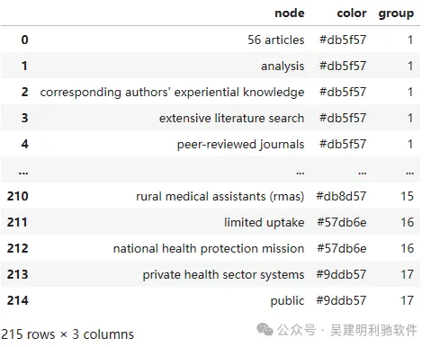

10、给图添加颜色

```python
for index, row in colors.iterrows():
    G.nodes[row['node']]['group'] = row['group']
    G.nodes[row['node']]['color'] = row['color']
    G.nodes[row['node']]['size'] = G.degree[row['node']]
```

```python
# 将一个 NetworkX 图形 G 转换为一个交互式的网络可视化，并将其保存为 HTML 文件。
from pyvis.network import Network

graph_output_directory = "./docs/index.html"

net = Network(
    notebook=False,
    # bgcolor="#1a1a1a",
    cdn_resources="remote",
    height="900px",
    width="100%",
    select_menu=True,
    # font_color="#cccccc",
    filter_menu=False,
)

net.from_nx(G)
# net.repulsion(node_distance=150, spring_length=400)
net.force_atlas_2based(central_gravity=0.015, gravity=-31)
# net.barnes_hut(gravity=-18100, central_gravity=5.05, spring_length=380)
net.show_buttons(filter_=["physics"])

net.show(graph_output_directory, notebook=False)
```

输出：./docs/index.html。

全部节点

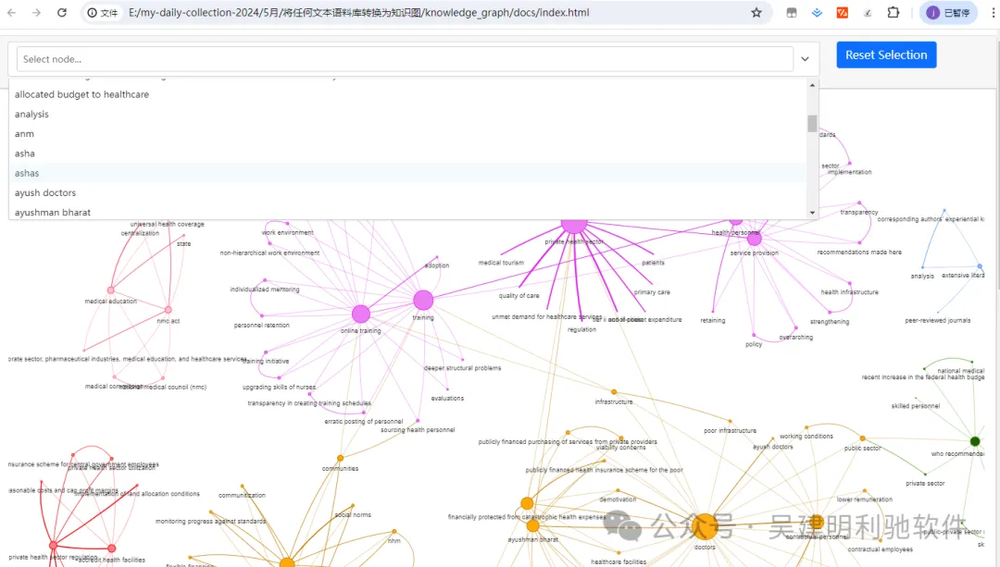

选择需要查询的节点：

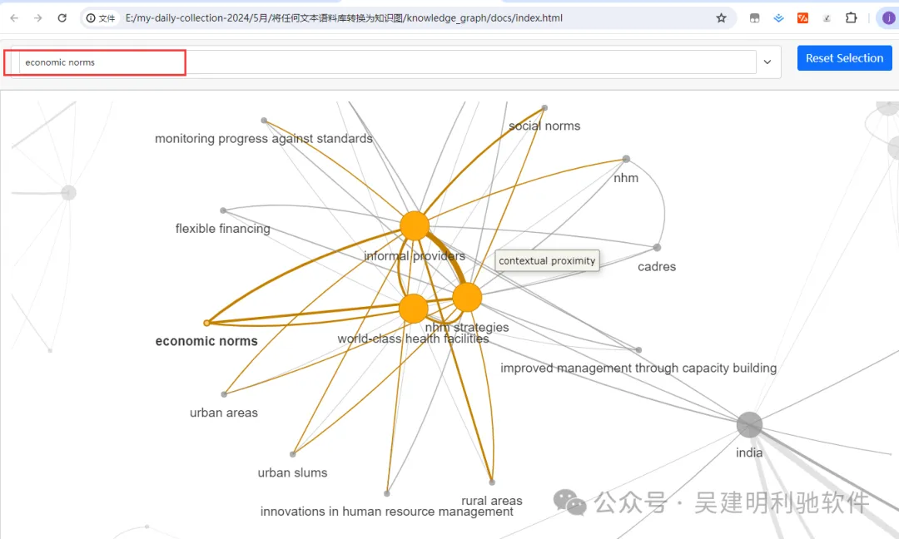

# 参考

[1] 如何将任何文本语料转换为知识图谱？https://mp.weixin.qq.com/s/pxavUtB2i0SjQazpxf_jwA
