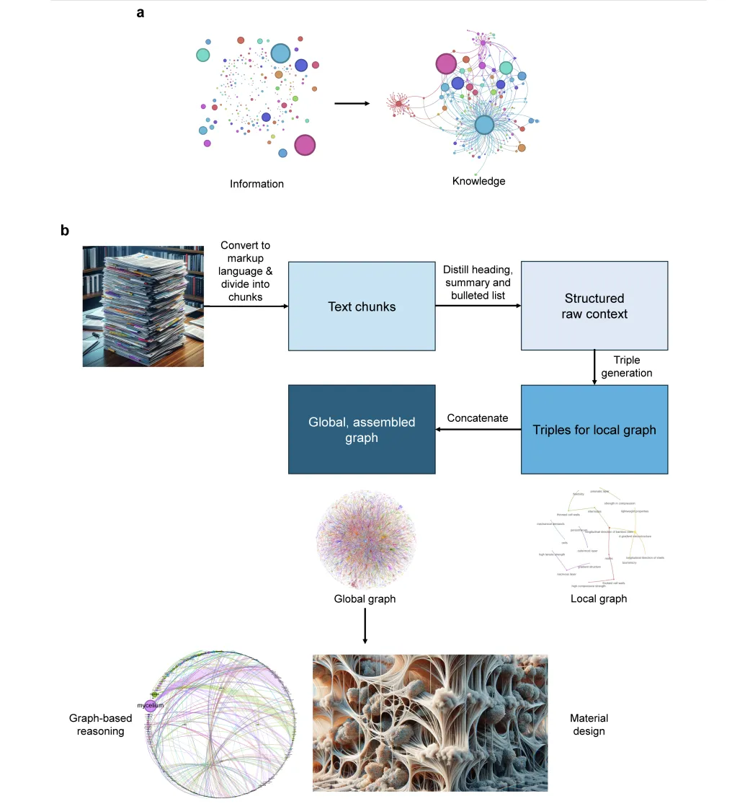
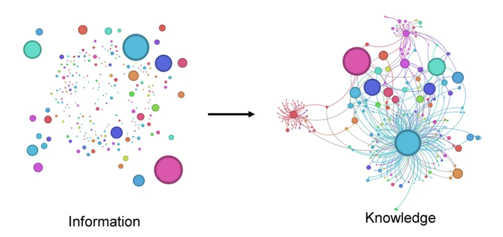

# 1. 资源

Graph Maker 的仓库见：https://github.com/rahulnyk/graph_maker

论文见：https://arxiv.org/pdf/2403.11996

# 2. 知识图谱概念介绍



上图展示了一个将信息转化为知识的方法。a面板强调了将容易获取的信息（如回答“谁”、“什么”、“在哪里”和“何时”）转化为更难以传达和转移的知识（即“如何”）。b面板说明了解决这一问题的过程：首先将科学文章转换成标记语言，然后分解成文本块，这些文本块用于提炼出简洁的科学摘要。这些原始内容进一步用于生成图的三元组，最初在每个文本块层面上创建，然后通过串联所有局部图来构建一个全局图。



要创建知识图谱，我们需要两部分信息。

知识库：可以是文本语料库、代码库、文章集合等。

本体：我们关心的实体类别及其关系类型。我可能简化了本体的定义，但这对我们的目的来说是可行的。

以下是一个简单的本体：

实体：人、地点

关系：

• 人—相关于→人

• 人—居住在→地点

• 人—访问→地点

有了这两部分信息，我们可以从提到人物和地点的文本中构建一个知识图谱。

然而，如果我们的知识库是关于处方药及其相互作用的临床研究，我们可能会使用不同的本体，其中化合物、用法、效果、反应等可能构成我们的本体。

在上一篇文章中，我们讨论了如何使用大模型提取知识图谱，而无需提供本体。这个想法是让大模型自己发现最适合给定文本语料库的本体。

尽管这种方法缺乏传统生成知识图谱方法的严谨性，但它有其优点。它可以比传统方法更容易地使用非结构化数据生成知识图谱。

它生成的知识图谱在某种意义上也是非结构化的，但它们更易构建且信息更丰富，适合GRAG（基于图谱的检索增强生成）等应用。

# 3. LLM构造图谱的问题

**为什么选择 Graph Maker？**

让我列出一些我在上一篇文章中收到的反馈中的挑战和观察。这将帮助我们理解使用大模型创建知识图谱面临的难题。让我们以《指环王》书籍的维基百科摘要为例。毕竟，没有人会不爱《指环王》！

**有意义的实体**

在自由运行的情况下，大模型提取的实体类别可能过于多样化。

例如，在“比尔博·巴金斯庆祝生日并把戒指留给佛罗多”这句话中，大模型可能会将“o比尔博·巴金斯庆祝生日”或“庆祝生日”标记为“动作”。但如果它提取“生日”作为“事件”可能更有用。

**一致的实体**

它也可能在不同的上下文中错误地标记相同的实体。例如：“索伦”、“黑暗之主索伦”和“黑暗之主”不应被提取为不同的实体。

或者，如果它们被提取为不同的实体，它们应该用等价关系连接。

**解析的弹性**

大模型的输出本质上是不确定的。为了从大文档中提取知识图谱，我们必须将语料库分割成较小的文本块，然后为每个块生成子图。

为了构建一致的图谱，大模型必须一致地输出符合给定模式的JSON对象，缺少一个可能会对整个图的连通性产生不利影响。

尽管大模型在生成格式良好的JSON对象方面变得越来越好，但它仍然远非完美。具有有限上下文窗口的大模型也可能生成不完整的响应。

**实体的分类**

大模型在识别实体时容易出错。当上下文是特定领域时，或者当实体不是标准英语命名时，这个问题更严重。NER模型在这方面可能表现更好，但它们也仅限于其训练数据。此外，它们无法理解实体之间的关系。

让大模型在类别上一致是提示工程的一门艺术。

**隐含关系**

关系可以是明确提到的，也可以是上下文隐含的。例如：

“比尔博·巴金斯庆祝生日并把戒指留给佛罗多”隐含了以下关系：

• 比尔博·巴金斯→拥有者→戒指

• 比尔博·巴金斯→继承人→佛罗多

• 佛罗多→拥有者→戒指

在某些时候，我认为大模型在提取关系方面会比任何传统方法更好。但目前，这仍是一个需要巧妙提示工程的挑战。

# 4. Graph Maker

```bash
pip install knowledge-graph-maker
```

以下是实现知识图谱的五个步骤。

Graph Maker 的Github 仓库见：https://github.com/rahulnyk/graph_maker

## 4.1 定义图的本体

该库理解如下的本体架构。实际上，本体是一个pydantic模型。

```python
ontology = Ontology(
    labels=[
        {"Person": "人物名称，无需任何形容词，记住一个人可以通过名字或代词引用"},
        {"Object": "物体名称，不要加定冠词'the'"},
        {"Event": "涉及多人的事件，不包括修饰词或动词如gives, leaves, works等"},
        "Place",
        "Document",
        "Organisation",
        "Action",
        {"Miscellaneous": "任何重要概念无法归类到其他标签"}
    ],
    relationships=[
        "任何实体对之间的关系",
    ],
)
```

我调整了提示，以生成与给定本体一致的结果。

我认为它在这方面做得相当不错。然而，它仍然不是百分之百准确。准确性取决于我们选择的模型、应用、本体和数据质量。

## 4.2 将文本分块

我们可以使用尽可能大的文本语料库来创建大规模的知识图谱。

然而，大模型目前有一个有限的上下文窗口。因此，我们需要适当地分块文本，并一次创建一个块的图谱。

块的大小应根据模型的上下文窗口确定。在这个项目中使用的提示占用了大约500个tokens。

其余的上下文可以分为输入文本和输出图谱。根据我的经验，较小的200到500个tokens的块可以生成更详细的图谱。

## 4.3 将这些块转换为文档

文档是一个具有以下架构的pydantic模型：

```python
class Document(BaseModel):
    text: str
    metadata: dict
```

我们添加到文档中的元数据将标记为从文档中提取的每个关系。我们可以将关系的上下文，例如页码、章节、文章名称等，添加到元数据中。

通常每对节点在多个文档中有多个关系。元数据有助于将这些关系情境化。

## 4.4 运行Graph Maker

Graph Maker直接接受一个文档列表，并迭代每个文档以创建每个文档的子图。

最终输出是所有文档的完整图谱。

以下是一个简单的示例：

```python
from knowledge_graph_maker import GraphMaker, Ontology, GroqClient

model = "mixtral-8x7b-32768"

llm = GroqClient(model=model, temperature=0.1, top_p=0.5)
graph_maker = GraphMaker(ontology=ontology, llm_client=llm, verbose=False)

graph = graph_maker.from_documents(docs)

print("Total number of Edges", len(graph))
```

Graph Maker将每个文档运行通过大模型，并解析响应以创建完整的图谱。

最终的图谱是一个边列表，每条边都是一个类似于以下的pydantic模型。

```python
class Node(BaseModel):
    label: str
    name: str

class Edge(BaseModel):
    node_1: Node
    node_2: Node
    relationship: str
    metadata: dict = {}
    order: Union[int, None] = None
```

我调整了提示，使其现在生成相当一致的JSON。如果JSON响应解析失败，Graph Maker还会尝试手动将JSON字符串拆分成多个边的字符串，然后尽力挽救有用的信息。

## 4.5 保存到Neo4j

我们可以将模型保存到Neo4j中，以创建RAG应用程序、运行网络算法，或者仅仅通过the Bloom来可视化图谱。

```python
from knowledge_graph_maker import Neo4jGraphModel
create_indices = False
neo4j_graph = Neo4jGraphModel(edges=graph, create_indices=create_indices)
neo4j_graph.save()
```

图谱的每条边都会作为一个事务保存到数据库中。如果你是第一次运行此代码，请将create_indices设置为true。

这将通过在节点上设置唯一性约束来准备数据库。

## 4.6 可视化

这里，由于我们已经将图谱保存到Neo4J中，可以直接利用Bloom来可视化图谱。

为了避免重复，我们生成了与上一篇文章不同的可视化。假设我们希望看到角色之间的关系如何随着书籍的进展而演变。

我们可以通过跟踪在图谱生成过程中，边的增量添加顺序来实现这一点。为此，Edge模型有一个名为‘order’的属性。

这个属性可以用于为图谱添加时间或顺序维度。

在我们的示例中，图谱生成器会自动将特定文本块在文档列表中出现的顺序编号添加到它从该块中提取的每条边上。

所以，为了看到角色之间关系的演变，我们只需按边的顺序对图谱进行切片即可。

以下是这些切片的截图。

# 5. 知识图谱与RAG

这种知识图谱的最佳应用可能在于RAG。有大量文章讨论如何使用图谱增强RAG应用程序。

本质上，知识图谱提供了许多不同的知识检索方式。根据我们设计图谱和应用程序的方式，其中一些技术可能比简单的语义搜索更强大。

最基本的，我们可以将嵌入向量添加到我们的节点和关系中，并针对向量索引运行语义搜索以进行检索。

然而，我认为知识图谱在RAG应用中的真正威力在于将Cypher查询和网络算法与语义搜索相结合。

我自己也在探索其中一些技术。希望能在下一篇文章中写到它们。

# 参考

[1] Graph Maker：轻松使用开源大模型将文本转为知识图谱，发现新知识！, https://mp.weixin.qq.com/s?__biz=Mzk0OTY0NzM1Ng==&mid=2247485901&idx=1&sn=0dbf87ae6cd841e826126cf2c3b99be0&chksm=c246aaafc98463df1ac58fc73a68a0638907c7f1f27705adf0a4e2eb0b6ba4ae556119b5a5af&scene=132&exptype=timeline_recommend_article_extendread_extendread_interest&show_related_article=1&subscene=132&poc_token=HIBLaGaj-UmJBKV-o4LYvVI6nbVh0UfQHAWNy4Z_