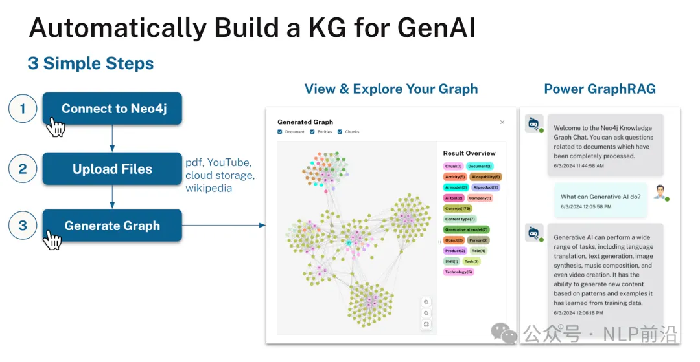

# 1. 资源

https://github.com/neo4j-labs/llm-graph-builder

项目主要是将非结构化数据（pdf、文档、txt、youtube 视频、网页等）转换为存储在 Neo4j 中的知识图。它利用大型语言模型（OpenAI、Gemini 等）的强大功能从文本中提取节点、关系及其属性，并使用 Langchain 框架创建结构化知识图。

项目主要特点：

- 知识图谱创建：使用LLMs将非结构化数据转换为结构化知识图谱。
- 提供架构：提供您自己的自定义架构或使用设置中的现有架构来生成图表。
- 查看图表：在 Bloom 中一次查看特定源或多个源的图表。
- 与数据聊天：通过会话查询与 Neo4j 数据库中的数据进行交互，还检索有关查询响应来源的元数据。