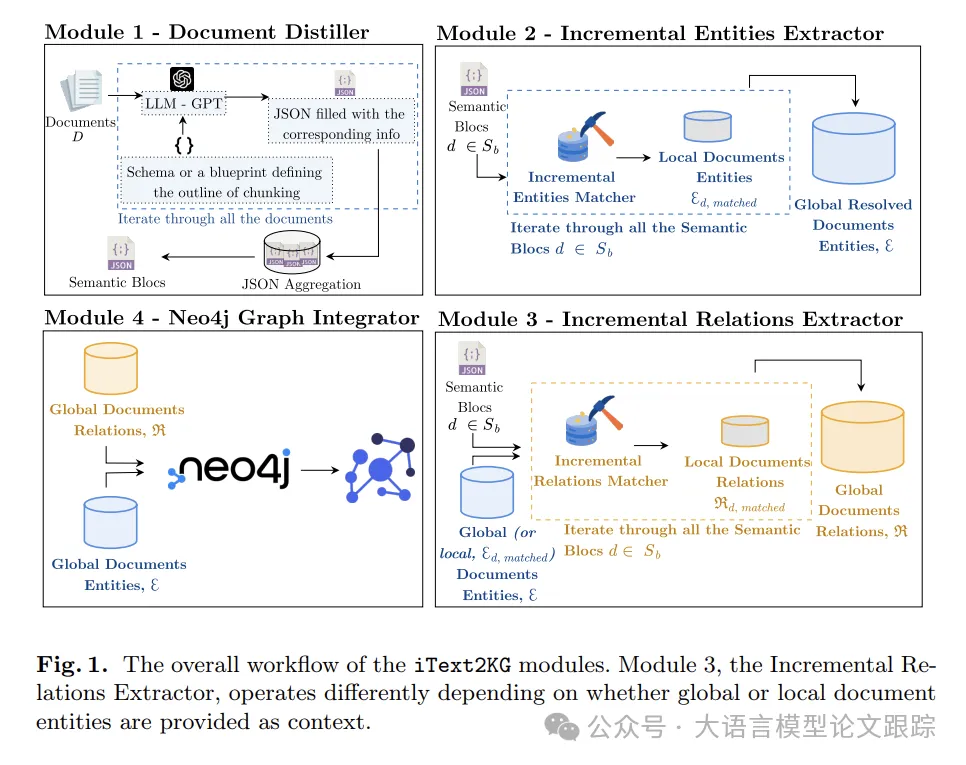
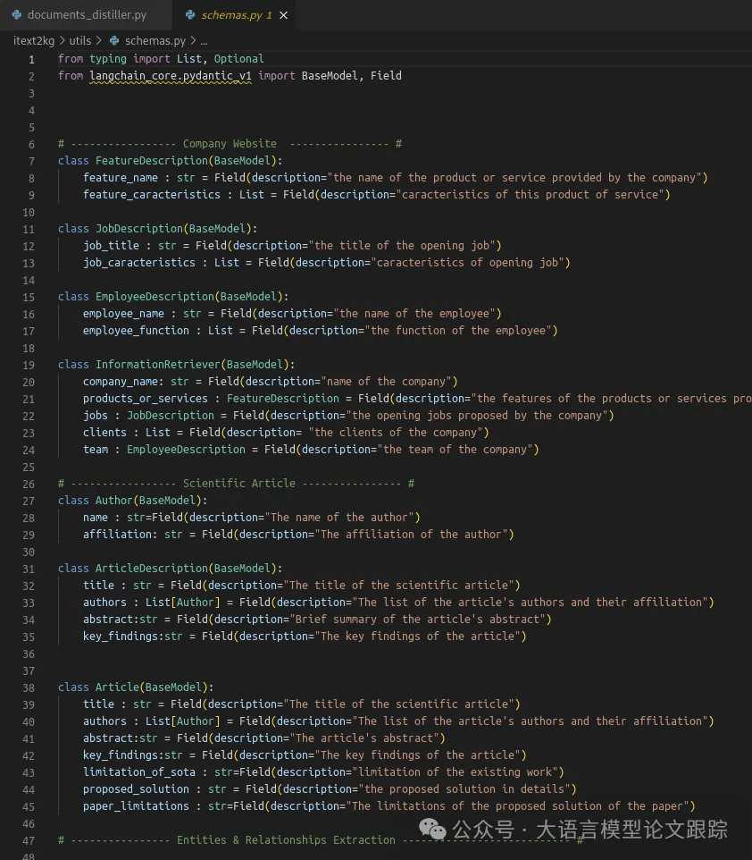
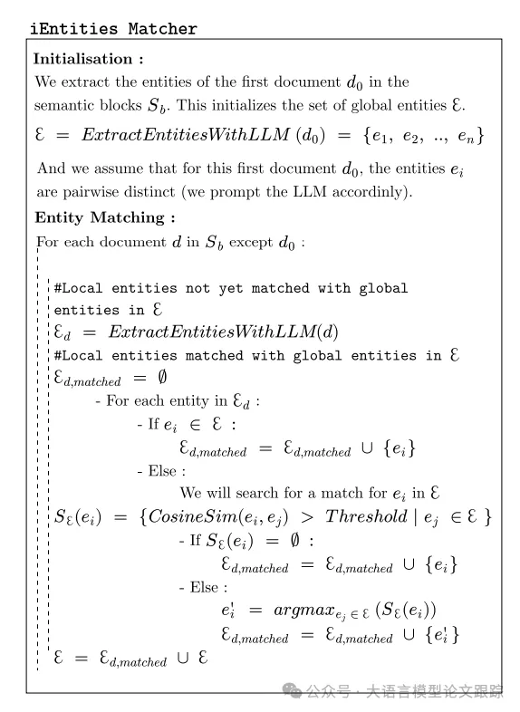
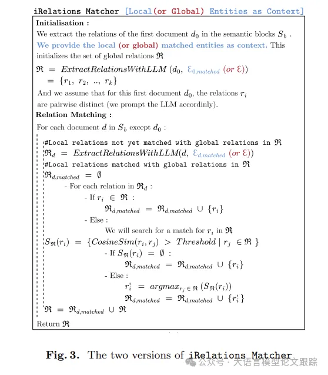
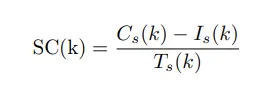
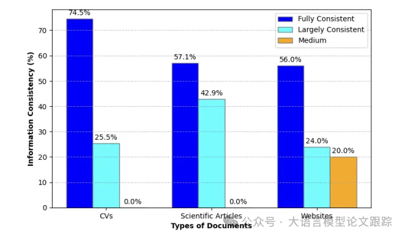
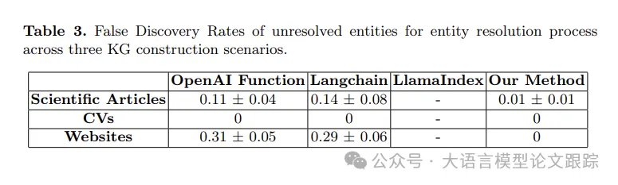
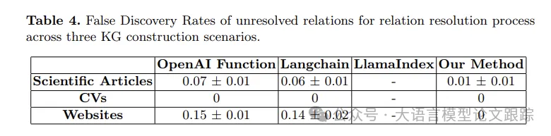
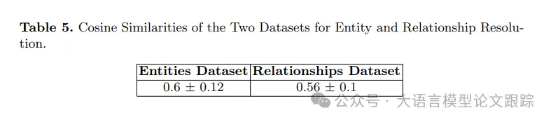
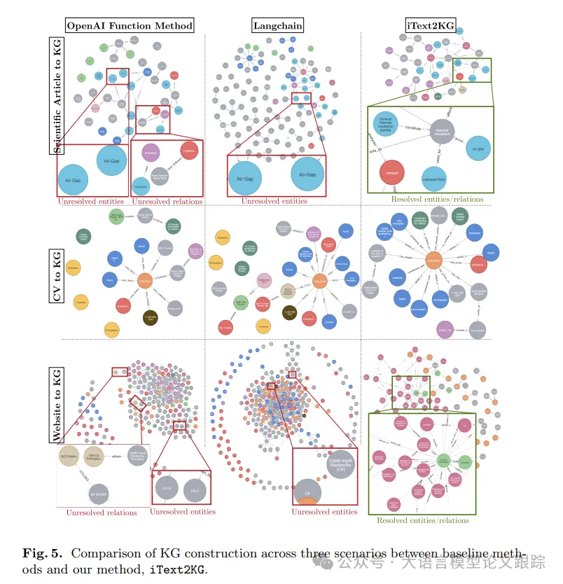

# 1. 资源

- 论文：iText2KG: Incremental Knowledge Graphs Construction Using Large Language Models
    - https://arxiv.org/abs/2409.03284
- 项目地址：https://github.com/AuvaLab/itext2kg
  - https://github.com/AuvaLab/itext2kg/tree/main/itext2kg/graph_integration
  
# 2. 原理

为了解决以上问题，作者提出了iText2KG。上图是 iText2KG 的工作流程概览。包含四个模块：

• 1）文档蒸馏器（Document Distiller）：利用 LLM，将原始文档重新整理为预定义和语义块。该模式类似预定义的 JSON 结构，引导语言模型从每个文档中提取与特定键相关的特定文本信息；

• 2）增量实体提取器（Incremental Entities Extractor）：获取语义块，识别语义块内独特的语义实体，消除歧义，确保每个实体都有清晰的定义并与其他实体区分开；

• 3）增量关系提取器（Incremental Relations Extractor）：处理已解决的实体和语义块，以检测语义上独特的关系。

• 4）图集成器（Graph Integrator）：使用 Neo4j 以图形格式直观地呈现这些关系和实体。

## 2.1 文档蒸馏器

运用大型语言模型（LLM）依照预定义的模式（Schema）或蓝图将输入文档重写为语义块。这些模式（Schema）并非本体，而是一个蓝图，使 LLM 倾向于特定类别，同时在其他方面保持灵活性。

实际上，该模式（Schema）的功能类似于预定义的 JSON，引导 LLM 从每个文档中为特定的键提取特定的值（文本信息）。在这个项目的Github仓库里可以找到一些这种Schema的示例（如下图）：

对于每个文档，如果其中存在所需信息，将获得一个半填充的 JSON。

然后将所有这些半填充的 JSON 聚合起来，形成文档的语义块。

该模块的主要目标为：

-（a）通过减少可能用冗余信息污染图形的噪声来提高信噪比。

-（b）利用模式引导图形构建过程，特别是针对概念键。例如，对于一篇科学文章，能够提取“标题”和“作者”，并添加诸如“具有标题”和“具有作者”之类的关系以及语义信息。为确保解决方案在各种用例中的适用性，Schema是一个取决于用户偏好和用例特殊性的输入。通过重新制定原始文档来增强图形构建过程的构想已被以下论文所证实。

## 2.2 增量实体提取器（Incremental Entities Extractor）

增量式实体匹配器（iEntities Matcher）会遍历所有语义块并提取全局文档实体。

iEntities Matcher 的主要算法如上图。

iEntities Matcher的核心算法是先利用大型语言模型（LLM）从首个语义块（即文档0）中提取实体，构建全局实体集ℰ，且假定这些实体在首次迭代中仅此一次成对独立。

遵循约束（C1，原文具体定义，即：实体和关系都应该描述一个语义上独特的概念。），引导LLM提取单一概念的实体，以避免语义混淆。

对于文档集合中的后续文档，算法抽取局部实体，并尝试将其与全局实体集中的实体进行匹配。

如果局部实体在中找到对应，则加入到匹配集中。

若未找到，算法将使用预设阈值的余弦相似度在中寻找相似实体。若依然无匹配项，局部实体将直接加入匹配集；

若有，则基于最高相似度选取最佳匹配的全局实体加入。随后，全局实体集通过与匹配集的合并进行更新。

这一流程在文档集合中的每个文档上重复执行，最终形成一个全面的全局实体集。

## 2.3 增量关系提取器（Incremental Relations Extractor）
将全局文档实体与每个语义块一同作为上下文提供给增量式关系匹配器（iRelations Matcher）以提取全局文档关系。

采用了与 iEntities Matcher 相同的方法。

根据将全局实体还是本地实体作为与语义块一起的上下文提供给 LLM，关系提取会有不同的表现。

当提供全局实体作为上下文时，LLM 会提取语义块直接陈述和隐含的关系，特别是对于语义块中未明确存在的实体。这为图形丰富了潜在信息，但增加了不相关关系出现的可能性。

相反，当提供本地匹配的实体作为上下文时，LLM 仅提取上下文直接陈述的关系。这种方式降低了图形的丰富程度，但也降低了不相关关系的概率。

iRelations Matcher 的两个版本如上图所示，蓝色表局部实体（Local），红色表示全局实体（Global）。

## 2.4 图集成器（Graph Integrator）

将全局文档实体和全局文档关系输入到 Neo4j 中以构建知识图谱。

https://github.com/AuvaLab/itext2kg/tree/main/itext2kg/graph_integration

# 3. 效果

## 3.1 文档蒸馏器效果评估
作者首先对模块 1 （文档蒸馏器）进行评估，以确保所提取的信息与模式及输入文档的语义相符。针对该模块，作者提出了以下指标：

• 模式一致性（Schema consistency）：检验重写文本内容是否与输入的架构相符。对于架构中每个关键点，我们定义   Cs(K)为正确对应到该关键点相关架构的元素数目。Is(k) 为那些被加入但不属于架构的元素数目。架构中某个关键点的一致性得分计算如下：

  

• 信息一致性（Information consistency）：评估重写文本的内容是否与原始报告的语义相符，具体分类为：差异极大（<30%）、中等差异（30-60%）、大致一致（60-90%）和完全一致（>90%）。

### 3.1.1 模式一致性

上表显示，文档蒸馏器在各类文档类型中均实现了较高的模式一致性。

科学文章和简历呈现出最高的模式一致性得分，表明该模块处理结构化信息的能力出色，特别是对于主要依靠标题来组织数据的文档。

网站的一致性得分仍高达 0.94，但相对略低，这或许是由于网络内容的多样性和结构化程度较低所致。

表明文档蒸馏器在处理和从不同类型文档中提取结构化信息方面的稳健性和适应性。

### 3.1.2 信息一致性

上图展示了不同类型文档（简历、科学文章和网站）的信息一致性情况。

对于简历，大部分信息（74.5%）完全一致，25.5%大致一致，不存在中等一致性。表明重写的文本与简历原始内容的语义高度匹配。因为简历主要以清晰简洁的短语编写，使得大型语言模型更易于捕捉语义。

对于科学文章，57.1%的信息完全一致，42.9%大致一致，在保留原始语义方面展现出较高的准确性，尽管略逊于简历。这在预料之中，特别是鉴于科学文章是用更为复杂的科学英语撰写的。

网站有 56.0%的信息完全一致，24.0%大致一致，20.0%为中等一致性。这可能归因于网络内容的非结构化特性，这给准确的语义重写带来了更大的挑战。

## 3.2 增量实体提取器和增量关系提取器效果评估

• 三元组提取精度（Triplet Extraction Precision）：不关心实体/关系解析过程，直接评估与相应文本的三元组一致性。三元组有的时候是隐含的，不一定直接由文本表述。将精度得分定义为提取的相关三元组数量除以提取的三元组总数。

• 实体/关系解析错误发现率（Entity/Relation Resolution False Discovery Rate）：评估在提取的实体或关系总数中未解决（假阳性）的实体或关系所占比例。具体而言，计算未解决的实体或关系与提取的实体或关系总数的比率。通过突出总提取中的错误（未解决的实体/关系）比例，表明实体和关系提取过程的可靠性。

### 3.2.1 三元组提取

参照上图，作者分别对使用全局还是局部实体作为上下文进行比较，比较二者在关系提取方面呈现出不同的表现。

当以全局实体作为上下文时，相关三元组的精度比以局部实体作为上下文时低 10%。当使用全局实体作为上下文时，大型语言模型会提取语义块中明确提及和隐含的关系。这会形成一个更丰富的图，包含更多潜在信息，但也有更高的出现不相关关系的可能性。

使用局部实体 作为上下文会致使大型语言模型仅提取直接陈述的关系，从而导致生成的图不够丰富，但不相关关系出现的可能性较低。

这体现了一种取决于用例的权衡。作者让用户决定是接受精度降低 10%以换取更丰富的图，还是获取 10%的精度但得到相对不那么丰富的图。

### 3.2.2 实体/关系解析
LlamaIndex 为检索增强生成（RAG）构建具有边级和节点级文本信息的未连接子图；因此，未将 LlamaIndex 与 iText2KG 进行对比评估。

从上面两个图中，可以看出 iText2KG 在三个不同的知识图谱构建场景中，在实体和关系解析过程方面取得了更优的成果。

此外，结果显示，当输入文档数量较少且具有清晰、非复杂的短语时，大型语言模型在实体和关系解析方面表现出色，如简历到知识图谱的过程所示。

此外，网站到知识图谱中未解决实体和关系的错误发现率高于其他知识图谱构建场景。是由于文档（块）数量较多以及网站文本信息的非结构化特性所致。

因此，只要文档（块）数量庞大且文本是非结构化且语言复杂，实体/关系解析过程对于构建一致的知识图谱就变得至关重要。

## 4.3 阈值估计
为基于余弦相似度估计合并实体和关系的阈值，使用 GPT-4 生成了一个包含 1500 个相似实体对和 500 个关系的数据集，其灵感源自不同领域。

## 4.4 整体效果

上图对比了其他方法与iText2KG在三种不同情境下的表现：

• 其他基准方法在所有三种知识图谱构建情境中都暴露出孤立节点，这些节点间缺乏联系。可能由于实体和关系提取的同时进行，导致语言模型产生幻觉效应，进而引起“遗忘”现象。可以通过分离实体和关系提取步骤可以提升性能。

• 在“网站至知识图谱”的场景中，输入文档数量的增加往往导致图中噪声节点的增加。表明文档蒸馏在有效提炼和精炼输入数据方面的重要性。

• iText2KG方法在三种知识图谱构建情境中均展现出了更优的实体和关系解析能力。当输入文档较少且内容简单、不复杂时，语言模型在实体和关系解析上表现出高效性，这一点在“简历至知识图谱”的流程中得到了体现。然而，随着数据集变得更为复杂和庞大，挑战也随之增大，如“网站至知识图谱”的场景。输入文档的分块大小和阈值对知识图谱构建的影响不容忽视。文档蒸馏器的输入可以是独立文档或分块。分块越小，语义块能捕捉到的文档细节就越具体，反之亦然。

# 参考

[1] iText2KG：显著降低LLM构建知识图谱时的幻觉现象，https://mp.weixin.qq.com/s/H-wCjygpTJ6zsCRSf8KTWQ
