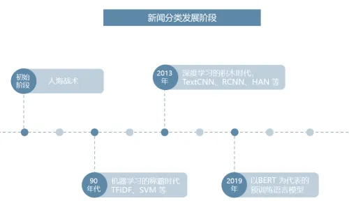
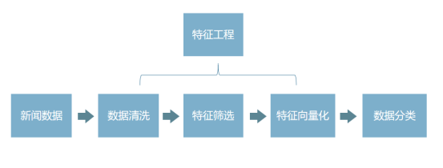
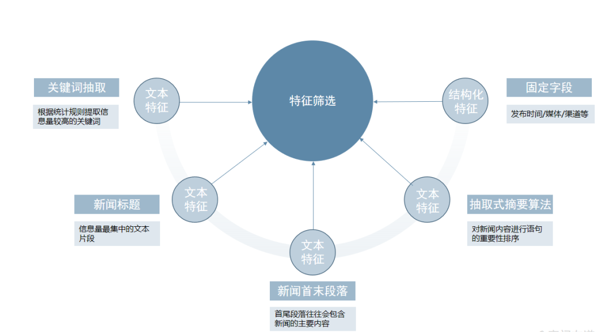

# 1. 简介

# 2. 数据处理

- 数据清洗：过滤和筛除一些与新闻无关的符号或特殊字段，去除重复内容，提升文本质量，减轻系统负荷；
- 特征筛选：根据业务需求，针对性地对关键词、新闻标题、新闻首尾段落等文本进行提取；
- 特征向量化：将每篇新闻的特征汇总为一个固定长度的向量，以便分类算法进行运算。
- 新闻分类：常规的新闻领域划分，如体育、财经、科技、娱乐等。

**数据清洗**
数据清洗主要用于提升文本质量，统一和对齐各个数据渠道的文本格式，具体而言其内容包括：
  - 滤除或统一替换特殊符号，如 html 标签，emoji 表情等；
  - 去除与新闻类别无关的特殊前缀、小尾巴等文本（如网站名）；
  - 去重，减少运算量，同时避免重复文本影响聚类算法的聚类中心，对于海量长文本的去重可以参考 SimHash算法；

**特征筛选**

文本特征
- 关键词抽取：根据统计规则提取信息量较高的若干关键词，常用的实现可以参考：
  - 基于 TextRank 的关键词提取
  - 基于 TF-IDF 的关键词提取
- 新闻标题：新闻标题是信息量最集中的文本片段，大多数新闻分类都会使用到该信息；
- 新闻的首尾段落：因为新闻的成文较为规范，首尾段落往往会包含新闻的主要内容，但是需要注意某些网站的首尾段落可能包含一些固定模板，在前置数据清洗流程中要注意进行相应的处理；
- 抽取式摘要算法：抽取式摘要算法可以理解为对新闻内容进行语句的重要性排序，从文章中抽出一些重要的句子，从而代表整篇文章的主要内容，语句的重要性排序同样是基于上述的关键词抽取、新闻标题、新闻的首末段落等步骤来实现的，一些开箱即用的摘要算法可以参考：
   - sumy：提供了若干种文章的摘要生成算法、策略

- 结构化特征（非文本）
  - 发布时间: 发布时间是判断新闻归属分类的重要参考依据
  - 发布媒体、渠道等

# 参考

[1] 干货 | 日采100W新闻数据，如何实现新闻自动分类, https://mp.weixin.qq.com/s?__biz=MzA4Njc4OTEwMQ==&mid=2651103757&idx=1&sn=56661958c1e889b30cf25e9d80dc5781&chksm=8534fbac305ed8c20e4ab229d3bc1447767668320108a4e324b1f3c3f05817c28484a53f4e21#rd
