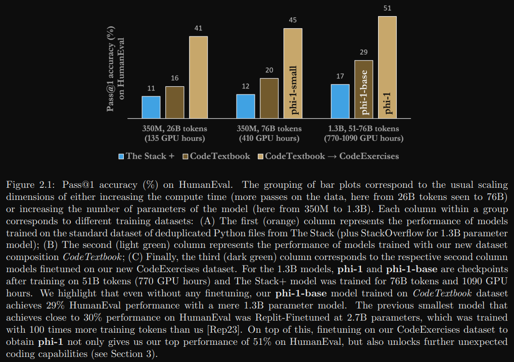
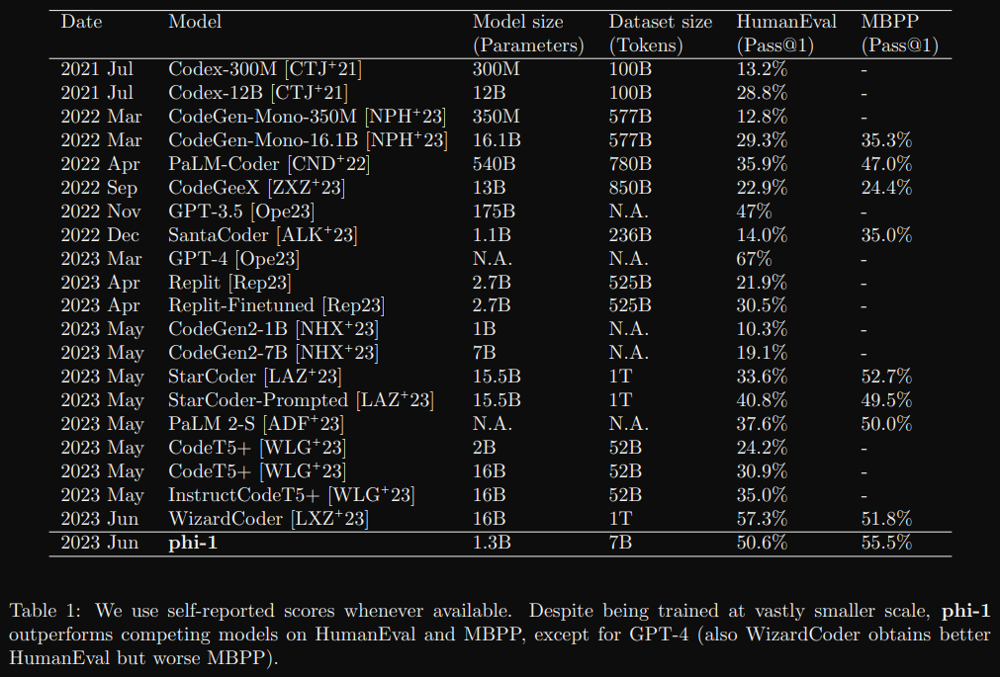

## 1. Textbooks Are All You Need

- 论文地址： https://arxiv.org/abs/2306.11644
- 发表时间： 2023.06.20

### 1.1 简介

根据模型扩展法则，为提升模型性能，需要从增大算量和模型规模入手。这里则另辟蹊径：
从数据质量出发。之前的研究证实：提升数据质量会大幅改变扩展法则趋势，
能让小模型达到大模型的效果。本文则在此结论上更进一步，
打破了已有的模型扩展法则，证明高质量的数据甚至可以在使用更少的数据和算量条件下超越大模型的SOTA。

用约 7B token 训练8轮，然后在少于 200M token的数据上微调得到 1.3B 的模型 phi-1。

### 1.2 训练细节

1. 数据来源和组成

    如标题所言，模型的最主要部分就是教科书质量的训练数据。此前用来做代码生成的数据集如The Stack，
    作者们认为都不宜用来教会模型推理和算法规划。模型结构和训练方法都比较传统，不必赘述。
    
    标准代码数据集是一个大而全的语料库，然而，通过随机抽查，作者们观察到其中许多片段对于学习写代码并不是很有指导性，存在如下缺点：
    
    - 代码示例不自成一体，依赖于外部模块或文件，导致它们在没有上下文的情况下很难理解。
    - 不少典型代码示例比较无聊，不涉及算法，比如定义常量、设置参数或配置GUI。
    - 含有算法逻辑的代码示例常常深藏在复杂或文档不完善的函数中，很难以理解或学习。
    - 代码示例偏向于某些主题，导致数据集中编码概念和技能的分布不均衡。
    
    因为要处理噪音、歧义和不完整数据，即使是一个想学编程的真人，看到上面这些示例也会觉得失望和低效（无比O疼）。
    因此，对于LLM而言，这些数据一样质量堪忧。作者们认为，一个简捷、自包含、有指导性且分布均衡的优秀数据集，必定会让语言模型学习得更好。
    
    本文使用的训练数据少于 7B token：
    
    - 过滤的code-language数据集：The Stack和StackOverflow的子集，使用基于语言模型的分类器过滤 （约6B token）
    - 人造教科书数据集：由GPT-3.5生成的Python数据集（< 1B token）
    - 小型的人造习题数据集：Python练习和解答 （约 180M token）。
    
    将code-language数据集和人造科教科书数据集称为CodeTextbooks用于预训练，
    得到基模型phi-1-base; 再使用人造习题数据集 CodeExcercises 微调得到 phi-1 模型。
    训练效果如下图所示：
    
    
    
    其中横轴是模型规模，逐渐变大。由图可见，使用 CodeTextbooks 预训练的模型相较原始数据集性能有所提升。
    虽然 CodeExcercises 规模很小，但相较于仅用 CodeTextbooks 预训练的模型性能提升明显：
    仅 1.3B 的预训练模型 phi-1-base 已在HumanEval数据集达到 29% Pass@1

2.  数据过滤器

    使用原始的代码生成数据集The Stack和The StackOverflow中的Python语言子集，包括约35M样本，总大小超过 35B token。
    使用GPT-4标注了约 100K 样本，标注prompt为："determine its educational value for a student whose goal is 
    to learn basic coding concepts"，也就是确定对一个要学编程基本概念的学生来说，这段代码的价值如何。
    然后使用这个标注数据集训练一个简单的随机森林分类器，用于判断一段代码样本的优劣。
    feature使用预训练codegen模型的embedding。

3. 数据构造
   （1） 构造数据   

       构造高质量代码生成的数据集的主要挑战之一是确保示例的多样性和不重复。所谓多样性，是指示例应涵盖广泛的编程概念、
       技能和场景，并且在难度、复杂度和风格上有所变化。多样性让语言模型接触到解决问题的不同方式，
       减少了过拟合或记忆特定模式的风险，同时增加模型对未见过任务的泛化能力和鲁棒性。
    
       然而，实现多样性并不简单，特别是使用另一个语言模型生成合成数据。仅仅通过prompt让模型生成编程教材或练习，
       即使在指令或参数上有一些变化，也很可能会得到一个同质化和冗余的数据集，其中相同的概念和解决方案反复出现，
       只有微小区别。这是因为语言模型在给定其训练数据和先验知识的情况下，往往会遵循最有可能或最常见的路径，
       它们缺乏创造性和动力去探索生成代码的新方式。因此，我们需要找到合适的“秘籍”，
       使语言模型在输出中更具创造性和多样性，同时仍然保持示例的质量和连贯性。

       受之前生成短篇故事论文的启发，通过在prompt中加入从固定词表中随机选择的词汇，在prompt中加入随机性，从而产生多样性的数据集。  
    
   （2） 模型合成数据   

       此数据集是用GPT3.5生成的Python教科书，少于1B token，主要包括高质量自然语言问题描述和相关的代码段。
       多样性由主题和目标受众的不同引入随机性来保证。

   （3） CodeExcercises 数据集   

       这个用于微调，少于 180M 的小数据集由Python习题和解答构成。每个练习都是一个待补全函数的字符串。
       此数据集是为了让模型对齐基于自然语言指令完成函数补全任务。数据集也由GPT-3.5生成，引入多样性的方式是使用不同的函数名。
       为避免测试数据集污染，我们使用了额外手段保证HumanEval中的问题不会在微调阶段出现。

4. 数据去重
    - n-gram
    - embedding和句法相似度
      - embedding用l2距离：阈值设在0.95到0.8
      - 句法用编辑距离
   
### 1.3 模型结构

1.3B phi-1 模型有24层，隐层维度2048，使用了FlashAttention实现的Multi-head attention。
除此之外未使用其他优化技术如Fill-In-the-Middle (FIM) 和 Multi-Query-Attention (MQA)。

使用deepspeed在8卡Nvidia-A100 GPU上训练，预训练模型 phi-1-base 训练用了不到4天，微调 phi-1 用了7小时。

### 1.4 评估

指标用来衡量LLM在代码生成上的质量，以单位测试通过率为准而非文本匹配。它的含义从直观上来讲，
是让模型生成k段代码，有任意一段pass了单元测试，则认为模型解决了该问题，
考虑到直接计算pass@k的方差和计算稳定性，该指标使用一种改进的算法进行计算。
细节可参考 # Evaluating Large Language Models Trained on Code。

从结果来看，phi-1以更小的模型和数据取胜或基本持平，性价比非常好：

### 1.5 局限性

- phi-1仅限制在Python代码任务，非通用编程模型
- phi-1缺少编程方面的领域知识
- 由于数据集在语言和风格方面缺乏多样性，模型对风格变化或prompt中的错误不够健壮

# 参考

[1] LLM数据为王: Textbooks Are All You Need, https://zhuanlan.zhihu.com/p/642684154