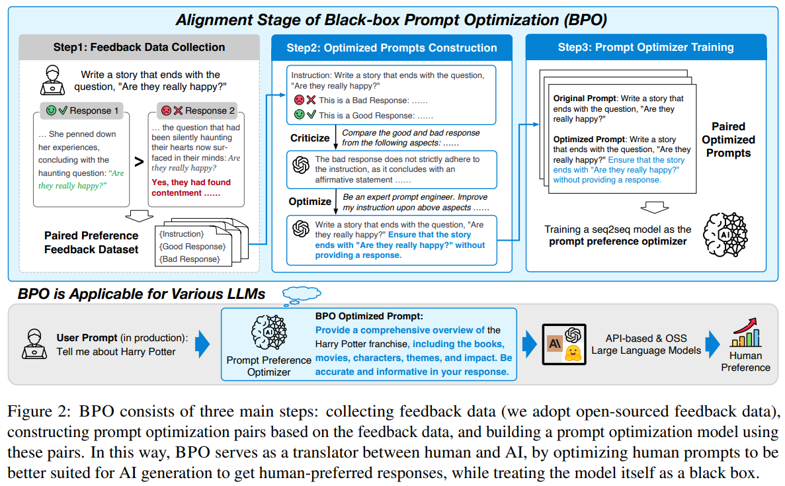
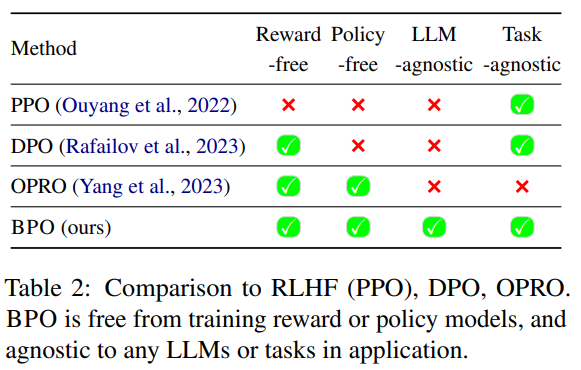
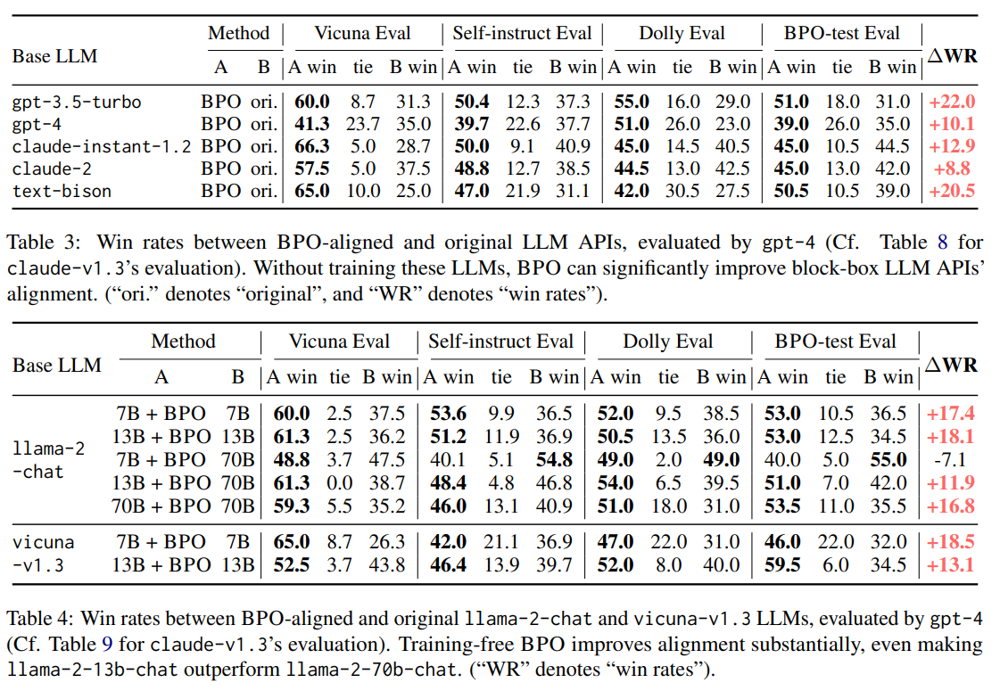

# 1. BPO：灵活的 Prompt 对齐优化技术

- 论文：Black-Box Prompt Optimization: Aligning Large Language Models without Model Training
- 论文：https://arxiv.org/abs/2311.04155
- 代码：https://github.com/thu-coai/BPO
- 数据：https://huggingface.co/datasets/THUDM/BPO
- 模型：https://huggingface.co/THUDM/BPO

Takeaway：以输入 prompt 优化的角度对大模型进行对齐，具体做法是冻结大模型参数，
训练一个 prompt 优化模型来改写输入给大模型的 prompt，相当于用模型取代了痛苦的手动调整
prompt以调教大模型的过程，符合直觉，且可以用于闭源大模型，实验结果证实优于DPO、PPO 或与他们互补。

## 1.1 简介

左：PPO、DPO 等优化生成模型参数本身的 RL 对齐算法；右：优化 prompt 重写模型参数、固定生成模型参数的 BPO

## 1.2 训练集的构建

以上是 BPO的思想和训练推理框架，接下来的关键就是如何构造优质的(naive prompt, good prompt)
数据对来训练prompt optimizer的参数γ。在NLP社区对SFT和 RLHF的研究中，已经涌现了诸多形式为
(naive prompt, good response, bad response)的human preference标注数据集，
本文在这些数据集的基础上用ChatGPT 来生成 BPO 训练所需要的prompt数据对。如下图所示，我们将
naive prompt、good response 、bad reponse 输入ChatGPT，加以两步指引：

1. Criticize: 让 ChatGPT 比较 good response 和 bad response，说明前者好在哪里；
2. Optimize: PUA 一下ChatGPT，告诉它“你是个 prompt 专家”，根据 good response 的优良属性改写原来的 naive prompt。

作者构建了规模为 14k 的(naive prompt, good prompt)数据对，已经发布在其git repo中，
之后在该数据集上训练了prompt优化器的参数γ，其初始化为llama2-7b-chat（大模型中的“小”模型）。

## 1.3 训练推理

1. 训练

   - 使用Llama-2-7b-chat-hf，训练3轮，使用最后一轮。
   - 优化器AdamW, Beta1=0.9, Beta2=0.999, Lr=2e-5, 0.1 warm-steps, linear decay
   - 8×80GB NVIDIA A800 GPUs

2. 推理

   - BPO decoding: top-p 0.9, temperature 0.6
   - LLM decoding: temperature 0`

3. RLHF

   - Deepspeed Chat
   - 1 epoch for reward model and PPO optimization
   - reward model 80% accuracy
   - 16k data for PPO from OASST1, hh-rlhf, 
     Chatbot Area Conversations, Alpaca-GPT4 

## 1.4 实验结果

对齐黑盒闭源大模型

与需要大模型本身参数θ与其梯度的PPO、DPO等白盒训练算法不同，BPO 提供的是一个通用的 prompt 优化器，
可以用于 OpenAI GPT、Claude 等闭源的黑盒大模型。 作者在 Vicuna Eval、Self Instruct Eval
等一些列 benchmark上的测评表明，接入 BPO 后，GPT和 Claude 的回答质量显著上升（和原始版本的回答 
battle，用 GPT-4和 Claude-2 评测，带 BPO 时的胜率高 10-20个百分点）。

对齐白盒开源大模型

对llama-2-chat 的测评显示，13B 的模型+7B参数的BPO胜率比原始的 70B模型还高 11.9 个百分点，
这回属于是在参数量更少的情况下取得了优势。

# 参考

[1] 大模型对齐的奇兵——黑盒 Prompt 优化BPO，https://zhuanlan.zhihu.com/p/668685286