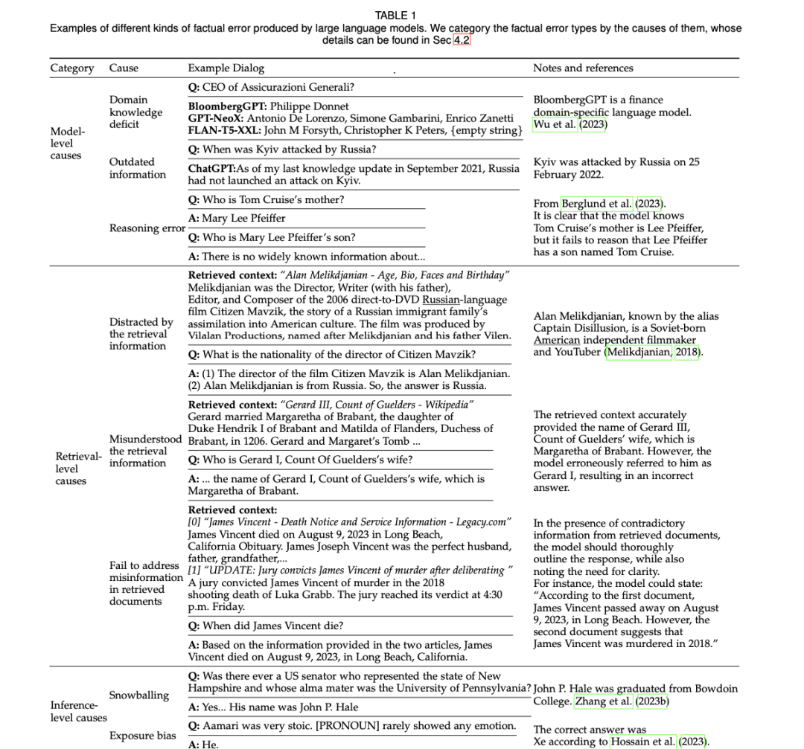

# 1. 简介

事实性问题与大型语言模型领域的几个热门话题密切相关，包括幻觉、过时信息和特定领域

表1中展示了事实性问题的各种实例。

LLM中的幻觉和事实性问题都与生成内容的准确性和可靠性有关，但它们涉及不同的方面。

举例说明两者的区别：

如果一个LLM在被要求创作"一个关于兔子和狼交朋友的童话故事"时，
创作出了一个关于"兔子和狗交朋友"的故事，那么它就表现出了幻觉。不过，这并不一定是事实性错误。

如果生成的内容包含准确的信息，但与提示的具体内容有出入，那就是幻觉，而不是事实性问题。

例如，如果LLM的输出包含了比提示指定更多的细节或不同的元素，但事实仍然正确，这就是幻觉。

相反，如果LLM避免给出直接答案，而是说"我不知道"，或者给出了一个准确的答案，
但遗漏了一些正确的细节，那么这就是事实性问题，而不是幻觉。

此外，值得注意的是，幻觉有时会产生一些内容，虽然与原始输入内容有偏差，但在事实方面仍然是准确的。

# 2. 原因分析

大模型事实性问题的归因分析

1、模型层面的原因
   - 缺少领域知识
   - 过时信息
   - 记忆化：模型并不总能保留训练语料库中的知识
   - 遗忘
   - 推理失败

2、检索层面的原因
   - 信息不足：如果检索到的数据没有提供足够的上下文或细节，
     大模型可能很难做出符合事实的回答。由于缺乏全面的证据，这可能会导致通用甚至错误的输出。
   - LLM无法识别的错误信息。 LLM有时会接受并传播检索数据中的错误信息。
     当模型遇到知识冲突时，即检索到的信息与其预先训练的知识相矛盾，
     或者多个检索到的文档相互矛盾时，这种情况更加。例如，证据越不相关，
     模型就越有可能依赖其内在知识，LLM在检索过程中容易受到错误信息的攻击。
   - 干扰信息。 LLM可能会被检索数据中的无关信息或干扰信息误导。
     例如，如果证据中提到了"俄罗斯电影"和"导演"，那么LLM可能会错误地推断出"导演是俄罗斯人"。
     分散注意力的检索结果会严重影响LLM。
   - 长文本偏差。 此外，在处理长检索输入时，模型在处理输入上下文开头或
     结尾的信息时往往会表现出最佳性能。与此相反，当模型需要从这些冗长上下文的
     中间部分提取相关数据时，它们的性能可能会显著下降。
   - 曲解相关信息。 即使检索到的信息与查询密切相关，LLM有时也会误解或曲解这些信息。  
     虽然这种情况在检索过程优化后可能会减少，但它仍然是一个潜在的错误来源。。

3、推理层面的原因

   - 滚雪球效应。在生成过程中，一开始的小错误或小偏差会随着模型不断生成内容而加剧。
     例如，如果一个LLM错误地理解了一个提示或以一个不准确的前提开始，随后的内容就会进一步偏离事实。
   - 错误解码。 解码阶段对于将模型的内部表征转化为人类可读的内容至关重要。
     在这一阶段出现的错误，无论是由于波束搜索错误还是采样策略不理想等问题，
     都会导致输出错误地反映模型的实际"知识"或意图。这可能表现为不准确、矛盾，甚至是无意义的陈述。
   - 暴露偏差。 LLM是训练数据的产物。如果他们更频繁地接触到某些类型的内容或措辞，
     他们可能会偏向于生成类似的内容，即使这些内容并不是最符合事实或最相关的。
     如果训练数据不平衡，或者某些事实场景代表性不足，这种偏差就会特别明显。
     在这种情况下，模型的输出结果反映的是训练数据，而不是客观事实。
     例如，LLM可以正确识别符合二元性别系统的个体的性别，但在确定非二元或中性性别时，LLM表现不佳。

# 参考

[1] 再看大模型事实性的界定、错误的起因、评估及前沿缓解方案：Survey on Factuality in LLMS, https://mp.weixin.qq.com/s?__biz=MzAxMjc3MjkyMg==&mid=2648404394&idx=1&sn=d7cfcf2cd9aa6756d3cbff938f5f4cf2&chksm=838362ffb4f4ebe9455e0a78f2d16e3b9ba55249fb0e751c7b486e79cd2e8bce9ceb9d6fb83e&scene=178&cur_album_id=2120957806534033409#rd