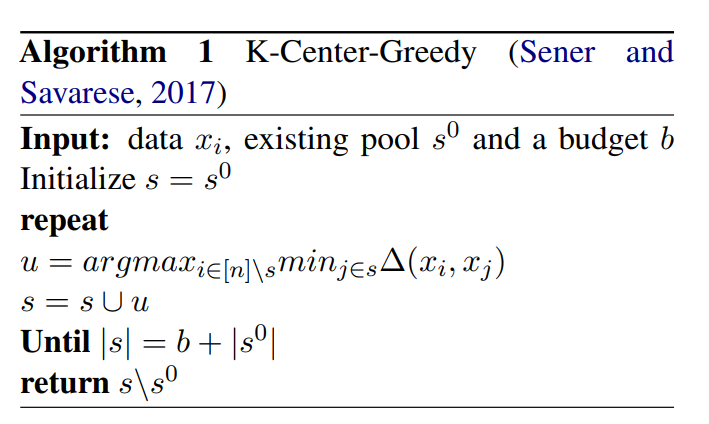
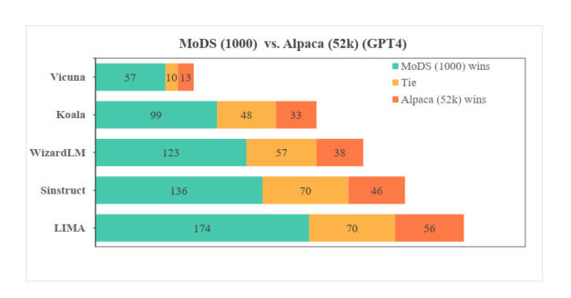
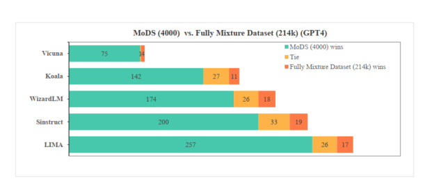
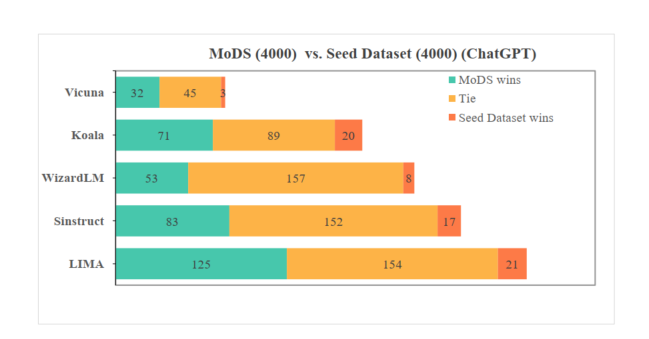
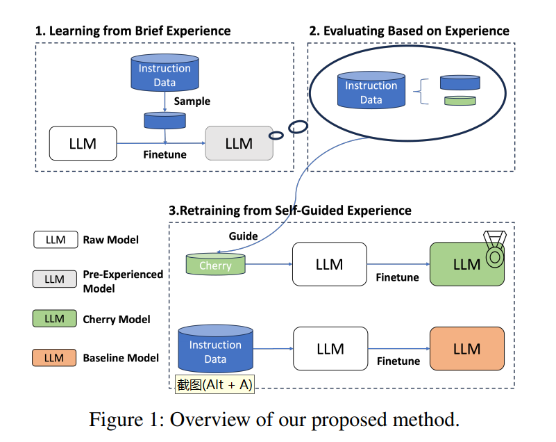
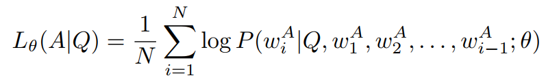
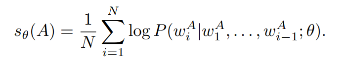
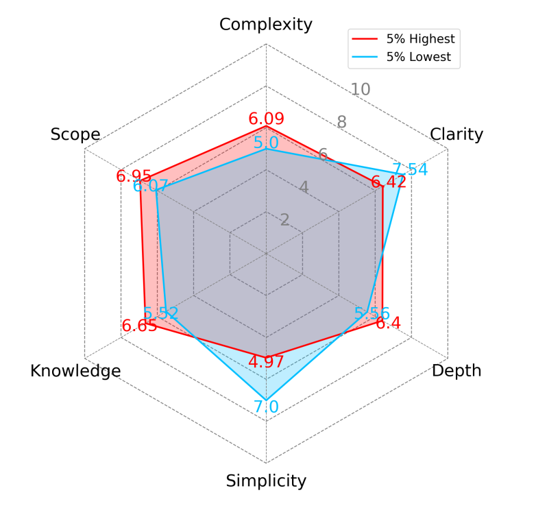
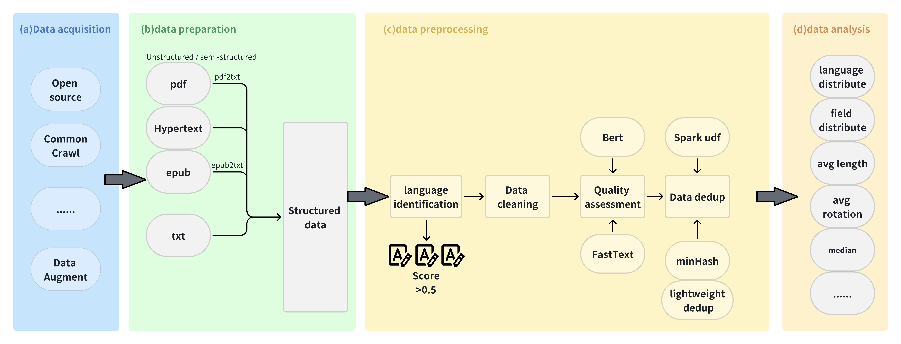

# 1. SFT数据
## 1.1 MoDS

### 1.1.1 方法介绍

1. 概要

   - 要点：核心是从数据质量、覆盖范围、必要性三个角度来对原始数据集进行数据过滤，
     最终获取对于不同模型的高质量数据集。并且相较于自动识别方法，在使用更少数据的情况下，就可以获取更好的效果。
   - 论文：MoDS: Model-oriented Data Selection for Instruction Tuning
   - paper: https://arxiv.org/pdf/2311.15653.pdf
   - github: https://github.com/CASIA-LM/MoDS

2. MoDS方法

    MoDS方法主要通过质量、覆盖范围、必要性三个指标来进行数据的筛选，其中数据质量是为了保证所选的指令数据的问题和答案都足够好；
    数据覆盖范围是为了让所选择的数据中指令足够多样、涉及知识范围更广；数据必要性是选择对于大模型较复杂、
    较难或不擅长的数据以填补大模型能力的空白。整体流程如下图所示，
    
    

3. 质量筛选

   对于数据进行质量过滤时，采用OpenAssistant的reward-model-debertav3-large-v2模型（一个基于DeBERTa架构设计的奖励模型）
   对数据进行质量打分。讲原始数据的Instruction、Input、Output的三个部分进行拼接，送入到奖励模型中，得到一个评分，
   当评分超过α时，则认为数据质量达标，构建一份高质量数据集-Data1。 

4. 多样性筛选

   为了避免所选质量数据高度相似，通过K-Center-Greedy算法进行数据筛选，在最大化多样性的情况下，使指令数据集最小。
   获取种子指令数据集（Seed Instruction Data）-SID。 

    

    在该步骤中，采用BERT模型为指令数据生成句向量来计算不同数据之间的距离。

5. 必要性筛选
   
   不同的大型语言模型在预训练过程中所学到的知识和具有的能力不同，因此在对不同的大型语言模型进行指令微调时，所需的指令数据也需要不同。

   对于一条指令，如果给定的大型语言模型本身能够生成较好的回答，则说明给定的大型语言模型具有处理该指令或者这类指令的能力，
   反之亦然，并且哪些不能处理的指令对于模型微调来说更为重要。
    
   - 使用SID数据集对模型进行一个初始训练
   - 用训练好的初始模型对整个高质数据集-Data1中的指令进行结果预测
   - 利用奖励模型对结果进行评分，当分值小于β时，说明初始模型不能对这些指令生成优质的回复，不具有处理这些类型指令的能力，获取必要性数据集-Data2
   - 对Data2进行多样性筛选，获取增强指令数据集（Augmented Instruction Data）-AID。

6. 模型训练

   最终利用种子指令数据集和增强指令数据集一起对模型进行指令微调，获得最终模型。

### 1.1.2 实验结果

1. 训练数据
   
   训练数据有两种，一种是单独的Alpaca数据集（52k），一种时混合数据集（214k），包含HC3数据集、
   Alpaca数据集、Alpaca-evol-instruct数据集、Dolly-v2数据集、InstructWild数据集和LIMA数据集。

   测试数据主要包含5个测试集，分别为Koala数据集（180）、WizardLM数据集（218）、Self-instruct数据集（252）、
   Vicuna数据集（80）和LIMA数据集（300）。

2. 训练超参

   模型基座采用LLaMA2-7B模型，训练过程中学习率为2e-5，warmup的比率为0.03，权重衰减为0.0，批大小为128，
   训练轮数为3。在质量评价和必要性评价过程中，Alpaca数据集的α和β均设置为0.0，混合数据集的α和β分别设置为1.0和-1.0。

   在模型测试过程中，采用ChatGPT和GPT4作为裁判，对模型生成结果从相关性和准确性两个角度进行打分，
   每个角度的评分从1到10。在评价两个模型胜、平、负时，当两个角度评分都高时为胜；当两个角度评分一高一低时为平；
   当两个角度评分都低时为负。

3. 结果分析

   在Alpaca数据集中通过MoDS方法获取1k数据的效果要优于全量数据训练的结果，如下图所示。
   
   

   在Alpaca数据集中MoDS方法在选择2k数据时，训练效果优于基于IFD的自动选择方法，如下表所示。
    
   

   在混合数据及中MoDS方法获取4k数据的效果全面优于全量数据训练的结果，如下图所示。
   
   

   验证指令多样性选择的重要性，与随机选择进行对比，如下图所示。
  
   

   验证必要性筛选的重要性，与仅用种子数据训练的模型进行对比，如下图所示。

  

## 1.2 IFD

### 1.1.1 方法介绍

1. 概要

   核心内容是提出一个指令跟随难度（Instruction-Following Difficulty，IFD）指标，
   通过该指标来筛选具有增强LLM指令调优潜力的数据样例（樱桃数据，cherry data），而模型仅使用原始数据
   5%-10%的樱桃数据就可以达到全量数据微调的效果，甚至可以有所提高。

   - Paper: https://arxiv.org/abs/2308.12032
   - Github: https://github.com/MingLiiii/Cherry_LLM
   - From Quantity to Quality: Boosting LLM Performance with Self-Guided 
     Data Selection for Instruction Tuning

2. 方法

   利用IFD指标自动筛选樱桃数据，再利用樱桃数据进行模型指令微调，获取更好地微调模型，主要涉及三个步骤：

   - Learning from Brief Experience：利用少量进行进行模型初学；
   - Evaluating Based on Experience：利用初学模型计算原始数据中所有IFD指标;
   - Retraining from Self-Guided Experience：利用樱桃数据进行模型重训练。

   

3. 动机
  
   利用少量数据进行模型初学习的原因如下：

   - 一些模型为Base模型，只能进行续写，并没有指令遵循的能力；
   - LIMA已经证明高质量数据可以让模型具有指令遵循能力；
   - 如果采用大量数据进行学习，时间成本和资源成本较高。
   
   而在少量数据的选择上，数量选择1k条样本，为了保证数据的多样性，采用K-Means方法对指令进行聚类，
   共聚出100个簇，每个簇里选择10个样本。并且仅在初始模型上训练1个epoch获取简要预经验模型（Brief Pre-Experience Model）。

4. 根据经验验证

   利用简要预经验模型可以对数据集中所有样本进行预测，通过指令内容预测答案内容，
   并可以获取预测答案与真实答案直接的差异值（利用交叉熵），即条件回答分数（ Conditioned Answer Score，CAS），如下：
   
   

   根据CAS的高低，可以判断出模型对指令Q生成答案A的难易，但也可能收到模型生成答案A的难易程度的影响。
   我们利用模型直接对答案进行续写，再根据答案真实内容获取直接的差异值，即直接答案分数（Direct Answer Score，DAS），如下：

   

   DAS得分越高，可能表明该答案对模型生成来说本身就更具挑战性或更复杂。为了获取更好的指令数据，也就是哪些指令对模型的影响更高，
   需要刨除答案本身的影响，因此提出了指令跟随难度（Instruction-Following Difficulty，IFD）分数，如下：
   
   

   利用IFD指标对数据进行筛选，减缓了大模型对答案本身拟合能力的影响，可以直接衡量给定指令对模型生成答案的影响。
   较高的IFD分数表明模型无法将答案与给定的指令内容进行对齐，表明指令的难度更高，对模型调优更有利。

### 1.1.2 实验结果

先说结论，在Alpaca和WizardLM两个数据集上利用Llama-7B进行实验，发现在5%的Alpaca樱桃数据上进行训练就超过了全量数据训练结果。

如何判断IFD指标是有效的？对比随机采样、IFD采样、IFD低分采样、CAS采样四种方法对模型指令微调的影响，
发现IFD采样在不同数据比例下，均高于全量数据微调效果，但其他采样方法均低于全量数据微调方法。

在前期，利用了1000条数据进行了模型简要学习，那么模型简要学习过程中数据量的影响如何呢？对模型简要学习不同数据量进行对比实验，
发现不进行模型简要学习，在樱桃数据占比10%时，模型依然效果由于全量参数，说明IFD指标的有效性而。
模型简要学习主要是为了让Base具有一定的指令遵循能力，在100样本时，模型训练并没有作用，当样本增加到300时，
模型具有了一定的指令遵循能力。

同时对于简要模型学习过程中的样本采样方式进行比较，对比样本分布采用（上文用的K-Mean的方法）和指令遵循难度
（IDF分数）采样的区别，发现都有效，因此对于模型来说简要学习的这个过程是更重要的。

对高质量数据和低质量数据进行分析，发现樱桃数据通常在范围、复杂性、深度和知识方面得分更高，
在清晰度和简单性方面得分更低。并且发现高难度和低难度的样本之间存在明显的界限。

## 1.3 数据合成

FlagData
- https://github.com/FlagOpen/FlagData
- 推荐：当前最全面最完整的数据处理流程代码
- 79 Stars
- 包含了完整的数据预处理流程，包括数据抽取、数据清洗、语种识别、质量评估、去重、数据分析
- 包含数据增广的prompt模板和流程代码，依赖ChatGPT构造数据
- 改流程主要适合基础模型数据处理的流程
- 当前仅公开了质量评估的模型
- 去重采用了minihash+Spark，速度较快
- Fasttext文本质量模型：https://huggingface.co/CASIA-LM/ChineseWebText-fasttext/tree/main

## 1.4 SFT

SFT: A prompt is sampled from the prompt dataset, 
and a labeler writes an answer to this prompt, supervised learning (13k prompts)

# 参考

[1] 大模型微调技巧 | 高质量指令数据筛选方法-MoDS, https://mp.weixin.qq.com/s/Y9YWov-DskFOVs5lECPJcA
[2] InstructGPT, https://daviddmc.github.io/blog/2022/InstructGPT/