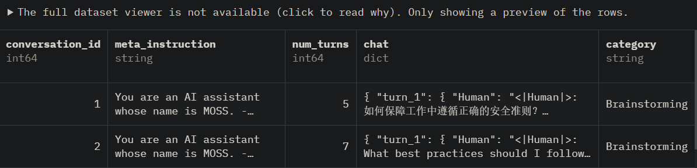
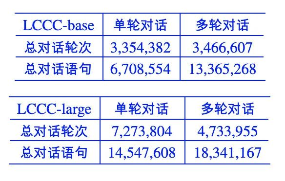
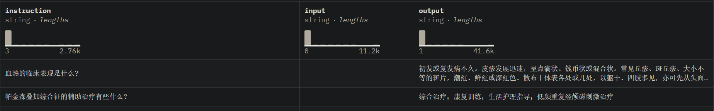

# 1. SFT数据

1. BelleGroup/train_1M_CN
   - https://huggingface.co/datasets/BelleGroup/train_1M_CN
   - 917k条， 458M
   -  

2. MOSS数据
   - Github: https://github.com/OpenLMLab/MOSS/tree/main/SFT_data
   - https://huggingface.co/datasets/fnlp/moss-003-sft-data
   - 3G
   - 
   - 

3. c-s-ale/alpaca-gpt4-data-zh
   - https://huggingface.co/datasets/c-s-ale/alpaca-gpt4-data-zh
   - license: cc-by-sa-4.0
   - 48.8k条，35.1M
   - 论文：Instruction Tuning with GPT-4
   - 

# 2. 对话数据

1. 中文闲聊语料库LCCC
   - 论文名称：《A Large-Scale Chinese Short-Text Conversation Dataset》
   - 论文链接：https://arxiv.org/abs/2008.03946
   - 项目地址：https://github.com/thu-coai/CDial-GPT
   
   

# 3. 专有领域

1. 医疗类数据
   - https://huggingface.co/datasets/shibing624/medical
   - 预训练362k条，约1G
    
   - 微调2.07M条
     
   - 奖励模型4k条
     

# 参考

[1] 动手做个DialoGPT：生成式多轮对话模型, https://blog.csdn.net/xixiaoyaoww/article/details/108656532