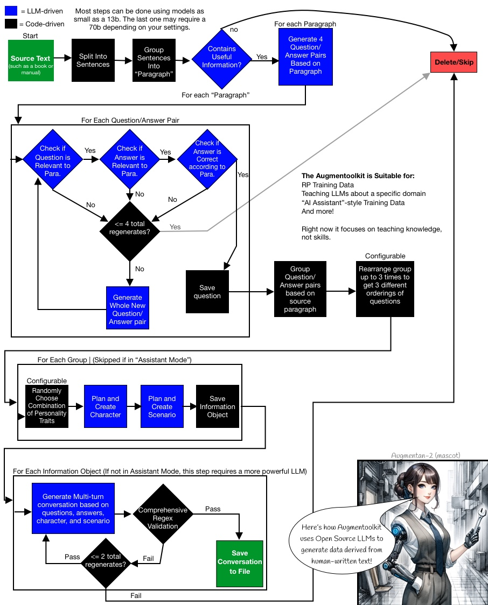

# 1. 原理

## 1.1 RefGPT

    - 数据路径：https://github.com/sufengniu/RefGPT
    - 论文：RefGPT: Reference -> Truthful & Customized Dialogues Generation by GPTs and for GPTs，
           https://arxiv.org/abs/2305.14994#:~:text=RefGPT%20solves%20the%20model%20hallucination%20in%20dialogue%20generation,highly%20customization%20capability%2C%20which%20previous%20studies%20have%20ignored.
    - 5万条

1. 简介

    <br/>
   
    众所周知，事实正确性是ChatGPT的一大薄弱环节，也是所有试图复现ChatGPT的同行们所面临的重大挑战。
    想要提升事实正确性，可以标注大量的事实型对话数据（比如人物、科技、医疗、法律、艺术）
    用于微调GPT模型。为了避免人工标注的昂贵成本，我们提出一种自动生成事实型对话的方法，
    并公开我们的部分数据。我们是来自上海交大、香港理工大学等机构的NLP从业者，
    我们决定公开一批数据，这批数据包含5万条中文多轮对话。  
    <br/>   

2. 方法

    我们的目标是自动生成海量、高质量、事实型多轮对话，用于训练GPT，提升GPT的事实正确性。
    我们采用如下方法自动生成数据。

    - 采集优质的事实型文档，我们称之为reference，其来源可以是电子书、维基百科、优质垂类网站。
      文档需要涵盖尽量多的主题，包括但不限于人物、机构、科技、医疗、法律、人文、经济、家居、
      汽车、出行、美食、时尚、体育、教育、宠物。
    - 利用已有的LLM（例如付费API）生成多轮对话。输入是一篇reference，prompt
      类似“请根据这篇文章生成多轮问答”。API会输出一段多轮对话（dialogue）。
      这种方法将原本只适合预训练的文档转化成可供微调的多轮对话。
    - 第2步收集到大量的reference-dialogue二元组。将reference和prompt作为输入，
      dialogue作为目标，微调一个GPT模型（可以基于LLaMA或BLOOM的预训练基座）。
      我们将微调出的模型称作Reference-to-Dialogue GPT，缩写RefGPT。有了RefGPT，
      即可基于reference生成多轮对话，获得海量的数据。
   
    外界复现我们的方法时，需要关注2个要点。

    - Reference的质量、广度。Reference内容质量必须高，比如医疗等优质垂类网站的页面
      、维基百科上非生僻的词条，且需要对网页做清洗。Reference的广度应当大，不能限制在单个垂类或单个网站。
    - 调用已有LLM时需要写prompt，需要仔细尝试各种prompt，使得LLM生成的多轮对话符合预期。
    
3. 样例
 
   ```markdown
    Reference：1863年征兵暴动。美国南北战争期间，纽约市工人因对征兵制度不满而举行的四天暴动。法律允许交纳三百美元即可免役，这笔金额仅极少数人能负担。1863年7月11日纽约市点名入伍一开始，大批白人（多为工人）涌上街头，攻打征兵总部，烧毁房屋。在纽约市，白人对于解放后南方来的黑人进入劳工市场，特别是许多雇主雇用黑人破坏罢工，又有嫉恨，于是暴动者时常砸毁无辜的黑人家庭和商店。约一百人死亡（多为暴民）。

    Dialogue：
    
    Human: 你知道1863年的征兵暴动吗？
    Assistant: 是的，那是在美国南北战争期间，纽约市的工人因不满征兵制度而举行的四天暴动。
    Human: 那么，为什么工人会暴动呢？
    Assistant: 因为法律允许交纳三百美元即可免役，这笔金额仅极少数人能负担，大多数工人无法承受这样的费用。
    ```

## 1.2 FlagData

FlagData
- https://github.com/FlagOpen/FlagData
- 推荐：当前最全面最完整的数据处理流程代码
- 79 Stars
- 包含了完整的数据预处理流程，包括数据抽取、数据清洗、语种识别、质量评估、去重、数据分析
- 包含数据增广的prompt模板和流程代码，依赖ChatGPT构造数据
- 改流程主要适合基础模型数据处理的流程
- 当前仅公开了质量评估的模型
- 去重采用了minihash+Spark，速度较快
- Fasttext文本质量模型：https://huggingface.co/CASIA-LM/ChineseWebText-fasttext/tree/main


## 1.3 FlagInstruct

1. 概述

   - 智源开源数据
   - Github: https://github.com/FlagOpen/FlagInstruct
   - Data: https://huggingface.co/datasets/BAAI/COIG/tree/main
   - 翻译指令：67,798
   - 考试指令：63,532, CoT数据
   - Human Value Alignment Instructions (34,471)
   - Counterfactural Correction Multi-round Chat (13,653)：平均5轮对话
   - Leetcode Instructions (11,737)

2. 数据详解

    - Translated Instructions (67,798)   
    There are 67,798 instructions in total, which are composed of 1,616 task descriptions 
    in Super-NaturalInstructions along with a single instance for each of them, 175 
    seed tasks in Self-Instruct, and 66,007 instructions from Unnatural Instructions. 
    To reduce the cost and further improve the quality of the instruction corpus, 
    we separate the translation procedure into three phases: automatic translation, 
    manual verification, and manual correction. These strict quality verification 
    procedures assure the reliability of the translated corpus.
    
    - Exam Instructions (63,532)     
    The Chinese National College Entrance Examination, Middle School 
    Entrance Examinations, and Civil Servant Examination are the main Chinese commonsense tests. 
    These exams contain various question formats and detailed analysis that can be used 
    as the Chain-of-Thought (CoT) corpus. We extract six informative elements 
    from original exam questions, including instruction, question context, question, 
    answer, answer analysis, and coarse-grained subject. There are six main 
    coarse-grained subjects: Chinese, English, Politics, Biology, History, and Geology. 
    There are very few Math, Physics, and Chemistry questions in the corpus 
    because these questions are often with complex symbols which are hard to annotate. 
    For many choice questions, we recommend that the researchers utilize 
    this corpus to further post-process it using prompts or post-process it to 
    blank-filling questions to increase the instructions' diversity further.
    
    - Human Value Alignment Instructions (34,471)    
    To respect and reflect the major difference caused by different cultural backgrounds, 
    different from other tasks in COIG that leverage one unified collection of instruction-following 
    samples, we categorize the value alignment data into two separate series: 
    A set of samples that present shared human values in the Chinese-speaking world. In total, 
    we choose 50 instructions as the augmentation seeds, and produce 3k resulting 
    instructions following samples for general-purpose value alignment in the Chinese-speaking world.
    Some additional sets of samples that present regional-culture or country-specific human values.
    Counterfactural Correction Multi-round Chat (13,653)
    The Counterfactual Correction Multi-round Chat dataset (CCMC) is constructed based on the 
    CN-DBpedia knowledge graph dataset with the aim of alleviating and resolving the pain points 
    of hallucination and factual inconsistency in current LLMs. The CCMC dataset includes 
    5 rounds of role-playing chat between a student and a teacher, and the 
    corresponding knowledge they refer to. The dataset contains ~13,000 dialogues with 
    an average of 5 rounds per dialogue, resulting in ~65,000 rounds of chat.
    
    - Leetcode Instructions (11,737)       
    Given that the code-related tasks potentially contribute to the ability emergence 
    of LLMs, we argue that code-related tasks aligned with the Chinese natural language 
    should be considered in our datasets. Therefore, we build the Leetcode 
    instructions from a CC-BY-SA-4.0 license collection of 2,589 programming questions. 
    The questions contain problem descriptions, multiple programming languages, 
    and explanations (834 questions do not have explanations).


## 1.4 Augmentoolkit

- 用于生成多轮对话训练数据的开源工具包
- https://github.com/e-p-armstrong/augmentoolkit

从概念上讲，Augmentoolkit 获取包含信息的人类编写的文本，并将其转换为指令调整数据：

- 它使用文本信息生成测试该信息的问题，并且还生成使用该信息的问题的答案。
- 它会三次检查生成的问题和答案是否准确，并且仅使用文本中提供的信息（确LLM不会产生新信息的幻觉）。
- 最后，它在虚构的环境中编写了具有领域专业知识的角色与无知的次要角色之间的交互，其中次要角色提出问题，主要角色回答问题。
- 在检查该对话是否忠实地包含原始问题和答案后，结果将保存为新生成的数据集的一部分。
   角色和设定的使用意味着模型的创意写作和RP技能可以在其知识库的同时得到提高
  （但如果你不想要RP机器人，你可以随时为用户打开“助手模式” - 助理互动代替）。
   您可以在使用中查看此过程的流程图。



## 1.5 Chinese-LLaMA-Alpaca Self Insturct

https://github.com/ymcui/Chinese-LLaMA-Alpaca/wiki/%E8%AE%AD%E7%BB%83%E7%BB%86%E8%8A%82

# 参考

[1] 也看大模型幻觉的脑图总结：详解RefGPT事实性数据集、
     KoLA知识图谱大模型评测及HaluEval幻觉评估实现，https://mp.weixin.qq.com/s?__biz=MzAxMjc3MjkyMg==&mid=2648403146&idx=1&sn=8d409e766442fef1c86288b227fece86&chksm=83837f9fb4f4f6897a8bd290b7de976bb7ceca98a79f646ab3bb82f42826961318e962cf41dd&scene=178&cur_album_id=2120957806534033409#rd
