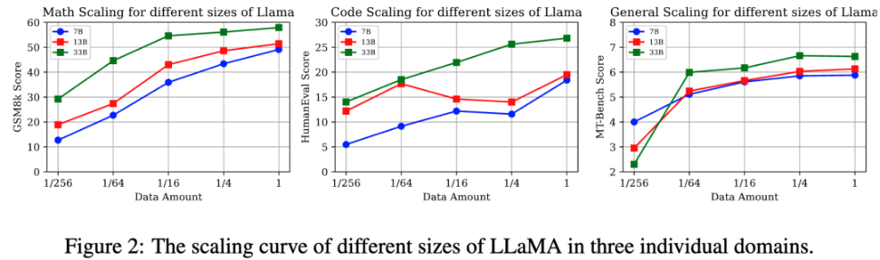
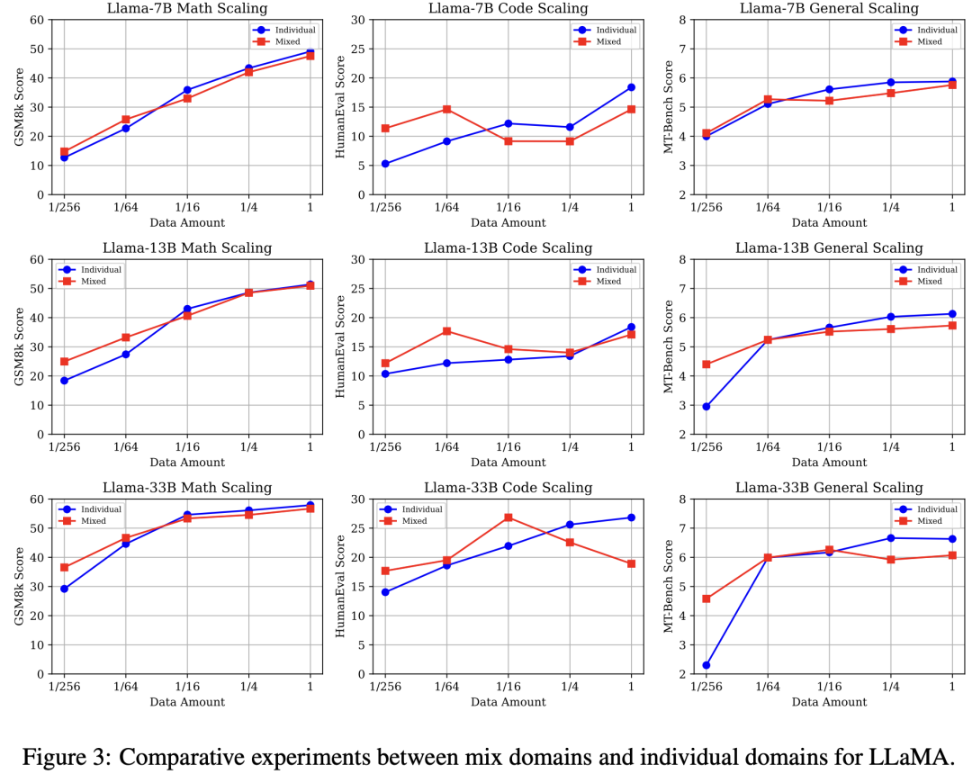
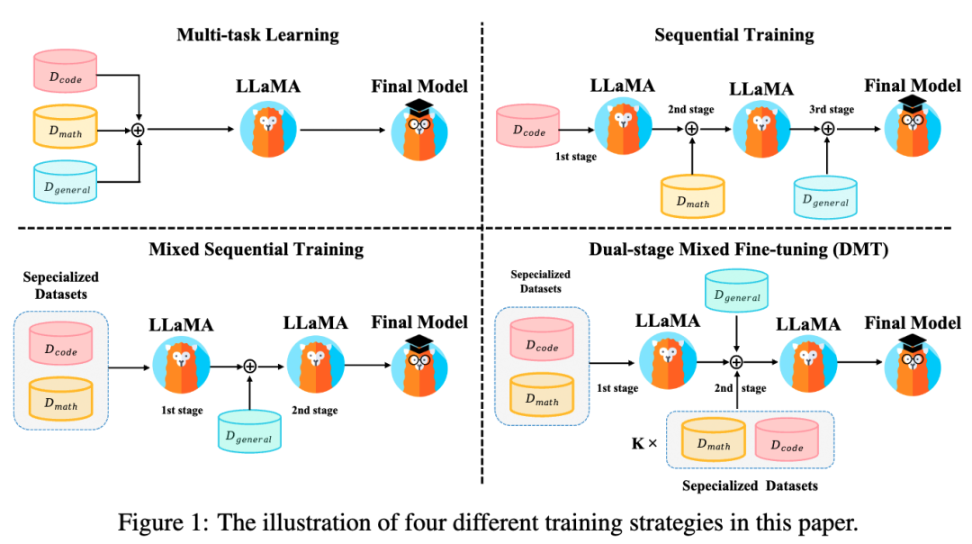
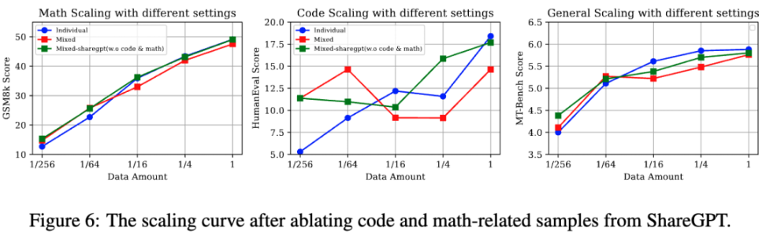

# 1. 专有数据和通用数据

## 1.1 简介

- 论文：HOW ABILITIES IN LARGE LANGUAGE MODELS ARE
  AFFECTED BY SUPERVISED FINE-TUNING DATA COMPOSITION
- 发表人：阿里爸爸
- 时间：2023.11
- 论文地址：https://arxiv.org/pdf/2310.05492.pdf

***

一句话概括：训通用大模型就少混点，训特定能力就着重多混合点！

***

文章核心要点：
- 对比了平衡专有领域和特定领域，不同训练数据配比的效果
- 对比了平衡专有领域和特定领域，不同训练方法，提出了多阶段训练方法

***

在大语言模型的监督微调阶段（Superviesd Finetuning, SFT），我们通过混合
注入不同能力项的数据（数学推理，翻译，代码，通用能力等），来解锁大模型多样化的能力。
然而由于不同能力项的数据的来源、领域、分布，以及数据规模的不同，这些因素都将对模型性能产生剧烈的影响。
因此，SFT的数据组成问题旨在探究模型能力与各种能力项数据之间的关系，包括不同能力项的数据量、
数据配比、模型参数量和微调训练策略等，这对未来全面提升大模型的奠定了坚实的基础。

***

文中聚焦于SFT阶段的数学推理能力，代码生成能力，以及通用指令遵循能力，这三个能力的数据集及评测指标的介绍如下：

- GSM8K RFT [1] 是一个增强的数学推理数据集，它基于GSM8K数据集[4]并结合RFT策略整合了多条推理路径。
  训练集中包含7.5K个问题和110K个回答，我们所有实验数学的评测指标为GSM8k测试集分数。

- Code Alpaca [2] 旨在构建一个遵循指令，生成代码的LLaMA模型，构建方式完全基于Stanford Alpaca，
  包含20K对的代码数据，我们代码生成的评测指标为HumanEval。

- ShareGPT [3] 使用多轮对话历史记录,包括约9w条来自人类的提问和来自ChatGPT和其他聊天机器人的回复。
  我们通用能力的评测指标为MT-Bench。

本文旨在从Data Scaling的视角，全面性地研究模型性能与不同因素之间的关系，包括数据量，数据配比，
模型参数量和SFT训练策略。我们的文章以4个研究问题（RQ）为主线进行探究。

## 1.2 实验--数据配比策略
### 1.2.1 RQ1: 随着数据量的增加，数学推理、代码生成和通用能力的性能变化趋势如何?

实验设置：

我们使用来自数学，代码，通用能力的训练集按比例{1, 1/4, 1/16, 1/64, 1/256}对不同参数量的LLaMA进行监督微调。
来评估每种单独能力项在不同数据量/模型参数量下的表现。

核心结论（图2）：

- 不同能力项有不同的Data Scaling曲线：数学推理能力，通用能力与数据量呈正相关模型的性能缩放曲线。
  值得注意的是通用能力只需要大约 1k数据样本便会产生性能激增（数据量从1/256 到 1/64），
  并在达到一定阈值提高缓慢（1/64），这契合于LIMA[5]文中所提到的“Less is more”。
  然而代码能力在7B，13B则呈现不规则的性能曲线，33B呈现log-linear的趋势。

- 数据充足的情况下，更大参数量的模型往往有更强大的性能

### 1.2.2 RQ2: 在SFT阶段中，将三种能力项数据直接混合是否会产生性能冲突？

实验设置：

- 单数据源：分别使用{1, 1/4, 1/16, 1/64, 1/256}数量的数学，代码，通用能力数据对LLaMA模型微调。
- 混合数据源：分别使用{1, 1/4, 1/16, 1/64, 1/256}数量的三种能力项数据，三种数据按照同等的数据比例直接混合，来对LLaMA模型微调。

核心结论（图3）：

- 与单数据源相比，混合数据源设置呈现低资源性能增益，而高资源性能冲突: 三种能力的性能放缩曲线一致呈现高资源下
 （1/1）混合数据源设置弱于单数据源，然而随着数据量下降二者产生性能转折，最终低资源（1/256）下混合数据源产生明显性能增益。
- 随着模型参数量的提高，数学推理与通用能力在低资源下的性能增益更加显著

### 1.2.3 RQ3: 什么是产生性能冲突的关键因素：

实验设置：

我们将代码生成与数学推理数据视为特定能力数据源，而ShareGPT则为通用能力数据源。
我们设计了以下三种设置来探究通用数据和特定能力数据之间的比例变化：

- 固定通用数据，放缩特定能力数据：Fix general + k (code, math)
- 固定特定能力数据，放缩通用数据：Fix (code, math)l + k general
- 固定1/64通用数据，放缩特定能力数据：Fix 1/64 general+ k (code, math)

核心结论（图4）：

- 当不同的SFT能力之间存在显著的任务格式和数据分布差异时（数学和通用数据之间），
  数据比例的影响较小。然而，当存在一定程度的相似性时（代码和通用数据之间），
  数据比例可能会导致明显的性能波动。（数据分布的讨论见D1）
- 即便在通用数据资源非常有限的情况下，特定能力的数据比例的放缩也没有对通用能力造成明显影响。

## 1.3 实验--训练策略

实验设置：

如图1所示，我们探究以上SFT训练策略对性能的影响：

- 多任务学习：直接混合不同的SFT能力项数据进行SFT。若将每个数据源视为不同任务，则可视为多任务学习。
- 顺序训练：按顺序依次在各能力项数据集上微调。由于通用能力是人类对齐的核心能力，我们将通用能力数据放在最后阶段微调。
- 混合顺序训练：首先在特定能力数据集（代码、数学）上进行多任务学习，然后在通用能力数据集上进行SFT。
- 两阶段混合微调（DMT）：我们综合RQ1-3的结论与上述训练策略的优缺点，提出DMT策略。
  在第一阶段我们首先在特定能力数据集（代码、数学）上进行多任务学习。
  在第二阶段我们使用混合数据源进行SFT，其中包括通用数据和一定比例k的特定能力数据（k = 1, 1/2, 1/4, 1/8, 1/16, 1/32），
  这有助于缓解模型对特定能力的灾难性遗忘。

核心结论（表1）：

- 多任务学习在尽可能保留了特有能力，但是通用能力性能下降显著。
- 两种顺序训练保留了通用能力能力，但是由于多阶段的微调产生灾难性遗忘，使得他失去了太多的特定能力（尤其是数学）。
- 在不同的模型参数量下（7B，13B，33B），DMT (k = 1/256)策略在特定能力方面（数学，代码）均有显著改善，
  甚至对于通用能力也有一定程度的优化。

## 1.4 结论分析

D1：不同能力的语义表示的可视化

使用t-SNE算法压缩到二维空间绘制

实验发现：如上图所示，通过对 LLaMA-13b [左]和 DMT-13b (k=1/256) [右]策略下 
LLaMA-13b 的第15层的语义表示进行可视化，我们发现虽然这两个模型可以分离开数学能力的语义表示，
但是在代码数据与通用能力数据的语义表示间，仍存在一定程度的坍缩重叠现象。

***

D2: 消融通用能力数据中的代码和数学样本

实验设计：为了消融通用能力数据中的特定能力数据，我们使用InsTag[1]工具对通用能力数据中的样本标注标签。
并通过正则匹配过滤掉“数学”，“代码”相关数据（从90K减少到63K）。
与RQ2中的设置对齐，我们从数学，代码，与过滤后的通用能力数据集中抽样不同比例的
训练数据（1, 1/4, 1/16, 1/64, 1/256），并按照相应的比例直接混合后来微调LLaMA。

实验结论：如图6所示，移除通用能力数据中的代码和数学后，低资源设置下依旧保持了稳定的增益。
这个消融实验也表明通用能力中的代码和数学样本不是导致低资源性能增益的关键因素，而是数据的多样性和可变性。

***

D3：双阶段混合微调（DMT）中第二阶段特定能力数据的比例K

实验发现：如上图所示，当我们将k从0调整到1/256（k = 0等于混合顺序训练）时，
发现模型在特定能力和通用能力方面都表现出显著的提升。相反，当k从1/4增加到1时，
模型的通用能力出现下降。我们认为这与RQ2的发现一致，即高资源环境会导致冲突，
而低资源环境会导致混合来源的增益。此外，当k从1/256增加到1/4时，
特定能力与通用能力呈现此消彼长的趋势。这表明需要根据具体大模型SFT需求调整k值，以在多种能力之间实现平衡。

## 1.5 总结

大模型混合多种能力项数据进行微调时，会呈现高资源冲突，低资源增益的现象。
我们提出的DMT策略通过在第一阶段微调特定能力数据，在第二阶段微调通用数据+少量的特定能力数据，
可以在保留通用能力的同时，极大程度地挽救大模型对特定能力的灾难性遗忘，
这为SFT的数据组成问题提供了一个简单易行的训练策略。值得注意的是，第二阶段微调时混合的特定能力数据量需要根据需求而定。

一句话概括：训通用大模型就少混点，训特定能力就着重多混合点！

# 参考

[1] 有被混合后的SFT数据伤到, https://mp.weixin.qq.com/s/3RIBzuVlK0qHbO_Q04s-cw