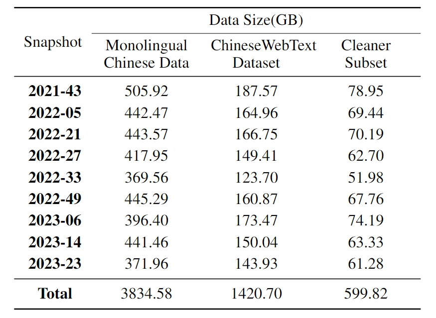

# 1. 中文

## 1.1 通用领域

1. Wikipedia: 中文Wikipedia的数据
   - https://github.com/goldsmith/Wikipedia
   - 2.7k stars
   - 提供python API

2. 悟道（智源）
   - 5T, 开源200G
   - 采用 20 多种规则从 100TB 原始网页数据中清洗得出最终数据集，注重隐私数据信息的去除，源头上避免 GPT-3 
     存在的隐私泄露风险；包含教育、科技等 50+个行业数据标签，可以支持多领域预训练模型的训练
   - https://data.baai.ac.cn/details/WuDaoCorporaText
   - https://github.com/yuanzhoulvpi2017/zero_nlp/wiki/%E6%95%B0%E6%8D%AE%E5%85%B1%E4%BA%AB%E2%80%94%E2%80%94%E6%82%9F%E9%81%93200G%E6%95%B0%E6%8D%AE%E5%88%86%E4%BA%AB

3. MNBVC
   - https://github.com/esbatmop/MNBVC
   - 2k stars
   - MNBVC(Massive Never-ending BT Vast Chinese corpus)超大规模中文语料集。
     对标chatGPT训练的40T数据。MNBVC数据集不但包括主流文化，
     也包括各个小众文化甚至火星文的数据。MNBVC数据集包括新闻、作文、小说、
     书籍、杂志、论文、台词、帖子、wiki、古诗、歌词、商品介绍、笑话、糗事、
     聊天记录等一切形式的纯文本中文数据。
   - 包含数据清洗工具

4. 书生·万卷1.0
    - 地址：https://arxiv.org/pdf/2308.10755.pdf
    - 包含多种模式的大规模训练语料库：书生·万卷文本数据集1.0由来自网页、百科、书籍、专利、教材、
      考题等不同来源的清洗后预训练语料组成，数据总量超过5亿个文档，数据大小超过1TB
    - 该语料将html、text、pdf、epub等多种格式的数据统一处理为字段统一的jsonl格式，并经过细粒度的清洗、去重、价值对齐，
      文本数据包括6亿多篇文档，数据存储量超过1TB；图像-文本数据经过处理后成为文档，共有2200多万篇文档，
      数据量超过200GB（图像通过URL链接提供）；视频文件共有1000多个，数据量超过900GB。
    - 中文数据占比35.1%，约2.2亿个文件，466.54GB。英文数据集占比61.4%，共3.83亿个文件，542.51GB
    - 采用多步骤文本提取流程、语言检测、语料库过滤和重复数据删除
    - 

     在数据存储上，提供统一的JSON格式，数据样例如下：
     
    ```{
    "id": "BkORdv3xK7IA0HG7pccr",
    "content": "\\*诗作[222]\n录自索菲娅·马克思的笔记本\n#### 人生\n时光倏忽即逝，\n宛如滔滔流水；\n时光带走的一切，\n永远都不会返回。\n生就是死，\n生就是不断死亡的过程；"
    }
    ```
 
5. wudao数据集
    - 采用20多种规则从100TB原始网页数据中清洗得出最终数据集，包含教育、科技等50+个行业数据标签，可以支持多领域预训练模型的训练。
    - 数据总量：5TB，数据格式为json，开源数量包括200GB；

6. 安娜的檔案
   - ***强烈推荐***
   - 世界最大的图书馆，包含了大量的文本数据
   - 其中书籍类，有重复数据，可用种子，并发下载
   - https://tw.annas-archive.org/

7. pleisto/wikipedia-cn-20230720-filtered
   - https://huggingface.co/datasets/pleisto/wikipedia-cn-20230720-filtered
   - Wiki中文百科（25w词条）
   - 500MB
   - 

8. BaiduBaiKe
   - 563w词条
   - 百度网盘：https://pan.baidu.com/share/init?surl=jIpCHnWLTNYabftavo3DVw&pwd=bwvb  ， 提取码：bwvb
   - 4.5G

9. ChineseWebText
   - Github: https://github.com/CASIA-LM/ChineseWebText
   - Data: https://huggingface.co/datasets/CASIA-LM/ChineseWebText
   - Data Intro:  1.42 TB all, 600G cleaned
   
   

   ```json
   {
     "title": "潍坊银行2021年上半年净利润同比增长29.57% 不良率降至1.10%_财经_中国网",
     "score": 0.95,
     "text": "潍坊银行2021年上半年净利润同比增长29.57% 不良率降至1.10%\n中国网财经8月24日讯 潍坊银行昨日披露2021年二季度信息报告显示，截至2021年6月末，潍坊银行资产总额1920.44亿元，较上年末增长9.34%；负债总额1789.16亿元，较上年末增长10.54%。2021年上半年，潍坊银行实现净利润6.09亿元，同比增长29.57%。\n资产质量方面，截至2021年6月末，潍坊银行不良贷款率1.10%，较上年末下降0.13个百分点。\n资本金方面，截至2021年6月末，潍坊银行资本充足率、核心一级资本充足率、一级资本充足率分别为11.66%、7.89%、10.13%，分别较上年末下降1.89、0.89、1.15个百分点。",
     "url": "http://finance.china.com.cn/news/special/2021bnb/20210824/5638343.shtml",
     "source_domain": "finance.china.com.cn"
   }
   ```
   
   - "title": 【string】The title of the data text.
   - "score": 【float】Quality score generated by the quality evaluation model.
   - "text": 【string】Text content of data sample.
   - "url": 【string】External URL, points to the original web address of the text.
   - "source_domain": 【string】The domain name of the source website.

## 1.2 专有领域

1. 医疗类数据
   - https://huggingface.co/datasets/shibing624/medical
   - 预训练362k条，约1G
    
   - 微调2.07M条
     
   - 奖励模型4k条
     


# 2. 英文

1. Pile
   - 论文：https://arxiv.org/abs/2101.00027
   - Github: https://github.com/EleutherAI/the-pile
   - 825GB
   - 
   - 

# 参考

[1] 大模型研发必备：两大开源可用且清洗过的中文文本语料库及大模型FLOPS、参数量快速估计工具推荐，
    https://mp.weixin.qq.com/s/uqU0LKzchGLmXiDswRFkrQ