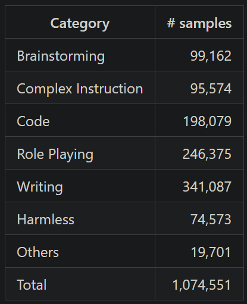
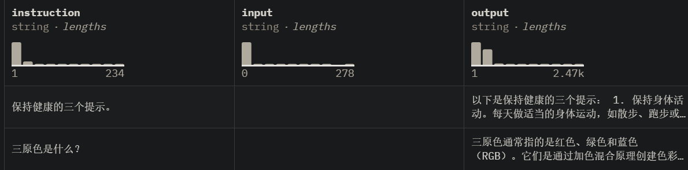
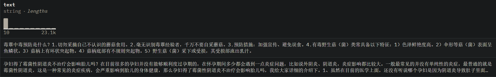
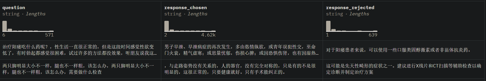

# 1. SFT数据

1. BelleGroup/train_1M_CN
   - https://huggingface.co/datasets/BelleGroup/train_1M_CN
   - 917k条， 458M
   -  

2. MOSS数据
   - Github: https://github.com/OpenLMLab/MOSS/tree/main/SFT_data
   - https://huggingface.co/datasets/fnlp/moss-003-sft-data
   - 3G
   - 
   - 

3. c-s-ale/alpaca-gpt4-data-zh
   - https://huggingface.co/datasets/c-s-ale/alpaca-gpt4-data-zh
   - license: cc-by-sa-4.0
   - 48.8k条，35.1M
   - 论文：Instruction Tuning with GPT-4
   - 

4. FlagInstruct
   - 智源开源数据
   - Github: https://github.com/FlagOpen/FlagInstruct
   - Data: https://huggingface.co/datasets/BAAI/COIG/tree/main
   - 翻译指令：67,798
   - 考试指令：63,532, CoT数据
   - Human Value Alignment Instructions (34,471)
   - Counterfactural Correction Multi-round Chat (13,653)：平均5轮对话
   - Leetcode Instructions (11,737)

# 2. 对话数据

1. 中文闲聊语料库LCCC
   - 论文名称：《A Large-Scale Chinese Short-Text Conversation Dataset》
   - 论文链接：https://arxiv.org/abs/2008.03946
   - 项目地址：https://github.com/thu-coai/CDial-GPT
   
   

2. ShareGPT
   - https://sharegpt.com/
   - 使用多轮对话历史记录,包括约9w条来自人类的提问和来自ChatGPT和其他聊天机器人的回复。
     我们通用能力的评测指标为MT-Bench。

# 3. 问答数据

1. 百度问答100w
   - https://github.com/CyberCommy/baidu-qa-100w

# 4. 特定类别
## 4.1 代码
1. Code Alpaca
   - https://github.com/sahil280114/codealpaca
   - 旨在构建一个遵循指令，生成代码的LLaMA模型，构建方式完全基于Stanford Alpaca，
      包含20K对的代码数据，我们代码生成的评测指标为HumanEval。

## 4.2 数学
1. GSM8K RFT 
   - https://huggingface.co/datasets/gsm8k
   - https://arxiv.org/pdf/2110.14168v1.pdf
   - 是一个增强的数学推理数据集，它基于GSM8K数据集[4]并结合RFT策略整合了多条推理路径。
     训练集中包含7.5K个问题和110K个回答，我们所有实验数学的评测指标为GSM8k测试集分数。

# 5. 专有领域

1. 医疗类数据
   - https://huggingface.co/datasets/shibing624/medical
   - 预训练362k条，约1G
    
   - 微调2.07M条
     
   - 奖励模型4k条
     
     

# 参考

[1] 动手做个DialoGPT：生成式多轮对话模型, https://blog.csdn.net/xixiaoyaoww/article/details/108656532
[2] 百度QA100万数据集, https://mp.weixin.qq.com/s/SJQX2tNJ5kz3--ReWAbZDg
