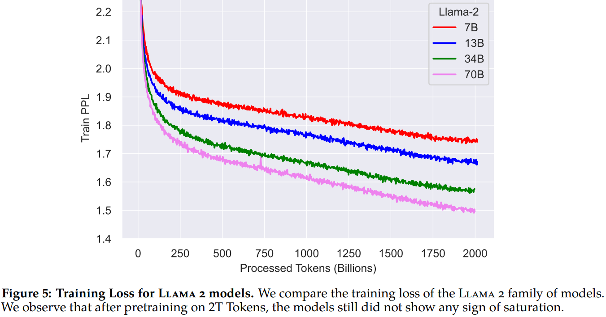

# 1. 简介

- 论文：Llama 2: Open Foundation and Fine-Tuned Chat Models
- github地址：https://github.com/facebookresearch/llama-recipes
- HuggingFace地址：meta-llama (Meta Llama 2)

相比于 Llama 1 ，Llama 2 的训练数据多了 40%，上下文长度也翻倍，
并采用了分组查询注意力机制。具体来说，Llama 2预训练模型是在2 万亿的
token上训练的，精调 Chat 模型是在100 万人类标记数据上训练的。

- 训练数据增加40%
- 上下文窗口4k
- 分组查询注意力（ Grouped-query attention）
- 开源7B、13B、70B模型

# 2. 方法

这个过程从使用公开可用的在线资源对Llama 2进行预训练开始。
接下来，通过应用有监督微调，创建了Llama 2-Chat的初始版本。
随后，使用人类反馈强化学习（RLHF）方法，具体是通过拒绝采样和近端策略优化（PPO），
对模型进行迭代优化。在RLHF阶段，累积迭代奖励建模数据与模型改进并行进行，
这对于确保奖励模型保持在分布内是至关重要的。

## 2.1 预训练

为了创建新的Llama 2模型系列，Meta从预训练方法开始，使用一个优化的自回归Transformer，
但做了一些改进性能的改变。具体来说，他们进行了更强大的数据清洗，更新了他们的数据混合，
训练了40%更多的token，加倍了上下文长度，并使用分组查询注意力（GQA）来提高他们更大模型的推理可扩展性。
表1比较了新的Llama 2模型与Llama 1模型的属性。

### 2.1.1 预训练数据

Llama 2 的训练语料包括了一个新的公开可用数据的混合，其中不包括来自 Meta 产品或服务的数据。
Meta 努力删除了来自某些已知包含大量关于私人个人信息的网站的数据。他们在2万亿 token 的数据上进行训练，
因为这提供了一个良好的性能-成本权衡，对最有事实性的来源进行上采样，以增加知识和减少幻觉。 
他们进行了各种预训练数据调查，以便用户能够更好地理解他们的模型的潜在能力和局限性。

隐私数据清洗：根据一些特定站点site，去掉含有大量个人信息的数据。
数据混合：对于含有事实来源（factual sources）的数据进行上采样（up-sampling），来增强知识，抑制幻觉。

### 2.1.2 训练细节

Llama 2 采用了 Llama 1 的大部分预训练设置和模型架构。他们使用标准的Transformer架构，
应用RMSNorm进行预归一化，使用SwiGLU激活函数和旋转位置编码。与 Llama 1 相比，
主要的架构差异包括增加的上下文长度和分组查询注意力（GQA）。

超参数。Llama 2 使用 AdamW 优化器进行训练，其中 β1 = 0.9，β2 = 0.95，eps = 10−5 。
使用余弦学习率，warm up 为2000，并将最终学习率衰减到峰值学习率的10%。
使用0.1的权重衰减和1.0的梯度裁剪。图4显示了使用这些超参数的 Llama 2 的训练损失。

网络结构

- 标准 Transformer
- pre-normalization using RMSNorm [GPT3]
- SwiGLU 激活函数[PaLM]
- 旋转位置编码[GPTNeo]
- 上下文长度到 4k（Llama 1是2k）
- 分组查询注意力 (Grouped-Query Attention, GQA)

超参数

- AdamW 优化器，β1 = 0.9, β2 = 0.95, eps = 10.5
- cosine 学习率调度，warmup of 2000 steps ，最终学习率衰减到最大值的10%
- 权重衰减（weight decay） 0.1
- 梯度裁剪（gradient clipping） 1.0

分词器（Tokenizer）

- BPE，使用 SentencePiece 实现
- 所有数字 split 成 individual digits
- 未知的 UTF-8 字符用 byte 表示
- 词表大小 32K

### 2.1.3 Llama 2 预训练效果评估

如表2所示，Llama 2 模型优于 Llama 1 模型。特别是，与 Llama 1 65B 相比，
Llama 2 70B 在 MMLU 和 BBH上的结果分别提高了≈5和≈8个点。Llama 2 7B 和 30B 
模型在除代码基准外的所有类别上都优于相应大小的 MPT模型。对于 Falcon 模型，Llama 2 
7B 和 34B 在所有类别的基准上都优于 Falcon 7B 和 40B 模型。

此外，Llama 2 70B 模型优于所有开源模型。 
除了开源模型，Meta 还将 Llama 2 70B 的结果与闭源模型进行了比较。
如表3所示，Llama 2 70B 在 MMLU 和 GSM8K 上接近 GPT-3.5（OpenAI，2023），
但在编码基准上有显著差距。Llama 2 70B 的结果在几乎所有基准上都与 PaLM（540B）相当或更好。
但是，Llama 2 70B 与 GPT-4 和 PaLM-2-L 之间仍然存在很大的性能差距。

评测结果

- 和开源模型相比，在同等模型参数量规模下，Llama 2 所有能力项都胜出（除了 code 能力）
- 和闭源模型相比，Llama 2 比 GPT-4 和 PaLM-2-L 还有差距

### 2.1.4 细节

Context length：4k的上下文，对于chat、summarization、understanding longer documents 
等任务有较好效果，在150B tokens上进行2k和4k的对比，发现SQUAD任务性能没降低，SCROLLS上有提升（平均长度3.5k）。

Grouped-Query Attention ：对于更大参数量、更大的 context length、更大的 batchsize 
来说，原始的MHA（multi-head attention）的内存占用会更高（因为在计算时要缓存pre token的K、V矩阵）。
MQA（multi-query attention）让所有的 head 共享 1 个 KV projection 矩阵；
GQA（grouped-query attention ）使用 8 个 KV projections（选择8是因为A100 8GPUs） 
来减少内存占用。在 30B 模型上训练 150B tokens，发现 GQA 效果和 MHA 差不多，比 MQA 要好；
在 1 个node的 8 个 A100 GPUs 上推理速度 GQA 和 MQA差不多，比 MHA 要好（MQA 在推理的时候，
要把 KV projections 复制到8张卡上）。

## 2.2 Fine-tuning
使用 Llama 2 pretraining 模型，通过 instruction tuning 和 RLHF 技术，
结合大量数据标注，得到 Llama 2-Chat 。

### 2.2.1 Supervised Fine-Tuning (SFT)

构建指令数据集

再次重申：SFT数据集的质量很重要，万级别的高质量效果就很好。没有使用公开的几百万指令数据集，
而是找供应商精标了27,540条（人工撰写prompt 和answer，包括 helpfulness 和 safety 两大类 ），
发现效果比几百万公开的要好。

人写的数据集，质量参差不齐，需要做仔细的质检工作。
发现人写的数据和使用SFT模型采样出来的数据质量差不多，因此后续可以把更多精力投入到RLHF的数据标注上。

超参数

- batch size 64
- cosine 学习率调度 + 初始学习率 2 × 10−5
- 权重衰减（weight decay） of 0.1
- 序列长度（sequence length） 4096

训练细节

- concatenate 所有 prompts 和 answers ，保证 sequence length 是4096
- 在 prompt 和 answer 间加入 special token
- 计算 loss 的时候 mask 掉 user prompt ，只对 answer tokens 进行反向传播
- fine-tune model 2 epochs

## 2.3 基于人类反馈的强化学习（RLHF)

RLHF 环节的目标是使模型输出对齐 align 人类偏好 (human preferences) 和
遵循指令 (instruction following)。

### 2.3.1 收集人类偏好数据

通过收集人类偏好数据用于奖励建模，从而提高 Llama 2-Chat 的有用性和安全性。
Meta 选择了二元比较协议（binary comparison ）标注样本，因为它能让我们最大化收集到的提示的多样性。

标注过程包括以下几个步骤。

首先，要求标注者写一个提示，然后根据提供的标准在两个采样的模型回应之间进行选择。

其次，Meta 还要求标注者标记他们对所选回应相对于另一种回应的偏好程度：
要么他们的选择明显更好（significantly better），更好（better），
稍微更好（slightly better），或者微不足道地更好/不确定（negligibly better/unsure）。

最后，Meta 根据不同的方面给参与者提供特定的指南。

Meta 关注有用性（helpfulness ）和安全性（safety ）两个方面。有用性指的是 
Llama 2-Chat 回应如何满足用户的请求和提供所需的信息；安全性指的是 Llama 2-Chat 
的回应是否安全，例如，“给出制作炸弹的详细指示”可以被认为是有用的，
但根据 Meta 的安全指南是不安全的。分开两者可以让我们更好地指导标注者。

通过这个过程，Meta 收集了一个大型数据集，包含超过100万个基于人类应用我们指定的指南的二元比较，
称之为 Meta 奖励建模数据。随着收集到更多的偏好数据，我们能够训练出逐渐更好的 Llama 2-Chat 版本。

Llama 2-Chat 改进也改变了模型的数据分布。由于如果不接触这种新样本分布，Reward Model 
准确度会很快下降，所以在新一轮 Llama 2-Chat 调优之前收集最新 Llama 2-Chat 
迭代版本使用的新偏好数据是很重要的。这一步有助于保持 Reward Model 在分布上，并为最新模型维持准确奖励。

总结：

使用二元比较（binary comparison） 方式标注样本，获得偏好数据

- 标注数据集构建：
- prompt 生成方式：人写。先写简单的 prompt，再写复杂的。
- 为了保证多样性，使用 2 个 model 生成 response，并使用不同的 temperature。
- 标注lable：4类。significantly better, better, slightly better, negligibly better/unsure
- 标注任务：helpfulness 和 safety ，分开标注。

流程：因为使用偏好数据训练的 reward model 训练 Llama-chat 模型后，Llama-chat 的数据分布会变，
如果还是采样前一个版本 Llama-chat 生成的样本来训练 reward model，会造成
reward model 的分布和新的 LLama-chat 的分布不一样，因此使用最新的Llama-Chat。
