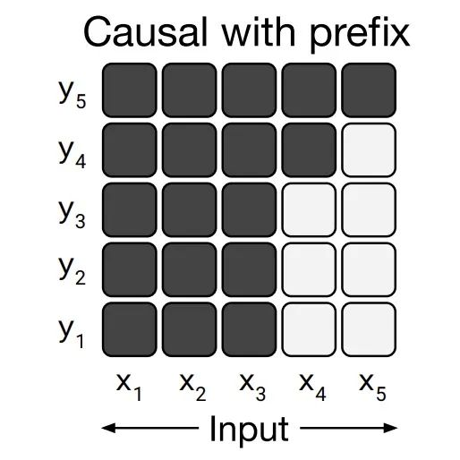

ChatGLM不属于严格意义上的Causal Language Model(因果语言模型)，因为它存在prefix attention mask
的设计。对于prefix而言，它的attention是双向的，而预测部分的attention是单向的，存在一定的适配成本。
但ChatGLM2做出了改变，它的注意力是单向的。

GLM和UniLM不属于严格意义上的Causal Language Model(因果语言模型)，因为它们存在prefix attention mask的设计。
对于prefix而言，它的attention是双向的，而预测部分的attention是单向的。

# 参考
[1] 源码解析ChatGLM2多轮对话训练方法的不足，以及改进方法，https://mp.weixin.qq.com/s/nhogoWnzl3nrs_77r38_UA