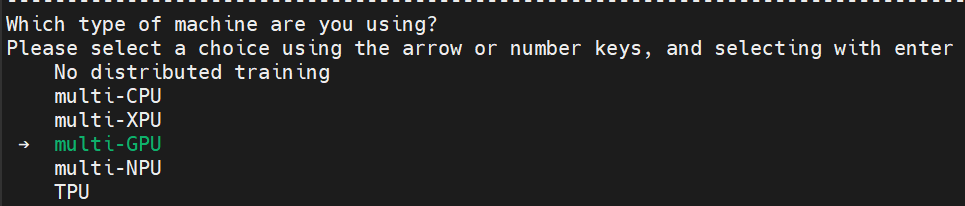
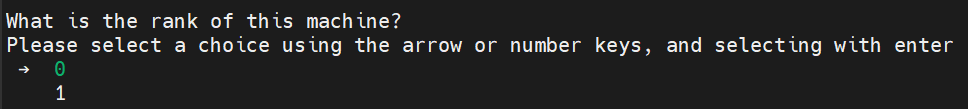
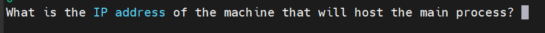
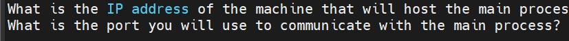
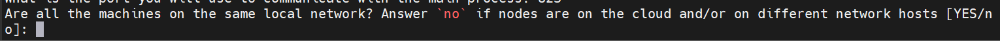
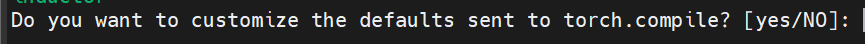
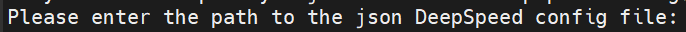
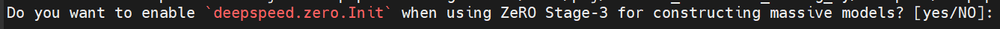
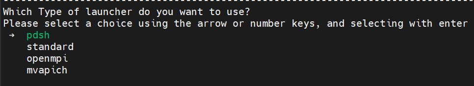
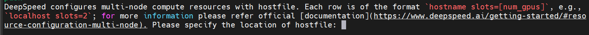

# 1. 多机多卡方式

1. accelerate （**首推此方案**）
    
    通过accelerate库，可以非常方便的实现多机多卡训练，代码改动量很少。
    
    共有2中方式（deepspeed采用同样的方式）：
    - pdsh：自动从1台主机启动多台从机
    - standalone: 在每台机器手动启动程序

2. torch ddp
    - 共享文件方式：生产一个用于通讯的文件，但需要有一个可共同访问的挂在盘（访问机器过多，会导致变慢）
    - TCP网络连接方式

3. 常用查找

    使用accelerate launch命令启动程序时，如果不指定accelerate的配置文件，则自动调用上述默认配置。
    
    /root/.cache/huggingface/accelerate/default_config.yaml

[**注意事项**]：
- 模型存放在启动任务的那台服务器上
- 需手动同步所有数据/模型/代码


# 2. 免密登录设置

1.  pdsh

   - 优点：在1太机器启动，即可自动启动其余机器，避免以前在每天机器都得启一遍脚本的麻烦
     - 缺点：会导致tqdm无法正常显示

   pdsh是deepspeed里面可选的一种分布式训练工具。适合你有几台裸机，
   它的优点是只需要在一台机上运行脚本就可以，
   pdsh会自动帮你把命令和环境变量推送到其他节点上，然后汇总所有节点的日志到主节点。
    
   用pdsh前，你得自己给所有的机器配一样的环境，配ssh，
   把所有机器之间都通过ssh的秘钥文件设置成不需要密码登录，然后安装pdsh，准备工作就结束了。

2. 安装

    ```bash
       sudo apt-get install pdsh
    ```
   
3. 生成sshkey：

    ```bash
       ssh-keygen -t rsa
    ```
    
    执行后一直回车就行生成sshkey的存储路径：~/.ssh/id_rsa

4. 服务器互相拷贝实现免密登录
    
    不加-p则使用默认端口
    
    注意：如下命令需要在每台服务器执行，本机也需要对自己ssh免密设置
    
    ```bash
        ssh-copy-id -p 22 root@124.23.134.178
        ssh-copy-id -p 22 root@124.32.143.156
    ```

5. 实验是否可以互相登录成功

   不加-p则使用默认端口
   
   ```bash
       ssh -p '22' 'root@124.23.134.178'
   ```

6. 系统hostfile配置
  
   在每台机器上分别执行
   
   ```bash
    vim ~/.ssh/config
   ```
   
   在文件中配置每台机器信息（注：该文件中不能加注释，否则会引起错误）
   ```
    Host huaweiyun1
        HostName 1.2.3.4     
        User root
        Port 33               
    
    Host huaweiyun2
        HostName 4.5.6.7    
        User root
        Port 33               
    ```

# 3.  accelerate

[**首推此方案**]

- 从一台机器可自动启动整个集群
- 需要手动同步所有数据/代码/模型文件

## 3.1 简介

- 优点：
  - 代码改动少：仅需很少量的改动（相比传统方法，需要对dataloader和训练部分），即可实现多机多卡
  - 自动启动多台机器：通过pdsh，从一个主机即可启动多台机器（具体配置，见下面描述）
    - 问题1：需要保证每台机器系统及python环境一致，需要手动同步代码
    - 问题2：使用lora deepspeed zero3时，保存模型可能存在问题，需要修改模型存储部分代码
    - 问题3：使用pdsh启动时，需要修改tqdm，否则无法正常显示
  - 自带了deepspeed：可以规避直接使用deepspeed时遇到的cpu optimizer的错误
    - 错误：该错误可能是和torch/cuda版本不配套或安装问题（可能要源码安装，尚未解决该问题）
  - 停止主进程时，可自动啥子所有子进程
- 缺点：
  - 不方便深度定制化修改（但以基本满足正常使用需求）

配置选项：  
- 通过命令行：可简介快速配置，并会把配置文件存放在系统默认位置
  - 建议不要开启，可能导致2个问题：
    - （1）无法通过accelerate launch命令调用指定路径配置文件，可能被系统设置干扰 
    - （2）一旦指定后，accelerate launch命令调用后面指定的启动脚本可能需要绝对路径才能找到
- 通过事先配置好的配置文件

## 3.2 自动配置方法

虽然方便，特别时如果不清楚如果写配置文件时，建议不要开启，可能导致2个问题：
- （1）无法通过accelerate launch命令调用指定路径配置文件，可能被系统设置干扰 
- （2）一旦指定后，accelerate launch命令调用后面指定的启动脚本可能需要绝对路径才能找到

运行命令
```shell
accelerate config
```

按照如下配置选择

1. 选择本机

    

2. 选择GPU

    

3. 选择节点数量

   

4. 选择本机节点编号

    

5. 设置本机IP地址

    

6. 设置端口号

    

7. 选择机器在同一网段

    

8. 是否使用torch的dynamo优化

    

9. 选择一种优化器

    

10. 是否定制化torch.compile的参数

    

11. 是否使用deepspeed

    

12. 是否使用已有的deepspeed json文件

    建议使用自己的已有的，并给定路径。采用自动配置虽然方便，有时会报找不到deepspeed的配置文件

    

13. 指定deepspeed配置文件

    

14. 是否使用zero初始化选项用于zero stage-3的大规模模型构建

    

15. 启动模式选择

    建议使用pdsh，从一台机器可启动整个集群。standard模式需要手动分别在每台机器启动。

    

16. 指定host文件

    用于需要集群中的机器

    

17. 是否需要过滤掉host文件中的一些特殊字符

    

18. 集群总共使用的数量

    


配置完毕，配置文件默认放在

```
accelerate configuration saved at /root/.cache/huggingface/accelerate/default_config.yaml
```

## 3.3 配置文件

1. accelerate配置文件

    使用accelerate launch命令启动程序时，如果不指定accelerate的配置文件，则自动调用上述默认配置。
    
    /root/.cache/huggingface/accelerate/default_config.yaml
    
    ```yaml
    # accelerate 配置文件
    compute_environment: LOCAL_MACHINE
    deepspeed_config:
      deepspeed_config_file: ./deepspeed.json
      deepspeed_hostfile: ./hostfile
      deepspeed_multinode_launcher: pdsh
      zero3_init_flag: true
    distributed_type: DEEPSPEED
    downcast_bf16: 'no'
    dynamo_config:
      dynamo_backend: INDUCTOR
    machine_rank: 0
    main_process_ip: 10.98.115.10
    main_process_port: 22
    main_training_function: main
    num_machines: 2
    num_processes: 16
    rdzv_backend: static
    same_network: true
    tpu_env: []
    tpu_use_cluster: false
    tpu_use_sudo: false
    use_cpu: false
    ```

2. hostfile配置
   
   ```
      huaweiyun1 slots=8
      huaweiyun2 slots=8
   ``` 
   
   通过pdsh，仅在一台服务器启动脚本即可，其它服务器机会自动启动。


3. 模型存放位置

    模型存放在启动任务的那台服务器上

## 3.4 启动

启动命令参考

```shell
#!/bin/bash

accelerate launch --config_file accelerate_config.yaml ../src/train_bash.py \
    --fp16
```

## 3.5 注意事项

1. 模型存放在启动任务的那台服务器上
2. 需手动同步所有数据/模型/代码
3. 需要修改tqdm的配置，否则无法正常显示
4. zero3时需要把accelerate库加入到python脚本中，否则模型无法正常保存
    

# 4. deepspeed + pdsh方案

配置可参考accelerate，配置方法完全相同，只不过使用deepspeed命令启动。

```shell
LR=5e-6

MASTER_PORT=$(shuf -n 1 -i 10000-65535)

deepspeed --num_gpus=8 --master_port $MASTER_PORT main.py \
    --deepspeed deepspeed.json \
    --bf16
    #--fp16
```
   
# 5. 问题和注意事项

1. 训练慢

    最后就是如果多机多卡训练很慢的话（GPU占用100%但是功率很低），
    很可能是你的NCCL走了socket导致的，这时候可以传入环境变量，将NCCL_NET改为IB就行了：
    
    ```
    export NCCL_NET=IB
    ```

2. 模型存放在启动任务的那台服务器上
3. 需手动同步所有数据/模型/代码
4. 需要修改tqdm的配置，否则无法正常显示
5. zero3时需要把accelerate库加入到python脚本中，否则模型无法正常保存
6. accelerate配合dataloader库使用时，数据可能存在分配不均，导致报错 
  （可是设小accumulate grad或batch size参数）

# 参考

[1] 