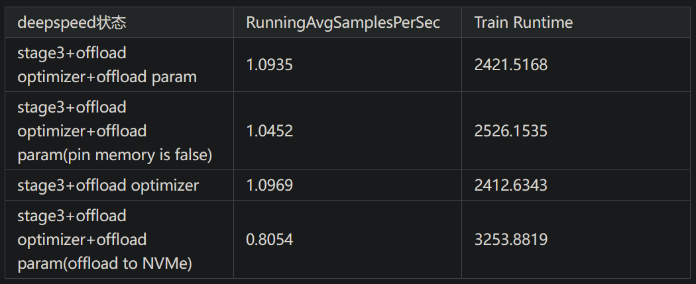
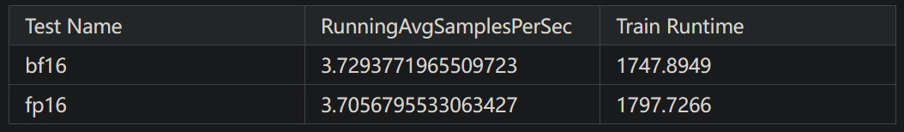

# 1. 简介

级别介绍：
- ZeRO-0：禁用所有类型的分片，仅使用 DeepSpeed 作为 DDP (Distributed Data Parallel)
- ZeRO-1：分割Optimizer States，减少了4倍的内存，通信容量与数据并行性相同
- ZeRO-2：分割Optimizer States与Gradients，8x内存减少，通信容量与数据并行性相同
- ZeRO-3：分割Optimizer States、Gradients与Parameters，内存减少与数据并行度和复杂度成线性关系。
- ZeRO-Infinity是ZeRO-3的拓展。允许通过使用 NVMe 固态硬盘扩展 GPU 和 CPU 内存来训练大型模型。ZeRO-Infinity 需要启用 ZeRO-3。

在deepspeed中通过zero_optimization.stage=0/1/2/3 设置，
卸载通过zero_optimization.offload_optimizer.device设置

混合精度：Choose between ['no', 'fp8', 'fp16', 'bf16']


# 2. 配置文件说明

```json
{
  "train_batch_size": 24,
  "train_micro_batch_size_per_gpu": 1,
  "gradient_accumulation_steps": 1,
  "steps_per_print": 1,
  "zero_optimization": {
    "stage": 3,
    "offload_param": {
      "device": "cpu",
       "pin_memory": true
    },
    "offload_optimizer": {
      "device": "cpu",
      "pin_memory": true
    },
    "allgather_partitions": true,
    "allgather_bucket_size": 1e7,
    "overlap_comm": true,
    "reduce_scatter": true,
    "reduce_bucket_size": 1e7,
    "contiguous_gradients" : true,
    "stage3_prefetch_bucket_size": "auto",
    "stage3_param_persistence_threshold": "auto",
    "stage3_max_live_parameters": 1e9,
    "stage3_max_reuse_distance": 1e9,
    "stage3_gather_16bit_weights_on_model_save": true
  },
  "bf16": {
    "enabled": false
  },
  "fp16": {
    "enabled": true,
    "loss_scale": 0,
    "loss_scale_window": 100
  },
  "gradient_clipping": 0.5,
  "prescale_gradients": false,
  "wall_clock_breakdown": false
}

```

参数解释

- fp16.loss_scale=0：自动放缩
- fp16.enabled=auto: 根据传参进行自适应混合精度模式
- fp16.initial_scale_power=16：初始放大率是2的16次方
- fp16.min_loss_scale=1：最小放大率为1，如果为1时仍然梯度溢出，程序则会报错
- gradient_clipping=1：梯度剪裁
- allgather_partitions： 在每个步骤结束时，从所有GPU中选择使用allgather集体操作或一
  系列广播集体操作之间的方式，以收集更新后的参数。 (默认值：true)
- allgather_bucket_size： 用于调节Allgather操作的分桶大小。将张量分成较小的桶有助于在通信过程中更高效地传输数据。
  较大的allgather_bucket_size值会导致每个桶的尺寸增大，可能加速通信操作，但也需要更多内存来存储中间结果。
  选择合适的桶大小需要根据实际情况进行调整。(默认值：5e8)
- overlap_comm： 控制通信与计算是否交叠执行。当设置为True时，DeepSpeed将尝试在梯度计算期间并行进行梯度通信。
  这有效地缩短通信时间，从而加速整个训练过程。(默认值：false)
- reduce_scatter： 使用reduce或reduce scatter来替代allreduce以平均梯度。(默认值：true)
- reduce_bucket_size： 用于控制Allreduce操作的分桶大小。将张量分为较小的桶有助于数据在
  通信过程中的更高效传输。随着reduce_bucket_size值的增大，每个桶的尺寸也随之增大，这或许能加速通信操作，
  但同时也需要更多内存来存储中间结果。合适的桶大小应根据实际情况进行适当调整。(默认值：5e8)
- contiguous_gradients： 在梯度产生时将其复制到一个连续的缓冲区中。在反向传播过程中避免了内存碎片化问题。(默认值：true)
- sub_group_size： 控制在优化器步骤中参数更新的粒度。参数被分组到大小为sub_group_size的桶中，
  每个桶依次进行一次更新。当与ZeRO-Infinity中的NVMe offload同时使用时，sub_group_size决定了
  在优化器步骤期间从NVMe迁移到CPU内存的模型状态的粒度。这有助于避免超大模型对CPU内存的过度占用。
  在不使用NVMe offload时，请保持其默认值。若遇到内存不足（OOM）情况，可以考虑减小sub_group_size。
  当优化器迭代较缓慢时，也可以考虑增大sub_group_size。(默认值：1e9)
- stage3_prefetch_bucket_size： 预取参数的固定缓冲区大小。较小的值使用的内存较少，
  但可能会因通信而增加停顿。(默认值：5e8)
- stage3_max_live_parameters： 保留在GPU上的完整参数数量的上限。(默认值：1e9)
- stage3_max_reuse_distance： 根据参数在未来何时再次使用的指标来决定是舍弃还是保留参数。
  如果一个参数在不久的将来会再次被使用（小于stage3_max_reuse_distance），则会保留该参数以减少通信开销。
  在遇到内存不足（OOM）的情况下，可以降低stage3_max_live_parameters和stage3_max_reuse_distance的值。(默认值：1e9)
- stage3_gather_16bit_weights_on_model_save： 在保存模型时启用模型FP16权重合并。对于大型模型和多GPU环境，
  这是一项在内存和速度方面代价较高的操作。(默认值：false)
- ZeRO-3 中不使用 allgather_partitions、allgather_bucket_size 和 reduce_scatter 配置参数

批量大小相关参数

```text
"train_batch_size": "auto",
"gradient_accumulation_steps": "auto",
"train_micro_batch_size_per_gpu": "auto",
```

- train_batch_size： 有效的训练批量大小。这指的是每次模型更新所涉及的数据样本数量。
  train_batch_size是单个GPU在一次前向/后向传递中处理的批量大小，也称为train_micro_batch_size_per_gpu，
  以及梯度累积步骤（也称为gradient_accumulation_steps），还有GPU数量，这些因素共同决定。
  如果同时提供train_micro_batch_size_per_gpu和gradient_accumulation_steps，可以忽略train_batch_size。(默认值：32)
- gradient_accumulation_steps： 在计算平均并应用梯度之前累积梯度的训练步骤数。这个功能有时候对于提高可扩展性非常有用，
  因为它减少了步骤之间梯度通信的频率。另一个影响是，可以在每个GPU上使用更大的批量大小进行训练。
  如果同时提供train_batch_size和train_micro_batch_size_per_gpu，可以忽略gradient_accumulation_steps。(默认值：1)
- train_micro_batch_size_per_gpu： 单个GPU在一个步骤中处理的微批量大小（不进行梯度累积）。
  如果同时提供train_batch_size和gradient_accumulation_steps，
  可以忽略train_micro_batch_size_per_gpu。(默认值：train_batch_size的值)
- train_batch_size = train_micro_batch_size_per_gpu * gradient_accumulation * 
  number of GPUs.（即训练批次的大小 = 每个GPU上的微批次大小 * 几个微批次 * 几个GPU）

# 3. Zero配置对比实验

对比实验
以下是进行的关于 deepspeed 主要功能的对比实验

实验基本deepspeed配置信息

(训练资源配置：master=1,worker=1 A800 双机8卡)

```json
// 实验使用 torchrun 启动器进行启动
{
    "train_batch_size": "auto",
    "optimizer": {
        "type": "Adam",
        "params": {
            "lr": "auto",
            "betas": [
                0.9,
                0.95
            ],
            "eps": "auto",
            "weight_decay": "auto"
        }
    },
    "scheduler": {
        "type": "WarmupDecayLR",
        "params": {
            "warmup_min_lr": 5e-6,
            "warmup_max_lr": "auto",
            "warmup_num_steps": "auto",
            "total_num_steps": "auto"
        }
    },
    "steps_per_print": 10,
    "bf16": {
        "enabled": true
    },
    "gradient_clipping": 1.0,
    "zero_optimization": {
        "stage": 3,
        "offload_param": {
            "device": "cpu",
            "pin_memory": true
        },
        "offload_optimizer": {
            "device": "cpu",
            "pin_memory": true
        },
        "overlap_comm": true,
        "contiguous_gradients": true,
        "sub_group_size": 1e9,
        "reduce_bucket_size": "auto",
        "stage3_prefetch_bucket_size": "auto",
        "stage3_param_persistence_threshold": "auto",
        "stage3_max_live_parameters": 1e9,
        "stage3_max_reuse_distance": 1e9,
        "stage3_gather_16bit_weights_on_model_save": true
    },
    "gradient_accumulation_steps": "auto",
    "train_micro_batch_size_per_gpu": "auto",
    "wall_clock_breakdown": false
}
```

***

实验一：关于开启ZeRO-3后关于不同offload设置对比实验结果如下  
基于 Starcoder 模型代码共跑20个steps的结果（所有实验皆使用bf16）



结论：使用ZeRO阶段三时，开启pin memory后吞吐率稍微加快。
是否开启offload parameter对实际吞吐率影响比较小。
将offload目标改为NVMe后，吞吐率下降明显。

建议：开启ZeRO阶段三后，若显存容量较小，可以将offload optimizer
与offload parameter全部开启，并且开启pin memory，若显存仍然不够，
可以尝试将offload的地址修改为NVMe，但需要输入NVMe的路径，
但必须接受训练速度变慢的可能。

***

实验二：关于不同ZeRO状态的对比实验   
基于 Starcoder 模型代码共跑50个steps的结果，
输入大小减小至实验一的0.125倍（所有实验皆使用bf16）


结论：在未开启offload的情况下，训练速度为

Stage 1 > stage 2 > stage 3

在开启offload（将能开启的全部开启）后，训练速度为

stage 1 > stage 3 > stage 2

建议：stage 3如果在其他配置相同的情况下，很可能比stage 2要慢，
因为前者除了执行stage 2的操作外，还需要收集模型权重。但经实验结果显示，
在多GPU的情况下将stage3的状态全部开启后，相对比stage2快一些。
如果stage 2满足需求，而且不需要在少数几个GPU之外进行扩展，
那么您可以选择继续使用它。若显存足够，可以使用stage 1.

***

实验三：fp16与bf16的对比实验   
基于 Starcoder 模型代码共跑50个steps的结果，输入大小减小至实验一的0.125倍，
实验使用stage3+offload optimizer+offload param 进行测试



结论：使用bf16训练快于fp16

建议：若硬件支持，请选择bf16进行训练

*** 

实验四：关于NCCL三个参数的对比实验

基于 Starcoder 模型代码在实验一的条件下共跑50个steps的结果


结论：经过对比可以发现，将IB,SHM,P2P传输全都禁用后运行速度最慢，
全部开启后运行速度最快。此外，发现将P2P禁用，即禁用NVlink对于训练速度影响最大；
在不禁用P2P的情况下，同时禁用IB,SHM对训练时间会有影响，但影响较弱，
会略微增加训练时长，单独禁用对训练无影响

建议：为了更快的训练速度，如果机器允许，请不要开启任何一个禁用。

# 4. Zero选择

如何选择最佳性能的ZeRO阶段和offload方式
一般而言，以下规则适用：

从速度角度来看 Stage 0 (DDP) > Stage 1 > Stage 2 > Stage 2 + offload > 
Stage 3 > Stage 3 + offloads

从GPU内存使用角度来看 Stage 0 (DDP) < Stage 1 < Stage 2 < 
Stage 2 + offload < Stage 3 < Stage 3 + offloads

因此，当想要在适合最少数量的GPU的情况下获得最快的执行速度时，可以遵循以下过程。
我们从最快的方法开始，如果遇到GPU内存不足，然后转到下一个速度较慢但使用更少GPU内存的方法，
依此类推。

***

具体方法

首先，将批量大小设置为1

启用 --gradient_checkpointing 1（HF Trainer）或直接使用 
model.gradient_checkpointing_enable() - 如果出现内存不足（OOM），则

首先尝试使用ZeRO stage2。如果出现内存不足（OOM），则

尝试使用ZeRO stage2+ offload optimizer - 如果出现内存不足（OOM），则

切换到ZeRO stage3 - 如果出现内存不足（OOM），则

将 offload_param 启用到CPU - 如果出现内存不足（OOM），则

将 offload_optimizer 启用到CPU - 如果出现内存不足（OOM），则

使用混合精度进行训练而不是fp32

如果仍然出现内存不足（OOM），可以添加更多硬件或启用ZeRO-Infinity - 即将卸载 
offload_param 和 offload_optimizer 切换到nvme。

***

性能优化

一旦批量大小为1不会导致内存不足，就可以测量有效吞吐量。

接下来，尝试将批量大小增加到尽可能大，因为批量大小越大，GPU的效率越高，
因为它们在乘法的矩阵很大时表现最佳。

最后就可以不断进行性能优化。可以通过关闭一些卸载功能，或者在ZeRO阶段中降级，
增加/减少批量大小，并再次测量有效吞吐量。反复尝试，直到满意为止。
